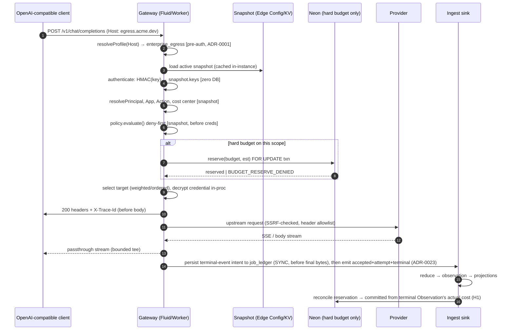
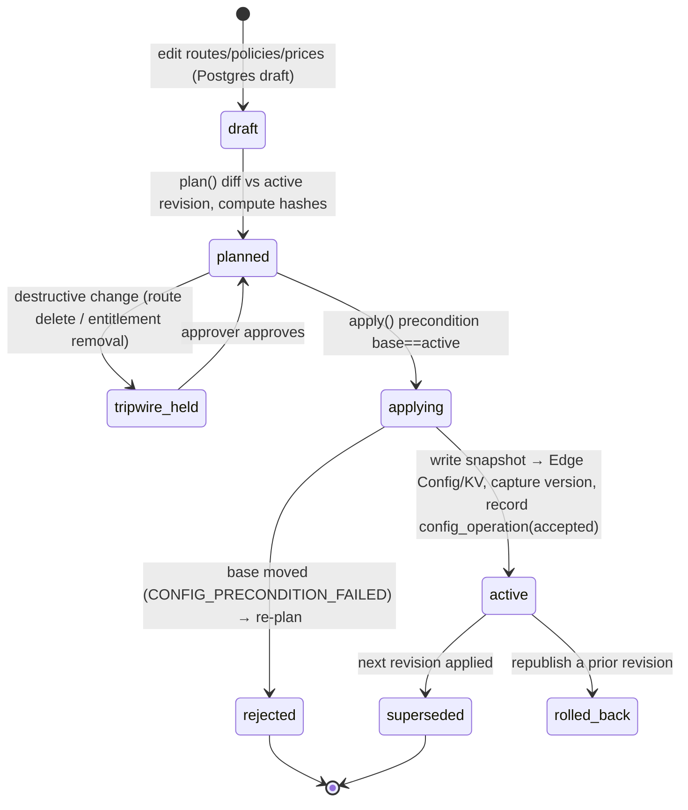
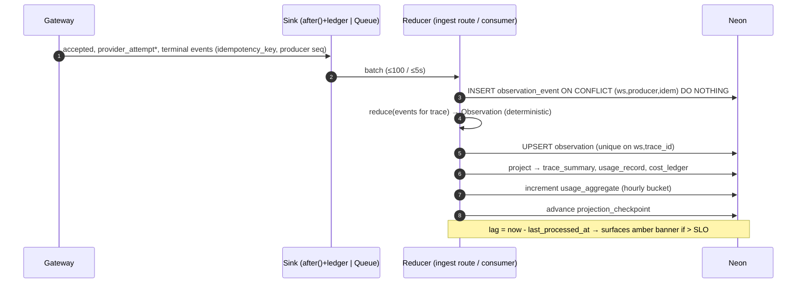
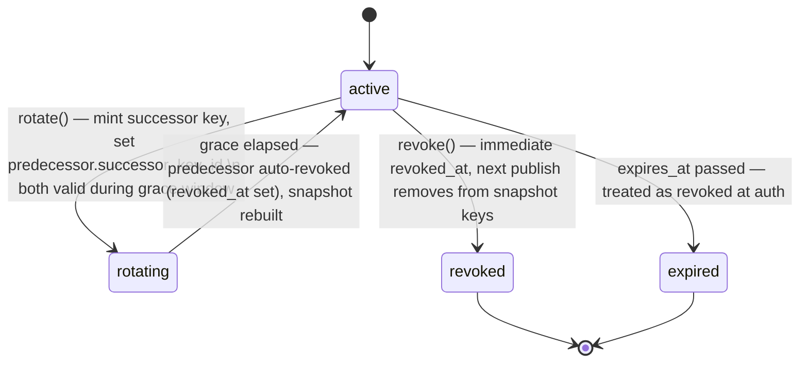
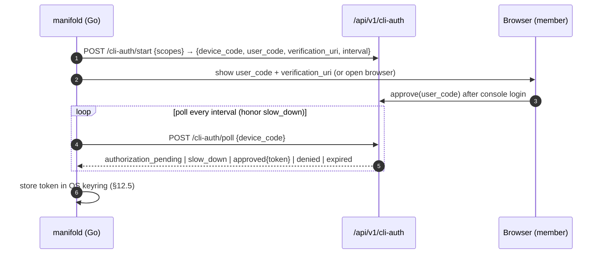
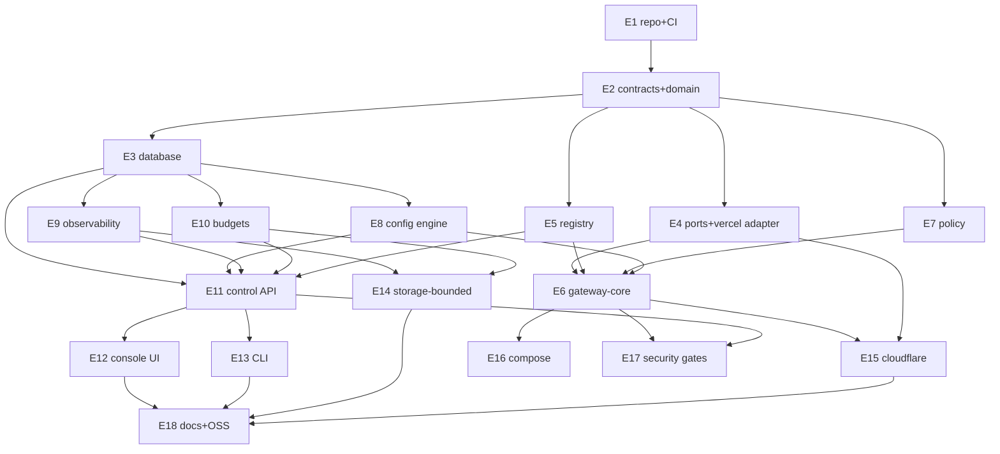

# Manifold — Architecture & Engineering Specification

An OpenAI-compatible, self-hostable AI gateway that is also its own logging and governance product. One codebase serves two customers through two front doors: an indie developer's own gateway-plus-logs, and an enterprise's governed internal model exit. Vercel + Edge Config + Neon is the first-class production target; a Cloudflare edition ships from the same runtime-agnostic core.

**Status:** Implementation-ready spec (supersedes the pre-Phase-0 build spec). Name "Manifold" is a working name pending a trademark and npm check (see ADR-0002).
**Audience:** The engineering team that will build this without inventing product, security, data, deployment, or operational decisions along the way.
**Source rules:** Reuses the Pulse Uptime stack and design system; imports Klu's own `ai-gateway` as the gateway core.

---

## How to read this document

This is one document by request. It is long because it is meant to remove decisions, not describe them. Read it in three passes:

1. §0–§5 give the shape: decisions, the two deployment topologies, the package graph, the domain model. Read these top to bottom once.
2. §6–§13 are the build surface: schema, snapshot, flows, services, APIs, views, CLI, storage-bounded mode. Read the ones you own; they are self-contained and cross-referenced.
3. §14–§27 are the operating contract and the plan: security, tenancy, concurrency, queues, observability, deploy, migrations, testing, phases, WBS, risks, and the sequenced backlog. §27 is where a new engineer starts picking up work.

Every identifier in this document — table name, column, endpoint, CLI verb, reason code — is normative. If code and spec disagree, that is a bug in one of them; file it.

### Conventions

- **MUST / SHOULD / MAY** carry RFC-2119 weight. **MUST** is a release gate.
- Money is integer **micro-USD** (`µ$`, 1 µ$ = 10⁻⁶ USD) unless a column says otherwise. No binary floats touch money. Prices from catalogs are stored as µ$ per **1,000,000 tokens** (`price_per_mtok_microusd`), an integer.
- Time is `timestamptz` in UTC. Durations are integer milliseconds with an explicit unit suffix in identifiers (`_ms`).
- Hashes are content-addressed and written `sha256:<hex>`; the `sha256:` prefix is stored, not stripped.
- "Tenant" means `Workspace`. Every durable row that is not global reference data carries `workspace_id` and is filtered by it in every query. There are no exceptions to tenant scoping; §15 makes this enforceable.
- Code samples are illustrative of the contract, not the final implementation. Where a Zod schema and a SQL column disagree in a sample, the SQL DDL in §6 wins for storage and the Zod schema in §10 wins for the wire.
- `public_app` and `enterprise_egress` are the two **ingress profiles**. "Profile" always means one of these two unless qualified.

### Table of contents

- §0 — Terminology, reason codes, error codes
- §1 — Architectural decisions (ADRs)
- §2 — Vercel production topology (primary)
- §3 — Cloudflare deployment topology (secondary, from the same core)
- §4 — Monorepo and package boundaries
- §5 — Domain model
- §6 — Full database schema + ER diagram
- §7 — Hot-path snapshot schema
- §8 — Request and event flows (+ 8 lifecycle diagrams)
- §9 — Application services and functions
- §10 — HTTP APIs
- §11 — Control-plane views
- §12 — Go CLI (`manifold`)
- §13 — Storage-bounded mode (500 MB)
- §14 — Security model
- §15 — Tenancy and authorization
- §16 — Consistency and concurrency
- §17 — Queues and scheduled work
- §18 — Observability
- §19 — Deployment and environment management
- §20 — Migrations and rollback
- §21 — Testing strategy
- §22 — Phased implementation plan
- §23 — Engineering work breakdown
- §24 — Dependency graph
- §25 — Risk register
- §26 — Unresolved decisions
- §27 — Definition of done + sequenced backlog

---

## §0 — Terminology, reason codes, error codes

### 0.1 Glossary

| Term | Meaning |
|---|---|
| Workspace | The tenant. Owns everything durable. Billing and isolation boundary. |
| Installation (`GatewayInstallation`) | One deployed gateway that has connected to this control plane, identified by a public key or workload identity. |
| Ingress profile | A trusted hostname binding with a fixed trust mode: `public_app` or `enterprise_egress`. Selected by host, never by header/claim/body. |
| Route (`GatewayRoute`) | A `public_name` a client puts in the `model` field, resolving to targets for one endpoint kind. |
| Route revision | An immutable, content-addressed version of a route's targets and policy. |
| Target (`GatewayTarget`) | One (provider credential × provider model offering × region) with weight/priority/health. |
| Canonical model | The provider-independent identity of a model (e.g. `claude-sonnet-4-5`). |
| Provider model offering | A canonical model as served by one provider (adapter, base URL, region, price revision). |
| Snapshot | The signed, read-only routing/auth/policy blob in Edge Config (Vercel) or KV (Cloudflare). Zero DB reads on the hot path. |
| Config revision (`GatewayConfigRevision`) | A content-addressed, published snapshot. The gateway serves exactly one active revision per installation. |
| Observation | The immutable, reduced record of one gateway request: trace, spans, usage, cost, policy decision. |
| Observation event | An append-only journal row; observations are a deterministic reduction of events. |
| Projection | A read-optimized table (trace summaries, usage aggregates) rebuilt deterministically from events. |
| Budget account | A spend or token cap at a scope (workspace/team/app/cost-center), advisory or hard. |
| Reservation | A pre-dispatch atomic hold against a hard budget, reconciled at completion. |
| Capture policy | The rule set bounding what request/response content is stored, and how it is redacted. |
| Tripwire | The publish gate that holds destructive config changes behind explicit approval. |
| Compaction | Rolling high-volume request detail into hourly/daily/monthly aggregates under the storage ceiling (§13). |

### 0.2 Reason-code registry

Reason codes are load-bearing: every `clamp`, `deny`, retry, and failover names one, and they link policy decision, trace, and audit. They are stable strings, `SCREAMING_SNAKE_CASE`, namespaced by a prefix. The registry is versioned with the API (`X-Manifold-Schema`). Adding a code is a minor bump; changing a code's meaning is a breaking change.

| Code | Class | Emitted where | Meaning |
|---|---|---|---|
| `AUTH_KEY_UNKNOWN` | auth | gateway | Presented key hash not in snapshot. |
| `AUTH_KEY_REVOKED` | auth | gateway | Key matched but `revoked_at` set. |
| `AUTH_KEY_EXPIRED` | auth | gateway | Key matched but past `expires_at`. |
| `AUTH_PROFILE_MISMATCH` | auth | gateway | Key/token belongs to the other ingress profile. |
| `AUTH_TOKEN_AUDIENCE` | auth | gateway | Short-lived token audience ≠ profile audience. |
| `AUTH_WORKLOAD_IDENTITY` | auth | gateway | OIDC/workload identity failed validation. |
| `POLICY_MODEL_DENIED` | policy | gateway | No `ModelEntitlement` grants this scope→model. |
| `POLICY_PROFILE_ESCALATION` | policy | control API + gateway | A `public_app` key was scoped to (or presented against) an enterprise-only target. |
| `POLICY_PARAM_CLAMPED` | policy | gateway | A `RequestConstraint` clamped a parameter (names the param). |
| `POLICY_PARAM_REJECTED` | policy | gateway | A parameter exceeded a hard ceiling and the route rejects rather than clamps. |
| `POLICY_DATA_REGION` | policy | gateway | `DataHandlingConstraint` forbade the target region. |
| `POLICY_CAPTURE_FORCED` | policy | gateway | Capture reduced/redacted by policy (informational). |
| `BUDGET_RESERVE_DENIED` | budget | gateway | Hard budget could not reserve (over limit). |
| `BUDGET_PRICE_UNKNOWN` | budget | gateway | Hard budget refused: price fidelity `unknown` (fails closed). |
| `BUDGET_RESERVE_EXPIRED` | budget | reconciler | Reservation expired before completion; reconciled to zero-or-actual. |
| `ROUTE_UNKNOWN` | routing | gateway | `model` string matched no route for this profile. |
| `ROUTE_NO_HEALTHY_TARGET` | routing | gateway | All targets unhealthy/circuit-open. |
| `ROUTE_ENDPOINT_UNSUPPORTED` | routing | gateway | Endpoint kind not supported by any target. |
| `PROVIDER_TIMEOUT` | upstream | gateway | Upstream exceeded target timeout. |
| `PROVIDER_HTTP_5XX` | upstream | gateway | Upstream returned 5xx (verbatim message preserved). |
| `PROVIDER_HTTP_4XX` | upstream | gateway | Upstream returned 4xx (verbatim message preserved). |
| `PROVIDER_STREAM_ABORTED` | upstream | gateway | Stream broke after first byte. |
| `RETRY_ATTEMPT` | routing | gateway | A retry was issued against the same target. |
| `FAILOVER_ATTEMPT` | routing | gateway | A failover moved to the next target. |
| `RATE_LIMIT_KEY` | limit | gateway | Virtual-key rate limit exceeded. |
| `CAPTURE_TRUNCATED` | capture | ingest | Payload exceeded capture bytes; truncated per policy. |
| `INGEST_DEDUP` | ingest | ingest | Duplicate producer sequence dropped (idempotent). |
| `STORAGE_SHED_SAMPLED` | storage | compactor | Detail dropped by trace sampling under storage pressure (§13). |
| `STORAGE_EMERGENCY_SHED` | storage | compactor | Emergency shedding active at ≥95% ceiling (§13). |
| `CONFIG_PRECONDITION_FAILED` | config | control API | Apply rejected: base revision moved under the plan. |
| `CONFIG_TRIPWIRE_HELD` | config | control API | Destructive change awaiting approval. |

The full enum lives in `packages/contracts/reason-codes.ts` and is the single source; the table above is generated from it in CI (§21) so drift fails the build.

### 0.3 Error envelope

Gateway data-plane errors are OpenAI-shaped so the base-URL swap is transparent:

```json
{ "error": { "message": "no route for model 'gpt-4o' on this endpoint",
             "type": "invalid_request_error", "param": "model",
             "code": "ROUTE_UNKNOWN" } }
```

Control-plane (`/api/v1`) errors use Manifold's envelope, carrying a request id and structured remediation for agents and the CLI (§12):

```json
{ "error": { "code": "CONFIG_PRECONDITION_FAILED",
             "message": "active revision advanced from sha256:abc… to sha256:def… during apply",
             "reason_codes": ["CONFIG_PRECONDITION_FAILED"],
             "remediation": "re-run plan against the current active revision, then apply",
             "request_id": "req_01J…", "schema": "manifold.v1",
             "retryable": true, "details": { "expected": "sha256:abc…", "actual": "sha256:def…" } } }
```

Both envelopes always carry `code`; the gateway additionally maps `code` into OpenAI's `type`/`param` shape. `X-Trace-Id` is returned on every data-plane response before the body streams. `X-Request-Id` is returned on every control-plane response.

---
## §1 — Architectural decisions (ADRs)

Each ADR is `Context → Decision → Consequences → Status`. Status is **Accepted** (build to it), **Provisional** (build behind a seam, revisit at the named trigger), or **Open** (see §26). ADRs are immutable once Accepted; a reversal is a new ADR that supersedes.

**ADR-0001 — Two ingress profiles, selected by trusted host. Accepted.**
Context: the product is one gateway core answering two trust models. Decision: a request's profile (`public_app` | `enterprise_egress`) is bound to the trusted hostname at the edge, resolved *before* authentication. No header, query parameter, token claim, or body field can select or upgrade the profile. Public and enterprise credential pools are disjoint. Consequences: the host→profile binding is security-critical config, published in the snapshot and covered by negative tests (§15.5); a deployment running both profiles runs two hostnames with separate token audiences and key material.

**ADR-0002 — Working name "Manifold". Provisional (trigger: trademark + npm clearance).**
Ship-blocking only for the public OSS release and the npm scope. Internal packages use `@manifold/*`; a rename is a scripted find-replace across `packages/*/package.json` and imports. Do not hard-code the string "Manifold" in protocol constants (use `manifold.v1` schema id, which we keep regardless of brand).

**ADR-0003 — License: Apache-2.0. Accepted.**
Context: enterprise-facing gateway; patent grant matters; Portkey/Bifrost set the precedent. Decision: Apache-2.0 for all first-party code, with `LICENSE`, `NOTICE`, and per-source attribution for imported catalog data. Consequences: every imported source must be Apache-compatible (models.dev MIT ✓, LiteLLM MIT ✓); GPL inputs are rejected in CI license-scan.

**ADR-0004 — Vercel-first; runtime-agnostic core; Cloudflare is a second edition. Accepted.**
Context: the builder already runs Vercel + Edge Config + Neon. Decision: Vercel is the primary, fully specified production target (§2). `packages/gateway-core` and the service layer take zero Vercel or Cloudflare imports; platform touchpoints go through adapter interfaces (§4.4). Cloudflare (§3) implements the same interfaces against Workers/KV/DO/Queues/Hyperdrive. Consequences: no Vercel primitive may appear in `gateway-core`, `application`, `gateway-policy`, or `observability`; a lint rule enforces this (§4.5). The Cloudflare path must never gate a Vercel feature; where parity is impossible, §3.7 records the delta.

**ADR-0005 — Hot path reads one signed snapshot; zero database reads. Accepted.**
Decision: routing, key verification, principal/attribution resolution, and static policy resolve entirely from an in-runtime snapshot (loaded into isolate memory; served with lower first-load latency by Edge Config on Vercel or KV on Cloudflare when it fits, ADR-0025). Neon is not on the latency-critical read path. Consequences: anything needed to route/authenticate/authorize-statically must fit the snapshot's compact schema (§7) and its ~512 KB/store budget (ADR-0025, §7.4); high-cardinality data and live counters do not go in the snapshot. Provider-secret *ciphertext* (never plaintext, never the DEK) rides in the snapshot so credential decryption is an in-process operation, not a DB read (ADR-0022).

**ADR-0006 — Neon Postgres is authoritative for everything durable. Accepted.**
Decision: no ClickHouse, Brainstore, Redis, or Supabase until a measured need exists. Observations, usage, cost, budgets, audit, config history all live in Postgres. Consequences: high-volume request detail is bounded by the storage-bounded mode (§13); analytical queries use projection tables (§6.9), not a separate OLAP store; if volume ever forces a columnar store, it attaches behind the `observability` package's reader interface, not in front of the product.

**ADR-0007 — Immutable, content-addressed revisions. Accepted.**
Decision: route, policy, and price revisions and published config revisions are immutable and identified by `sha256:` of their canonical JSON. Rollback is republishing a prior revision, never mutation. Consequences: "edit" creates a successor revision; the DB keeps full lineage (§6.11); the snapshot carries only the active pointer plus the compact active records.

**ADR-0008 — Money is integer micro-USD; prices are µ$ per 1M tokens. Accepted.**
Decision: no binary float in any monetary column, reservation, ledger, or budget. Catalog prices convert to `price_per_mtok_microusd BIGINT` on import (§11 mapping). Consequences: `$3.00 / 1M` stores as `3_000_000`; `$0.30 / 1M` stores as `300_000`; per-request cost = `Σ (tokens_k × price_per_mtok_microusd_k) / 1_000_000` computed in integer arithmetic with documented rounding (banker's rounding at the µ$, §6.10).

**ADR-0009 — models.dev is the primary registry source. Accepted.**
Context: the registry is the single source of provider/model metadata for route validation, `/v1/models`, usage normalization, and budget eligibility. Decision: models.dev (167 providers, 5,696 models, MIT) is the primary discovery source, imported through a pinned, reviewed, offline transform (§11). LiteLLM's catalog is a secondary cross-check for divergence detection. OpenAI-compatible request/response *shapes* (codec structure) follow the public braintrust-proxy repo; catalog and pricing come from models.dev and LiteLLM. Provider-native pages/APIs outrank all aggregators for **hard-budget** price eligibility. Consequences: a models.dev price is fidelity `aggregator` by default; it becomes `provider_verified` only when the models.dev provider id is a known first-party (`openai`, `anthropic`, `google`, `google-vertex`, `mistral`, `amazon-bedrock`, `azure`, …) or an operator override supplies it. Hard budgets fail closed on `unknown`.

**ADR-0010 — Endpoint-specific codecs; no universal request union; Responses is not Chat Completions. Accepted.**
Decision: `/v1/chat/completions`, `/v1/responses`, `/v1/embeddings` each have their own codec and typed I/O; Responses is never internally rewritten into Chat Completions. Unknown request/response fields are preserved within size limits. Unsupported endpoint/feature combinations fail with an OpenAI-shaped 400 before any provider call. Consequences: a capability matrix per (endpoint × provider) is generated from adapter metadata each release (§21.6); realtime/image/audio/batch stay out of v1.

**ADR-0011 — Observations are an append-only journal reduced deterministically. Accepted.**
Decision: producers write `ObservationEvent`s (idempotency key + producer sequence); `Observation`, `TraceSummary`, and usage aggregates are deterministic reductions/projections with resumable checkpoints. Consequences: replay rebuilds any projection; ingest is idempotent; token chunks are never stored as events.

**ADR-0012 — Hard budgets reserve on Neon; the public path stays DB-free by default. Accepted.**
Decision: `enterprise_egress` requests against a hard budget take one Neon transaction to reserve before dispatch and reconcile at completion. `public_app` requests take zero DB reads unless a key opts into per-user budgets. Consequences: enterprise egress tolerates one round-trip of added latency (budgeted in §2.6 SLOs); Edge Config is never used for spend enforcement (it would oversell).

**ADR-0013 — CLI user-facing command is `manifold`. Accepted.**
Decision: the binary and command is `manifold` (§12). `mfctl` is a deprecated alias that prints a deprecation notice and forwards, kept for one minor series for anyone who scripted the Pulse-era name. Consequences: docs, completion, and examples use `manifold`; the Go module is `github.com/<org>/manifold/cli`.

**ADR-0014 — Storage-bounded mode with a hard, operator-selected 500 MB ceiling. Accepted.**
Decision: an operator-selectable durable-size ceiling (default 500 MB) with configurable warning/emergency thresholds drives retention, compaction, sampling, and shedding (§13), preserving usage/cost/budget/security/audit truth while compacting request detail. Consequences: every high-volume table has a retention tier and a compaction path; the system computes live footprint, forecasts exhaustion, and reserves headroom for indexes and migrations; behavior at 70/85/95/100 % is specified and tested deterministically.

**ADR-0015 — Reuse Pulse's design system and config engine; import the cleaned `ai-gateway` core. Accepted.**
Decision: copy Pulse's tokens/components/charts, `lib/config` + `config-service`, `lib/api` kit, `lib/auth`, `lib/db` conventions, device-auth CLI, and onboarding; import `ai-gateway`'s edge-adapter model, provider selection, OpenAI passthrough/codecs, and Web-Streams/SSE utilities. Strip on import: the hard-coded `https://api.klu.ai/v1/data/` logging sink, forward-all-headers, the in-memory full-response tee, and stale model→provider tables (replaced by the registry). Consequences: §4 maps what is reused from Pulse, imported from `ai-gateway`, and written fresh.

**ADR-0016 — Keyed hashes for keys/tokens; application-layer encryption for provider secrets. Accepted.**
Decision: virtual keys and API tokens store a keyed hash (HMAC-SHA-256 with a server pepper) plus a display prefix; provider credentials are encrypted with envelope encryption (§14.3) and decrypt only inside the gateway process. Consequences: no plaintext key/token/secret is ever stored, logged, put in a header, snapshot, crash report, or metric; the snapshot carries key *hashes*, not keys.

**ADR-0017 — Durable async ingest; never block the provider path. Accepted.**
Decision: observation writes happen after the response starts streaming, via `after()` (Vercel) or a durable queue, with a Postgres job ledger backing retries. Consequences: provider latency is independent of ingest health; ingest lag is surfaced (the amber banner, §11) and bounded by SLO (§18).

**ADR-0018 — v1 gateway runs as a Vercel Node/Fluid function, not the Edge runtime. Accepted (trigger to revisit: measured cold-start or fan-out cost).**
Context: provider codecs, streaming tees, and crypto are simpler and faster to get correct on Node; Fluid Compute gives concurrency-per-instance and `after()`. Decision: gateway is a Node function under Fluid Compute; the *core* stays runtime-agnostic so an Edge/Workers host is a packaging change, not a rewrite. Consequences: cold-start and region placement are managed per §2.4; the Cloudflare edition (§3) is the Workers packaging of the same core.

**ADR-0019 — Drizzle ORM + the plain `postgres` driver. Accepted.**
Decision: keeps Neon portable to Supabase/Aurora/self-managed Postgres and to Cloudflare Hyperdrive. Consequences: no Neon-proprietary SQL on the hot write path; `pgvector` is an optional extension gated behind a feature flag for related-observation detection (§26).

**ADR-0020 — Bounded capture and streaming memory are release invariants. Accepted.**
Decision: streaming MUST NOT grow process memory proportional to the full response; capture is byte-bounded and redacted per policy before durable write. Consequences: the tee is a bounded ring, not a full buffer (§8.1); a load test asserting flat memory under a 1 GB streamed completion is a release gate (§21.7).

**ADR-0021 — One workspace per database; durable state is single-tenant per installation. Accepted.**
Context: the storage-bounded mode (§13) measures footprint with `pg_total_relation_size` (a database-wide number) and reclaims space with O(1) partition drops, while `workspace.storage_ceiling_bytes` is per-workspace — mutually consistent only if a workspace *is* the database. Decision: each installation's durable state is a single-tenant Postgres database (a Neon project/branch per workspace); exactly one `workspace` row per database. The control plane is multi-installation — it holds a connection per installation and selects a workspace by selecting its database, never by filtering a shared table. Consequences: `pg_total_relation_size` over `public` *is* the workspace footprint (§13.2 holds unchanged); a partition drop never touches another tenant's rows (§13.6 stays O(1)); the ceiling, forecast, and shedding are all measurable per workspace. Global reference data (`canonical_model`, `provider_model_offering`, global prices) is replicated into each database by the registry-sync job (§11.6), not shared across tenants. RLS + the query-lint (§15.2) remain as defense-in-depth and as the seam for a future hosted multi-tenant edition, but the database — not RLS — is the primary isolation boundary. A hosted multi-tenant edition, if ever built, is a new ADR that supersedes this one and re-opens §13 (per-workspace byte accounting) and §15 (RLS as primary boundary).

**ADR-0022 — Provider-secret ciphertext travels in the signed snapshot; plaintext never does. Accepted (refines ADR-0005, ADR-0016).**
Context: to decrypt a provider secret the gateway needs the ciphertext, which lives in `provider_credential.encrypted_secret` in Postgres — but ADR-0005 forbids a DB read on the dispatch path (B3). Decision: the snapshot `credmap` carries the AES-256-GCM *ciphertext* of each reachable credential plus its `dek_id`, never the plaintext and never the DEK. The gateway decrypts in-process with a DEK unwrapped once per isolate from the KEK and cached in memory. Rotating or revoking a secret writes a new ciphertext and republishes the snapshot — the existing config path (§8.2) — so the prior ciphertext stops being served within the propagation window; there is no separate secret cache to invalidate. Consequences: credential retrieval is not a DB read (ADR-0005 holds); a leaked snapshot store still exposes no usable secret because the DEK/KEK are not in it (ADR-0016 holds); secret-rotation latency equals snapshot propagation latency (§2.3, §8.2), stated in the rotation runbook (§19.4); ciphertext counts against the 512 KB snapshot budget (§7.4).

**ADR-0023 — Terminal-event intent is persisted synchronously before the response is released; `after()` is an optimization. Accepted (refines ADR-0017).**
Context: `after()` (Vercel) is best-effort — an instance killed by `maxDuration`, deploy, or crash after the last provider byte but before `after()` runs loses the terminal event, and with it hard-budget reconciliation (H1/H9). Decision: at the terminal transition the gateway writes the terminal-event intent to the durable `job_ledger` (folded into the same transaction as the budget reconcile touch on the enterprise path; a single synchronous insert on the public path) *before* releasing the final bytes of the response; `after()`/the Queue then performs the reduce as an optimization. Consequences: the durability boundary is the synchronous ledger write, not `after()`; reconciliation is driven from the durable terminal `Observation` carrying real usage/cost, never from best-effort post-response work (§8.1, §8.4, §17.2); a completed-but-uncompacted request cannot silently escape hard-budget accounting.

**ADR-0024 — The snapshot-signing keypair is control-plane-owned and distinct from installation identity. Accepted (refines ADR-0016).**
Context: §7.3/§14.3 previously said the gateway verifies a snapshot against "the installation's pinned public key," but `gateway_installation.public_key` is the installation's *ingest* identity — conflating them either lets the wrong key verify a snapshot or leaves rotation undefined (H10). Decision: two disjoint keypairs. (1) The **snapshot-signing keypair** is owned by the control plane (`MANIFOLD_SNAPSHOT_SIGNING_KEY`, §19.3); the gateway pins only its public half (`MANIFOLD_SNAPSHOT_PUBLIC_KEY`) and verifies every snapshot against it. (2) The **installation-identity keypair** (`gateway_installation.public_key`) authenticates the installation to the ingest endpoint and heartbeat and never verifies a snapshot. Consequences: snapshot integrity depends on the control-plane signing key alone; the two keys rotate independently (§19.4); a test asserts an installation-identity key cannot validate a snapshot and vice-versa (§21.8).

**ADR-0025 — Edge Config is a 512 KB accelerator, not the required hot path; boot-fallback is the default above the cap. Accepted (refines ADR-0005).**
Context: Vercel Edge Config is 512 KB/store (Enterprise; 64 KB Pro, 8 KB Hobby), propagates in up to 10 s, and caps at 10 stores/account and 3/project (Vercel docs, 2026-03); the prior 5 MB / <1 s / free-sharding assumptions were wrong by ~10× (B4). Decision: the snapshot's home of record is the signed `gateway_config_revision.snapshot` in Postgres, loaded by the gateway via boot-fallback (`GET /api/v1/config/active`, §7.4) and cached in-isolate for the isolate lifetime. Edge Config (and CF KV) is an *optional accelerator* that serves the same signed bytes with lower first-load latency when the snapshot fits one store; a tenant whose snapshot exceeds the store runs on boot-fallback by default — the documented default at scale, not a degraded mode. Consequences: all snapshot sizing re-baselines to 512 KB (§7.4); propagation math uses 10 s (not 1 s) wherever it feeds a grace window (§8.2, §16.7, §3.7); per-PR ephemeral preview stores share one namespaced store to stay under the 10-store cap (§2.5); the §2.6 SLOs cover the in-isolate cached read (steady-state identical to an Edge Config read after first load), and first-per-isolate boot-fallback load is a per-instance cost excluded from the per-request budget.

---
## §2 — Vercel production topology (primary)

Vercel is the first-class production architecture. Everything below is the default; §3 is an alternate packaging, not a fork.

### 2.1 Deployables and projects

Two Vercel projects in one team, both deployed from the monorepo:

| Project | Root | Runtime | Purpose | Public surface |
|---|---|---|---|---|
| `manifold-control-plane` | `apps/control-plane` | Node 22 (Functions), Next.js 16 | Management UI, `/api/v1`, ingest `/api/v1/observation-events:batch` | Console hostname + control API |
| `manifold-gateway` | `apps/gateway` | Node 22 + Fluid Compute | OpenAI-compatible data plane `/v1/*` | One hostname per ingress profile |

Two managed services: **Neon Postgres** (authoritative durable state) and **Vercel Edge Config** (hot-path snapshot). Both projects target the same primary region as Neon (§2.4). The gateway and control plane never share a process; they share only the database, the Edge Config store, and the `packages/*` code.

Gateway hostnames map to ingress profiles by DNS + a Vercel domain per profile. A single installation with both front doors uses two domains (`api.acme.com` → `public_app`, `egress.acme.internal` → `enterprise_egress`) both pointing at the same `manifold-gateway` project; the profile is resolved from the incoming `Host` (ADR-0001), not from the deployment.

### 2.2 Compute model

- **Gateway: Fluid Compute, Node runtime.** Fluid gives in-instance concurrency (one warm instance serves many concurrent streams — right for I/O-bound provider passthrough), and `waitUntil`/`after()` for post-response ingest without a separate queue hop on the happy path. The gateway function is configured `maxDuration` = 300 s (streaming completions can be long), `memory` = 1024 MB, `regions` pinned to the Neon primary region set (§2.4).
- **Control plane: standard Vercel Functions** for `/api/v1` and server components; ISR is not used for authenticated pages. The ingest endpoint is a Function with `maxDuration` = 60 s and an idempotent batch contract (§10.7).
- **Background/durable work:** `after()` handles the fast path (enqueue-or-write observations). Anything that must survive a crashed invocation is a **Postgres-backed job** (`job_ledger`, §6.12) drained by **Vercel Cron** (§2.7). This is the portable substrate; the Compose edition swaps Cron for Graphile Worker with no service-layer change.

Why not the Edge runtime for the gateway in v1: ADR-0018. The core is runtime-agnostic; if cold-start or fan-out cost later justifies it, the same core packages into an Edge/Workers host (that packaging *is* §3).

### 2.3 Data services

- **Neon Postgres.** One database per workspace (ADR-0021). Access through the pooled connection string (PgBouncer, transaction pooling) for serverless functions; a second **direct** (unpooled) connection string is used only by migrations and the compaction job (which need session-level features: advisory locks, `SET LOCAL`, `VACUUM`). Drizzle + `postgres` driver (ADR-0019). Connection caps: functions use `max: 1` per invocation against the pooler; the compactor uses a single direct connection guarded by an advisory lock (§13.9). **Scale-to-zero:** any installation using hard budgets MUST either disable Neon scale-to-zero (Launch plan or higher) or run the DB keep-warm Cron (§2.7) that issues a trivial query every < 5 min, so the first reservation after idle does not incur a ~1.8–3.1 s cold start against the ≤ 8 ms reservation SLO (§16.3, H8). Advisory budgets and the public path tolerate a cold start; hard budgets do not.
- **Vercel Edge Config (optional accelerator, ADR-0025).** When the snapshot fits one store (≈ **512 KB** on the Enterprise tier; 64 KB Pro, 8 KB Hobby), the active snapshot (§7) is mirrored there; reads are synchronous, in-region, < 15 ms P99, often < 1 ms, and do not count as DB reads. **Propagation after a write is up to 10 s** (not sub-second), which sets the destructive-change grace window (§8.2, §16.7). Writes go through the Vercel API from the control plane's config-service only (§8.2). The 512 KB size cap and the account/project store caps (10/account, 3/project) drive the compact snapshot schema and the boot-fallback rules in §7.4; a tenant whose snapshot exceeds the store serves from the Postgres-backed boot-fallback (§7.4), which is the default at scale, not a fault.

### 2.4 Regional placement

- Pick one **primary region** = the Neon region (e.g. `iad1` ↔ Neon `us-east-2`). The control plane and its Neon writes are colocated to keep `/api/v1` and reservation transactions single-digit-ms to the database.
- The gateway is pinned to the primary region by default. Provider egress latency dominates; colocating the gateway with Neon keeps the enterprise reservation round-trip cheap and keeps `after()` ingest writes local.
- Multi-region gateway is **Provisional**: because hard-budget reservation needs a single serialization point, a multi-region gateway either (a) routes reservation to the primary-region Neon (accept cross-region RTT on enterprise hard-budget requests only), or (b) on Cloudflare, uses a Durable Object as the per-budget serialization point (§3.4). Public-app traffic, which is DB-free, may run multi-region freely. Do not build multi-region writes for v1; document the seam (§16.4).
- Cold starts: Fluid keeps instances warm under load; a `GET /v1/models` health ping from Cron every 5 min per region keeps at least one instance warm in low-traffic installations. Cold-start budget is excluded from the streaming SLO but included in the `p99_ttfb` panel (§18).

### 2.5 Environments, isolation, and secrets

Three environments, mapped to Vercel's model plus one added staging project alias:

| Env | Vercel mapping | Neon | Edge Config | Domains |
|---|---|---|---|---|
| Preview | every PR deployment | Neon **branch** per PR (ephemeral, copy-on-write) | ephemeral store, seeded | `*.vercel.app` preview URLs |
| Staging | `staging` git branch → aliased | Neon `staging` branch | dedicated staging store | `staging-console.…`, `staging-egress.…` |
| Production | `main` → production | Neon primary | production store(s) | customer domains |

- **Neon branching** gives every preview a real, isolated database seeded by `packages/database` fixtures; no preview shares production data. Branch teardown is automated on PR close.
- **Secrets** are Vercel Environment Variables scoped per environment, never in the repo. The application-layer data key (§14.3) is a Vercel secret injected only into the gateway project. `EDGE_CONFIG` connection string is injected into both projects (read) but the write token only into the control plane. The full env contract is §19.3.
- **Isolation invariant:** preview deployments MUST NOT hold production secrets. CI asserts that the production data key and provider-secret KMS grant are absent from preview/staging environments (§21.9).

### 2.6 Latency budget and SLOs

The gateway's added latency (excluding provider time) is the product's core promise. Budget, measured as gateway overhead added to a request:

| Path | Budget (P99, added overhead) | Composition |
|---|---|---|
| `public_app` route + auth + static policy | ≤ 15 ms | snapshot reads only (§2.3), no DB |
| `enterprise_egress` with hard budget | ≤ 15 ms + one Neon reservation txn | reservation txn P99 ≤ 8 ms in-region (§16.3), **DB kept warm** (§2.3, H8); subject to the per-budget throughput ceiling (§16.3, H2) |
| Time to first byte (TTFB) proxied | provider TTFB + ≤ 20 ms | codec + credential inject + stream start |
| Observation ingest lag | P99 ≤ 5 s from terminal to queryable | `after()` → ingest → reduce → projection |

SLOs (§18 defines measurement and alerts): gateway availability 99.9 %; added-overhead P99 within budget; ingest lag P99 ≤ 5 s; reservation-txn error rate < 0.1 %. Breaching the ingest-lag SLO raises the amber banner in the console (§11) because displayed numbers are then behind.

### 2.7 Cron and durable work

Vercel Cron entries (defined in `apps/control-plane/vercel.json`), each hitting an authenticated internal route that acquires an advisory lock so overlapping fires are safe:

| Schedule | Route | Job |
|---|---|---|
| `* * * * *` (1 min) | `/api/internal/jobs/drain` | Drain `job_ledger`: ingest retries, reconciliation, config-apply followups. |
| `*/5 * * * *` | `/api/internal/jobs/warm` | Keep-warm ping (gateway instance **and a trivial Neon query**, H8) + provider health probe roll-up. |
| `*/15 * * * *` | `/api/internal/storage/measure` | Recompute live DB footprint + forecast (§13.2). |
| `0 * * * *` (hourly) | `/api/internal/compact/hourly` | Roll request detail into hourly usage/cost aggregates (§13.4). |
| `10 0 * * *` (daily) | `/api/internal/compact/daily` | Daily aggregation, retention deletion pass, partition maintenance. |
| `30 0 1 * *` (monthly) | `/api/internal/compact/monthly` | Monthly rollups, cold-tier export candidates. |
| `0 3 * * 0` (weekly) | `/api/internal/registry/refresh` | Open the registry-sync PR from pinned inputs (§11.6) — never auto-merges. |

Cron routes are not public: they require the internal job secret header and run the same service functions the CLI and Compose worker call, so behavior is identical across substrates.

### 2.8 Networking and egress safety

- The gateway enforces an **outbound URL policy** before any provider call: only `https`, only hosts on the resolved provider offering's allowlist (from the registry/snapshot), no link-local/loopback/RFC-1918 targets, DNS re-resolution pinned to the validated host (SSRF defense, §14.4). Operator-configured private deployments (Azure, self-hosted vLLM) are allowlisted explicitly per `ProviderCredential`.
- A **header allowlist** governs what forwards upstream; the stripped `ai-gateway` forward-all behavior is replaced (ADR-0015). Hop-by-hop and auth headers never forward; provider auth is injected fresh from the decrypted credential.
- Enterprise egress MAY additionally restrict source networks (allowed CIDRs / mTLS) per profile; this is policy metadata in the snapshot, enforced at the edge.

### 2.9 Rollback and promotion

- **Code** rolls back via Vercel instant rollback to a prior immutable deployment. Gateway and control plane roll back independently; the API contract between them is versioned (`X-Manifold-Schema`) so a one-version skew is safe.
- **Config** (routes/policies/prices) rolls back by republishing a prior `GatewayConfigRevision` (ADR-0007, §8.2) — independent of code deploys.
- **Schema** rolls back by the expand/contract discipline in §20; no destructive migration ships in the same release that starts using the new shape.

---

## §3 — Cloudflare deployment topology (secondary)

The Cloudflare edition is the same `gateway-core` and service layer packaged against Workers primitives. It exists so an operator who lives on Cloudflare can self-host without a rewrite, and so globally-atomic budgets become possible if ever required (ADR-0004). It MUST NOT shape the Vercel-first design; where it cannot match a Vercel behavior, §3.7 records the delta rather than degrading Vercel.

### 3.1 Dependency mapping

| Concern | Vercel (primary) | Cloudflare (this edition) |
|---|---|---|
| Gateway compute | Fluid Node function | Worker (module syntax), `nodejs_compat` flag |
| Control plane + UI | Next.js on Vercel Functions | Next.js on Workers via OpenNext (`@opennextjs/cloudflare`) |
| Hot-path snapshot | Edge Config | Workers **KV** (snapshot value, versioned key) |
| Durable serialization (budgets, rate limits) | Neon transaction | **Durable Object** per budget account / per key |
| Async ingest | `after()` → job_ledger | **Queues** (producer in Worker, consumer Worker) |
| Scheduled jobs | Vercel Cron | **Cron Triggers** (`scheduled` handler) |
| Postgres access | pooled Neon (PgBouncer) | **Hyperdrive** in front of Neon/any Postgres |
| Secrets | Vercel env vars | Wrangler **secrets** / `env` bindings |
| Analytics/metrics | Vercel + OTel export | **Workers Analytics Engine** + OTel export |
| Object export (cold tier) | Neon + external object store | **R2** |
| Deploy config | `vercel.json` | `wrangler.toml` + bindings |

### 3.2 Worker topology

- `manifold-gateway` Worker: the data plane. Same `gateway-core` entrypoint, wrapped by a Cloudflare adapter that implements the platform interfaces (§4.4): `SnapshotStore` → KV, `BudgetReserver` → Durable Object, `IngestSink` → Queue, `Clock`/`Crypto`/`Fetcher` → Workers globals. `nodejs_compat` is enabled for the codec/crypto paths; the core avoids Node-only APIs except through the adapter.
- `manifold-control-plane` Worker (OpenNext): UI + `/api/v1` + ingest producer. Talks to Postgres through Hyperdrive.
- `manifold-ingest-consumer` Worker: Queue consumer that runs the same reduce/projection service functions as the Vercel ingest route.

### 3.3 KV snapshot

The published snapshot (§7) is written to KV under a versioned key `snapshot:<installation_id>:<config_revision>` plus a pointer key `snapshot:<installation_id>:active` holding the active revision id. The Worker reads the pointer once per isolate lifetime and caches the snapshot in isolate memory keyed by revision; a background `scheduled` refresh and a pointer-mismatch check on cache miss pick up new revisions. KV's eventual consistency (up to ~60 s global) is acceptable for routing/auth/static-policy because revisions are immutable and additive: a stale isolate serves a prior valid revision, never a torn one. Destructive changes rely on the same tripwire + grace window as Vercel (§8.2) so a slow-to-propagate delete cannot strand a live key mid-change.

### 3.4 Durable Objects for atomic budgets and rate limits

Hard-budget reservation and per-key rate limiting need a single serialization point. On Cloudflare that is a Durable Object:

- One `BudgetReservationDO` per `budget_account_id`. It holds the authoritative reserved/committed counters in DO storage, serializes reserve/commit/rollback, and writes through to Postgres (via Hyperdrive) as the durable record and audit source. If the DO and Postgres disagree after a crash, Postgres is authority and the DO rehydrates from it on next access (§3.7 delta: reservation is DO-serialized, Postgres-durable). A single DO serializes every reserve for its budget subtree, so per-budget reserve throughput is bounded (a DO tops out around 500–1000 requests/s before returning *overloaded*); high-fan-in roots use the per-shard sub-counter scheme (§16.3, H2) so a workspace-root cap does not funnel all enterprise traffic through one object, and overload surfaces as `BUDGET_RESERVE_DENIED`/backpressure, never as a corrupted counter.
- One `RateLimitDO` per virtual key (or per key-shard) implementing the token bucket that the Vercel edition can also run in Postgres/edge. This gives Cloudflare *global* atomic rate limits, which the Vercel edition approximates per-region (§16.5 delta).

This is the one place Cloudflare is arguably stronger (globally atomic without a central DB round-trip). The Vercel design does not adopt DO semantics; it uses the Neon reservation (ADR-0012), which is simpler and single-region-correct.

### 3.5 Queues for ingest

The gateway Worker produces one message per terminal observation to a Cloudflare Queue; `manifold-ingest-consumer` batches (max 100 / 5 s), runs the idempotent reduce, and writes projections. Failed batches retry with backoff to a dead-letter queue; the DLQ drains into the same `job_ledger` reconciliation the Vercel edition uses, so operational tooling (CLI `manifold jobs`, §12) is identical.

### 3.6 Hyperdrive and Postgres

Hyperdrive pools and caches Postgres connections at the edge, giving Workers a warm pool to Neon (or any Postgres). Drizzle + `postgres` driver runs unchanged. Migrations run from CI against the direct Postgres URL (not Hyperdrive), identical to Vercel. Read-heavy control-plane queries benefit from Hyperdrive caching; write/transaction paths (reservation write-through, config-apply) bypass the cache.

### 3.7 Consistency and operational deltas (documented, not hidden)

| Behavior | Vercel | Cloudflare | Delta handling |
|---|---|---|---|
| Snapshot propagation | Edge Config ≤ 10 s (ADR-0025) | KV eventual ≤ ~60 s | Immutable revisions + tripwire grace window make staleness safe; delete-visibility SLA differs (§8.2). |
| Hard budget authority | Neon txn | DO-serialized, Postgres-durable | Same external contract (`BUDGET_RESERVE_DENIED`); recovery source is Postgres in both. |
| Rate limit scope | per-region approximate | global exact (DO) | Vercel documents a small cross-region overshoot bound (§16.5); CF is exact. |
| Ingest delivery | `after()` + job_ledger | Queue + DLQ + job_ledger | At-least-once + idempotent reduce in both; ordering not assumed in either. |
| Cold export tier | external object store | R2 | Same `export-before-delete` manifest (§13.8). |
| Next.js features | native | via OpenNext (some edge cases) | Console is server-rendered + `/api/v1`; avoid Vercel-only APIs in `apps/control-plane` (lint, §4.5). |

The rule: identical **feature contracts** (same endpoints, reason codes, schemas, CLI), documented **operational** differences (propagation windows, rate-limit exactness). No Cloudflare limitation may remove a Vercel capability.

### 3.8 `wrangler.toml` shape (illustrative)

```toml
name = "manifold-gateway"
main = "dist/cf-entry.js"
compatibility_date = "2026-06-01"
compatibility_flags = ["nodejs_compat"]
workers_dev = false
routes = [
  { pattern = "api.acme.com/*",      zone_name = "acme.com" },       # public_app
  { pattern = "egress.acme.dev/*",   zone_name = "acme.dev" },       # enterprise_egress
]
kv_namespaces      = [{ binding = "SNAPSHOT", id = "…" }]
queues.producers   = [{ binding = "INGEST", queue = "manifold-ingest" }]
durable_objects.bindings = [
  { name = "BUDGET", class_name = "BudgetReservationDO" },
  { name = "RATELIMIT", class_name = "RateLimitDO" },
]
hyperdrive         = [{ binding = "PG", id = "…" }]   # → Neon/any Postgres
[triggers]
crons = ["* * * * *", "*/15 * * * *", "0 * * * *", "10 0 * * *"]
[vars]
MANIFOLD_PROFILE_BINDINGS = "api.acme.com=public_app;egress.acme.dev=enterprise_egress"
# secrets (wrangler secret put): MANIFOLD_DATA_KEY, PG_DIRECT_URL, INTERNAL_JOB_SECRET
```

The host→profile binding lives in `MANIFOLD_PROFILE_BINDINGS` here and in the snapshot; both editions resolve the profile from the trusted host before auth (ADR-0001).

---
## §4 — Monorepo and package boundaries

npm workspaces, one root lockfile. Copy Pulse's design system and config engine; import Klu's `ai-gateway` as the gateway core (ADR-0015). The boundary rule (ADR-0004) is enforced, not aspirational: platform-specific code lives only in `apps/*` and `packages/adapters-*`.

### 4.1 Layout

```
manifold/
  apps/
    control-plane/          Next.js 16: UI + /api/v1 + ingest. Seeded from Pulse (app/, components/, lib/).
    gateway/                Vercel Node/Fluid entry. Thin: wires adapters-vercel to gateway-core.
    gateway-cf/             Cloudflare Worker entry. Thin: wires adapters-cloudflare to gateway-core.
    cli/                    Go `manifold` (module github.com/<org>/manifold/cli).
  packages/
    contracts/              Zod schemas + generated TS types; reason-codes; error envelopes; schema version. NO runtime deps.
    domain/                 Pure domain types + state machines + invariants. Depends only on contracts.
    gateway-core/           Runtime-agnostic: request pipeline, authorizer, route resolver, codecs, streaming. Depends on domain, contracts, provider-registry, gateway-policy. NO platform imports.
    gateway-policy/         Deny-first evaluator, reason codes, simulator. Pure. Depends on domain, contracts.
    provider-registry/      Catalog schema, models.dev importer/transform, capability matrix, price units. Depends on contracts.
    application/            Service layer (no HTTP): config, keys, providers, budgets, observations, audit, storage. Depends on database, domain, contracts, config, provider-registry, gateway-policy.
    database/               Drizzle schema + migrations + query helpers. Depends on contracts. Owns the ONLY import of `drizzle-orm`/`postgres`.
    config/                 Snapshot builder + publisher (from Pulse lib/config + config-service). Depends on domain, contracts, database.
    observability/          Observation events, reducers, projections, checkpoints, compaction logic. Depends on database, domain, contracts.
    ports/                  Platform-adapter INTERFACES only (SnapshotStore, BudgetReserver, IngestSink, JobQueue, Clock, Crypto, Fetcher, ObjectStore). Pure types. §4.4.
    adapters-vercel/        Implements ports/ against Edge Config, Neon, after(), Vercel Cron. Used by apps/gateway + apps/control-plane.
    adapters-cloudflare/    Implements ports/ against KV, DO, Queues, Hyperdrive, Cron Triggers, R2. Used by apps/gateway-cf.
    ui/                     Design system: tokens (globals.css), components/ui, charts. From Pulse. React only.
  deploy/
    vercel/                 Project config, region, env contracts, vercel.json fragments.
    compose/                Portable self-host: Node gateway + Postgres + Graphile Worker + Caddy.
    cloudflare/             wrangler.toml, DO migrations, KV/Queue/Hyperdrive bindings.
  db/
    migrations/             Generated SQL (Drizzle Kit) + hand-written data migrations. §20.
  tools/
    registry-sync/          Offline supply-chain job: fetch pinned models.dev/LiteLLM, validate, transform, open PR. §11.6.
    conformance/            OpenAI-compat fixtures + capability-matrix generator. §21.
```

### 4.2 Dependency directions (the import graph is a DAG)

Allowed edges only; anything else fails the boundary lint (§4.5).

```
contracts  ← domain ← gateway-policy
contracts  ← provider-registry
contracts, domain, provider-registry, gateway-policy ← gateway-core
contracts ← database ← config, observability, application
domain ← config, observability, application
provider-registry, gateway-policy ← application
ports  ← adapters-vercel, adapters-cloudflare   (adapters implement ports)
ports  ← gateway-core (core depends on the interfaces, never the adapters)
apps/gateway        → gateway-core, adapters-vercel, application(read-only subset), ports
apps/gateway-cf     → gateway-core, adapters-cloudflare, ports
apps/control-plane  → application, config, observability, database, ui, contracts, adapters-vercel
apps/cli (Go)       → talks only to /api/v1 over HTTP (no shared code)
```

Hard rules: `gateway-core`, `gateway-policy`, `domain`, `provider-registry`, `observability`, `application`, `config` MUST NOT import from `adapters-*`, `apps/*`, `next`, `@vercel/*`, `@cloudflare/*`, or `drizzle`/`postgres` except that `database` is the sole owner of `drizzle-orm`/`postgres`. The gateway request pipeline receives its platform capabilities by dependency injection through `ports/` (§4.4).

### 4.3 Package contracts (what each exposes)

- **contracts** — `zod` schemas for every wire type (gateway I/O per endpoint, ingest batch, control API), the `reason-codes.ts` enum, the error envelopes, and `SCHEMA_VERSION = "manifold.v1"`. Generated `.d.ts` types. This package pins the wire; changing it is an API change (§20).
- **domain** — entity types (`Workspace`, `GatewayRoute`, `Observation`, `BudgetAccount`, …), value objects (`Money`, `ContentHash`, `KeyedHash`, `TokenCounts`), and state-machine definitions (§8) as pure transition functions `(state, event) → state | error`.
- **gateway-core** — `handleRequest(ctx, req): Response` where `ctx` bundles the injected ports and the loaded snapshot. Sub-modules: `resolveProfile`, `authenticate`, `resolvePrincipal`, `resolveRoute`, `selectTarget`, `codec/*`, `stream/*`, `reserveBudget` (delegates to port), `emitObservation` (delegates to port).
- **gateway-policy** — `evaluate(request, policyRevision): PolicyDecision` (`allow|clamp|deny` + reason codes), pure and identical in gateway and simulator (§11 Policies).
- **provider-registry** — `CatalogSchema`, `importFromModelsDev(json): Catalog`, `capabilityMatrix(catalog)`, `priceToMicroUnits(...)`, `resolveOffering(canonicalModel, provider)`.
- **application** — service objects (§9), each a plain function/class taking a `ServiceContext` (db handle, actor, clock, audit sink). No HTTP, no framework. This is what both `/api/v1` handlers and the CLI's server-side and Cron routes call.
- **database** — the Drizzle schema (§6), typed query helpers, and migration entry. The only package that opens a connection.
- **config** — `buildSnapshot(revisionInput): Snapshot`, `planApply(base, target): Plan`, `apply(plan, store): ConfigOperation`, `tripwire(plan): Approval[]`.
- **observability** — `reduce(events): Observation`, `project(observation): {traceSummary, usage}`, `checkpoint` helpers, `compact(window, budget): CompactionResult` (§13).
- **ports / adapters-** — §4.4.

### 4.4 Platform adapter interfaces (`packages/ports`)

The runtime seam. `gateway-core` and `application` know only these interfaces; `adapters-vercel` and `adapters-cloudflare` implement them. This is the single mechanism that keeps Vercel-first without forking (ADR-0004).

```ts
// packages/ports/index.ts  — pure types, zero platform imports
export interface SnapshotStore {
  /** Load the active snapshot for an installation. Zero-DB-read hot path. */
  loadActive(installationId: string): Promise<Snapshot>;        // Edge Config get | KV get
  /** Publish a built snapshot; returns the platform version handle. */
  publish(installationId: string, revision: string, snap: Snapshot): Promise<{ version: string }>;
  pointer(installationId: string): Promise<{ revision: string; version: string }>;
}
export interface BudgetReserver {
  reserve(input: ReserveInput): Promise<ReserveResult>;         // Neon txn | Durable Object
  commit(reservationId: string, actual: Money): Promise<void>;
  rollback(reservationId: string, reason: ReasonCode): Promise<void>;
}
export interface IngestSink {
  emit(event: ObservationEvent): Promise<void>;                 // after()+ledger | Queue
}
export interface JobQueue {
  enqueue(job: JobSpec): Promise<{ jobId: string }>;            // job_ledger | CF Queue
  claim(kind: string, n: number): Promise<Job[]>;
  complete(jobId: string, result?: unknown): Promise<void>;
  fail(jobId: string, err: JobError): Promise<void>;
}
export interface ObjectStore { put(key: string, body: Uint8Array, meta?: Record<string,string>): Promise<void>; }
export interface Clock { now(): Date; }
export interface Crypto { hmacSha256(key: Uint8Array, msg: Uint8Array): Uint8Array;
                          randomId(prefix: string): string;
                          sealAesGcm(dek: Uint8Array, pt: Uint8Array): Uint8Array;
                          openAesGcm(dek: Uint8Array, ct: Uint8Array): Uint8Array; }
export interface Fetcher { fetch(req: Request): Promise<Response>; }  // provider egress; wraps SSRF policy
```

`ReserveInput/ReserveResult`, `Snapshot`, `ObservationEvent`, `JobSpec` are `contracts` types. Adapters are the only place a platform SDK is imported. A fake in-memory implementation of every port lives in `packages/ports/testing` and backs unit tests and the deterministic storage tests (§13.10, §21).

### 4.5 Boundary enforcement

- **`eslint-plugin-boundaries`** (or `dependency-cruiser`) encodes §4.2 as rules; a forbidden import fails CI. Rule set: `gateway-core`/`gateway-policy`/`domain`/`provider-registry`/`observability`/`config`/`application` may not import `next`, `@vercel/*`, `@cloudflare/*`, `react`, or `adapters-*`; only `database` may import `drizzle-orm`/`postgres`.
- **`import/no-restricted-paths`** blocks deep imports; packages consume each other only through their published entrypoints.
- A CI check greps `gateway-core` for `process.env` and platform globals and fails on any hit not routed through a port.

### 4.6 Reuse map: Pulse, `ai-gateway`, and fresh code

| From Pulse (yours, MIT → relicensed Apache-2.0) | From `ai-gateway` (yours) | Written fresh |
|---|---|---|
| `ui/` tokens, components, charts; `lib/config` + `config-service` → `config/`; `lib/api` kit; `lib/auth` (argon2, sessions); `lib/db` conventions; device-auth CLI; onboarding/readiness; `/api/v1` pattern | edge-adapter model; provider selection + base-URL resolution; OpenAI passthrough + provider codecs; Web-Streams/SSE utils → `gateway-core` (stripped per ADR-0015) | `ports/` + both adapters; `provider-registry` importer (models.dev); `observability` events/reducers/compaction; storage-bounded mode; two-profile authorizer; budget reservation; `domain` state machines |

Concepts drawn from `klu-gateway_DEPRECATED` and `proxy`: weighted selection, ordered fallback, retry/attempt-header contracts, Azure multi-endpoint failover.

---

## §5 — Domain model

Five bounded contexts. Each owns its aggregates and invariants; they interact through the service layer (§9) and the event journal (§8.3), never by reaching into each other's tables.

### 5.1 Contexts and aggregates

| Context | Aggregates (root in bold) | Owns |
|---|---|---|
| **Tenancy & Access** | **Workspace**, **Team**, **Member**, **CostCenter**, **ApiToken**, **CliAuthorization** | who exists, who may act, org tree |
| **Ingress & Keys** | **GatewayInstallation** → **GatewayIngressProfile**, **VirtualKey**, **App** → **Action** | the front doors, the caller credentials, attribution targets |
| **Routing & Registry** | **GatewayRoute** → **GatewayRouteRevision** → **GatewayTarget**, **ProviderCredential**, **CanonicalModel** → **ProviderModelOffering** → **ProviderPriceRevision** | how a `model` string resolves; what exists to route to |
| **Governance** | **GatewayPolicy** → **GatewayPolicyRevision** → {**ModelEntitlement**, **RequestConstraint**, **DataHandlingConstraint**, **PolicyApproval**}, **BudgetAccount** → **BudgetAllocation** / **BudgetReservation**, **PolicyDecision**, **AuditEvent**, **AlertRule** | entitlements, spend control, the decision/audit record |
| **Observability** | **ObservationEvent** (journal) → **Observation** → {**TraceSummary**, **UsageRecord**, **CostLedger**}, **ProjectionCheckpoint**, **Annotation**/**FeedbackEvent**, **UsageAggregate** (hourly/daily/monthly), **StorageStat** | the immutable record of traffic and its compaction |
| **Config distribution** | **GatewayConfigRevision**, **ConfigOperation** | the published snapshot lineage |

### 5.2 Aggregate invariants (enforced in `domain` + DB checks)

- A **Workspace** is the tenant root; every non-reference aggregate carries `workspace_id` (§15).
- A **GatewayIngressProfile** has exactly one `mode`; the (installation, hostname) pair is unique; the mode is immutable after creation (change = new profile). Public and enterprise profiles never share key material (ADR-0001, §14).
- A **VirtualKey** stores only a keyed hash + display prefix; it belongs to exactly one profile; its scopes are a subset of that profile's allowed apps; it cannot reference an enterprise-only target from a public profile without an explicit grant (§15.4).
- A **GatewayRoute** has exactly one `active_revision_id` at a time; a **GatewayRouteRevision** is immutable and content-addressed; its targets reference offerings that exist in the registry (FK) and provider credentials in the same workspace.
- A **GatewayPolicyRevision** is immutable and content-addressed; removing a `ModelEntitlement` between revisions is a destructive change (tripwire, §8.2).
- A **BudgetAccount** with `enforcement = hard` MUST reference a `pricing_catalog_revision_id` whose price fidelity for every reachable model is `provider_verified` or `operator_override`; a hard budget cannot be published against an `unknown`-priced model (ADR-0009, DB check + publish gate).
- An **Observation** is immutable; corrections are new events; **Annotation**/**FeedbackEvent** are the only mutable, separately-stored adjuncts.
- A **GatewayConfigRevision** is immutable; `apply` is precondition-checked against the current active revision (optimistic concurrency, §16.2).

### 5.3 Identity, slugs, and soft deletion

- Human-facing handles are slugs, unique per tenant per type (`workspace_id + type + slug`), immutable after creation where they appear in attribution (App, Action) to keep historical telemetry stable.
- **App** and **Action** soft-delete (`archived_at`) while any telemetry or budget references them; they never hard-delete under the storage-bounded mode except through the compaction/export path (§13.7), which preserves aggregate attribution.
- Provider credentials, keys, and profiles use lifecycle columns (`revoked_at`, `disabled_at`), not row deletion, so audit and observations keep their foreign anchors.

### 5.4 State machines (defined here, diagrammed in §8)

| Machine | States | Terminal |
|---|---|---|
| Gateway request | `received → profiled → authenticated → authorized → reserved? → dispatching → streaming → reconciled` (or `→ rejected`) | `reconciled`, `rejected` |
| Config revision | `draft → planned → (tripwire_held?) → applying → active` / `rejected` / `superseded` | `superseded`, `rejected` |
| Budget reservation | `reserved → committed` / `rolled_back` / `expired` | `committed`, `rolled_back`, `expired` |
| Provider credential | `unvalidated → valid ⇄ invalid → rotating → revoked` | `revoked` |
| Virtual key | `active → rotating(grace) → revoked` / `expired` | `revoked`, `expired` |
| CLI device authorization | `pending → approved → issued` / `denied` / `expired` | `issued`, `denied`, `expired` |
| Observation | `event_appended → reduced → projected` (+ `compacted`) | `compacted`/`deleted` (§13) |
| Storage tier | `normal(<70%) → warning(70) → high(85) → critical(95) → emergency(100)` | recovers downward |

Each machine's transition table, guards, and failure edges are in §8; the `domain` package encodes them as exhaustive `switch` transitions so an illegal transition is a type error plus a runtime `INVALID_TRANSITION`.

### 5.5 Immutability, encryption, and lineage at a glance

| Data | Mutability | At rest |
|---|---|---|
| Route/policy/price/config revisions | immutable, content-addressed | plaintext JSON + `content_hash` |
| Observations, observation events, audit, policy decisions | append-only | plaintext; capture fields redacted per policy |
| Provider secret | mutable via rotation (new ref) | envelope-encrypted (§14.3) |
| Virtual key / API token secret | never stored | keyed hash + prefix only |
| Annotations / feedback | mutable | plaintext |
| Usage aggregates | append-then-compact | plaintext integers |
| Budgets / reservations | mutable counters, immutable ledger | integer µ$ |

---
## §6 — Full database schema

Drizzle `pg-core` (ADR-0019), mirroring Pulse's style: a `timestamptz` helper, a `bytea` custom type, string-union enums as `text` + `CHECK`, integer money. The SQL DDL below is normative; the Drizzle file `packages/database/schema.ts` must generate exactly this shape (verified in CI, §21.9). Everything is grouped by pillar. Partitioning and index summaries are §6.13; immutability enforcement §6.15.

### 6.1 Conventions and shared helpers

- **IDs** are ULIDs rendered as prefixed text: `ws_01J…`, `key_01J…`, `obs_01J…`. Stored `text PRIMARY KEY`. Prefixes are per-table (`ws, tm, mbr, cc, tok, cli, inst, prof, key, app, act, pc, cm, off, prc, rt, rev, tgt, pol, plr, ent, rc, dh, pa, ba, bal, res, pd, aud, alr, oe, obs, ts, ur, cl, ua, ck, ann, fb, cfg, cop, job, sst`). ULID gives lexicographic time-ordering for range scans and partition routing.
- **Common columns**: `created_at timestamptz NOT NULL DEFAULT now()`, `updated_at timestamptz NOT NULL DEFAULT now()` (trigger-maintained on mutable tables). Immutable tables omit `updated_at`.
- **Tenant column**: `workspace_id text NOT NULL REFERENCES workspace(id)` on every non-reference table, first column of most composite indexes, and the RLS key (§15.2).
- **Money**: `*_microusd BIGINT` (µ$). Token counts `*_tokens BIGINT`. No `numeric`/`float` for money — ever.
- **Hashes**: `content_hash text` storing `sha256:<hex>`; `keyed_hash bytea` storing HMAC output.
- **Soft-delete / lifecycle**: `archived_at`, `revoked_at`, `disabled_at timestamptz NULL`. Partial indexes exclude non-null lifecycle columns from "active" queries.
- **Enums** are `text` + `CHECK (col IN (...))` (Pulse style: readable in psql, migratable without `ALTER TYPE`).

```ts
// packages/database/columns.ts (helpers)
export const ts = (name: string) => timestamptz(name, { withTimezone: true });
export const money = (name: string) => bigint(name, { mode: "bigint" });   // µ$
export const bytea = customType<{ data: Uint8Array }>({ dataType: () => "bytea" });
export const id = (name = "id") => text(name).primaryKey();                 // prefixed ULID
export const wsId = () => text("workspace_id").notNull().references(() => workspace.id);
```

```ts
// representative Drizzle table — the rest follow the same pattern; SQL DDL below is authoritative
export const virtualKey = pgTable("virtual_key", {
  id: id(), workspaceId: wsId(),
  profileId: text("profile_id").notNull().references(() => gatewayIngressProfile.id),
  displayPrefix: text("display_prefix").notNull(),
  keyedHash: bytea("keyed_hash").notNull(),
  scopes: jsonb("scopes").$type<KeyScopes>().notNull(),
  allowedAppIds: jsonb("allowed_app_ids").$type<string[]>().notNull().default([]),
  defaultAppId: text("default_app_id").references(() => app.id),
  defaultActionId: text("default_action_id").references(() => action.id),
  principalId: text("principal_id"), teamId: text("team_id").references(() => team.id),
  costCenterId: text("cost_center_id").references(() => costCenter.id),
  budgetAccountId: text("budget_account_id").references(() => budgetAccount.id),
  rateLimit: jsonb("rate_limit").$type<RateLimit | null>(),
  expiresAt: ts("expires_at"), revokedAt: ts("revoked_at"), lastUsedAt: ts("last_used_at"),
  createdAt: ts("created_at").notNull().defaultNow(),
}, (t) => ({
  byWorkspace: index("virtual_key_ws_idx").on(t.workspaceId),
  uniquePrefix: uniqueIndex("virtual_key_prefix_uq").on(t.workspaceId, t.displayPrefix),
  byHash: uniqueIndex("virtual_key_hash_uq").on(t.keyedHash),   // hash lookup for admin ops only
}));
```

### 6.2 Tenancy & access

```sql
CREATE TABLE workspace (
  id            text PRIMARY KEY,                       -- ws_…
  slug          text NOT NULL,
  name          text NOT NULL,
  region        text NOT NULL,                          -- primary region hint (§2.4)
  storage_ceiling_bytes bigint NOT NULL DEFAULT 524288000,  -- 500 MB (§13)
  storage_warn_pct  int NOT NULL DEFAULT 70  CHECK (storage_warn_pct  BETWEEN 1 AND 99),
  storage_high_pct  int NOT NULL DEFAULT 85  CHECK (storage_high_pct  BETWEEN 1 AND 99),
  storage_crit_pct  int NOT NULL DEFAULT 95  CHECK (storage_crit_pct  BETWEEN 1 AND 100),
  created_at    timestamptz NOT NULL DEFAULT now(),
  updated_at    timestamptz NOT NULL DEFAULT now(),
  CONSTRAINT workspace_slug_uq UNIQUE (slug),
  CONSTRAINT storage_thresholds_ordered CHECK (storage_warn_pct < storage_high_pct AND storage_high_pct < storage_crit_pct)
);

CREATE TABLE cost_center (
  id text PRIMARY KEY, workspace_id text NOT NULL REFERENCES workspace(id),
  slug text NOT NULL, name text NOT NULL,
  parent_id text REFERENCES cost_center(id),            -- tree
  archived_at timestamptz,
  created_at timestamptz NOT NULL DEFAULT now(), updated_at timestamptz NOT NULL DEFAULT now(),
  CONSTRAINT cost_center_slug_uq UNIQUE (workspace_id, slug)
);

CREATE TABLE team (
  id text PRIMARY KEY, workspace_id text NOT NULL REFERENCES workspace(id),
  slug text NOT NULL, name text NOT NULL,
  cost_center_id text REFERENCES cost_center(id),
  archived_at timestamptz,
  created_at timestamptz NOT NULL DEFAULT now(), updated_at timestamptz NOT NULL DEFAULT now(),
  CONSTRAINT team_slug_uq UNIQUE (workspace_id, slug)
);

CREATE TABLE member (                                    -- a human principal in a workspace
  id text PRIMARY KEY, workspace_id text NOT NULL REFERENCES workspace(id),
  email citext NOT NULL, name text,
  role text NOT NULL CHECK (role IN ('owner','admin','editor','viewer','billing')),
  auth_subject text,                                     -- OIDC subject / Pulse session principal
  disabled_at timestamptz,
  created_at timestamptz NOT NULL DEFAULT now(), updated_at timestamptz NOT NULL DEFAULT now(),
  CONSTRAINT member_email_uq UNIQUE (workspace_id, email)
);

CREATE TABLE team_member (                               -- m:n human↔team
  workspace_id text NOT NULL REFERENCES workspace(id),
  team_id text NOT NULL REFERENCES team(id),
  member_id text NOT NULL REFERENCES member(id),
  PRIMARY KEY (team_id, member_id)
);

CREATE TABLE api_token (                                 -- control-plane tokens (Pulse token-service)
  id text PRIMARY KEY, workspace_id text NOT NULL REFERENCES workspace(id),
  display_prefix text NOT NULL, keyed_hash bytea NOT NULL,
  scopes jsonb NOT NULL,                                 -- control-API scopes (§15.3)
  created_by text REFERENCES member(id),
  expires_at timestamptz, revoked_at timestamptz, last_used_at timestamptz,
  created_at timestamptz NOT NULL DEFAULT now(),
  CONSTRAINT api_token_hash_uq UNIQUE (keyed_hash),
  CONSTRAINT api_token_prefix_uq UNIQUE (workspace_id, display_prefix)
);

CREATE TABLE cli_authorization (                         -- device-authorization grant (Pulse /cli-auth)
  id text PRIMARY KEY, workspace_id text NOT NULL REFERENCES workspace(id),
  device_code_hash bytea NOT NULL, user_code text NOT NULL,
  status text NOT NULL CHECK (status IN ('pending','approved','issued','denied','expired')),
  scopes jsonb NOT NULL,
  approved_by text REFERENCES member(id),
  issued_token_id text REFERENCES api_token(id),
  interval_seconds int NOT NULL DEFAULT 5,
  expires_at timestamptz NOT NULL, created_at timestamptz NOT NULL DEFAULT now(),
  CONSTRAINT cli_user_code_uq UNIQUE (user_code)
);
```

`citext` requires the `citext` extension (enabled in migration 0001). `member.role` is the workspace-level RBAC coarse role; fine-grained scopes for tokens/keys are in `scopes` JSON validated by `contracts`.

### 6.3 Ingress & keys

```sql
CREATE TABLE gateway_installation (
  id text PRIMARY KEY, workspace_id text NOT NULL REFERENCES workspace(id),
  name text NOT NULL,
  public_key bytea,                                      -- ed25519 pubkey (installation identity)
  workload_identity jsonb,                               -- OIDC issuer/audience for enterprise
  applied_config_revision text,                          -- last revision the installation reports serving
  edition text NOT NULL DEFAULT 'vercel' CHECK (edition IN ('vercel','cloudflare','compose')),
  last_seen_at timestamptz, disabled_at timestamptz,
  created_at timestamptz NOT NULL DEFAULT now(), updated_at timestamptz NOT NULL DEFAULT now(),
  CONSTRAINT installation_identity_present CHECK (public_key IS NOT NULL OR workload_identity IS NOT NULL)
);

CREATE TABLE gateway_ingress_profile (
  id text PRIMARY KEY, workspace_id text NOT NULL REFERENCES workspace(id),
  installation_id text NOT NULL REFERENCES gateway_installation(id),
  hostname text NOT NULL,
  mode text NOT NULL CHECK (mode IN ('public_app','enterprise_egress')),  -- immutable (trigger §6.15)
  network_exposure text NOT NULL CHECK (network_exposure IN ('public','vpc','mtls')) DEFAULT 'public',
  auth_config jsonb NOT NULL,        -- token audience (public) | OIDC/SAML/workload (enterprise)
  network_config jsonb,              -- allowed CIDRs / mTLS anchors (§2.8)
  policy_revision_id text REFERENCES gateway_policy_revision(id),
  default_route_set jsonb,           -- default allowlist for this profile
  disabled_at timestamptz,
  created_at timestamptz NOT NULL DEFAULT now(), updated_at timestamptz NOT NULL DEFAULT now(),
  CONSTRAINT ingress_host_uq UNIQUE (installation_id, hostname),
  CONSTRAINT ingress_host_global_uq UNIQUE (hostname)   -- one hostname → one profile, globally
);

CREATE TABLE app (
  id text PRIMARY KEY, workspace_id text NOT NULL REFERENCES workspace(id),
  slug text NOT NULL, name text NOT NULL,
  status text NOT NULL CHECK (status IN ('active','archived')) DEFAULT 'active',
  default_capture_policy jsonb NOT NULL,                 -- capture bounds + redaction (§14.5)
  archived_at timestamptz,
  created_at timestamptz NOT NULL DEFAULT now(), updated_at timestamptz NOT NULL DEFAULT now(),
  CONSTRAINT app_slug_uq UNIQUE (workspace_id, slug)     -- slug immutable while referenced (§5.3)
);

CREATE TABLE action (
  id text PRIMARY KEY, workspace_id text NOT NULL REFERENCES workspace(id),
  app_id text NOT NULL REFERENCES app(id),
  slug text NOT NULL, name text,
  source text NOT NULL CHECK (source IN ('explicit','route_default','discovered')) DEFAULT 'explicit',
  archived_at timestamptz,
  created_at timestamptz NOT NULL DEFAULT now(), updated_at timestamptz NOT NULL DEFAULT now(),
  CONSTRAINT action_slug_uq UNIQUE (app_id, slug)
);

CREATE TABLE virtual_key (                               -- see Drizzle sample §6.1
  id text PRIMARY KEY, workspace_id text NOT NULL REFERENCES workspace(id),
  profile_id text NOT NULL REFERENCES gateway_ingress_profile(id),
  display_prefix text NOT NULL, keyed_hash bytea NOT NULL,
  scopes jsonb NOT NULL,
  allowed_app_ids jsonb NOT NULL DEFAULT '[]',
  default_app_id text REFERENCES app(id),
  default_action_id text REFERENCES action(id),
  principal_id text, team_id text REFERENCES team(id),
  cost_center_id text REFERENCES cost_center(id),
  budget_account_id text REFERENCES budget_account(id),
  rate_limit jsonb,
  successor_key_id text REFERENCES virtual_key(id),      -- set during rotation grace
  expires_at timestamptz, revoked_at timestamptz, last_used_at timestamptz,
  created_at timestamptz NOT NULL DEFAULT now(),
  CONSTRAINT virtual_key_hash_uq UNIQUE (keyed_hash),
  CONSTRAINT virtual_key_prefix_uq UNIQUE (workspace_id, display_prefix)
);
CREATE INDEX virtual_key_ws_idx ON virtual_key (workspace_id);
CREATE INDEX virtual_key_profile_idx ON virtual_key (profile_id) WHERE revoked_at IS NULL;
```

Invariant enforced in service + snapshot build: a `virtual_key.profile_id` in `public_app` cannot carry scopes reaching an enterprise-only target (§15.4). `keyed_hash` uniqueness lets admin tooling locate a key by presented value without storing plaintext.

### 6.4 Providers, model registry, prices

```sql
CREATE TABLE provider_credential (
  id text PRIMARY KEY, workspace_id text NOT NULL REFERENCES workspace(id),
  provider text NOT NULL,                                -- models.dev provider id (e.g. 'openai','azure')
  label text NOT NULL,
  encrypted_secret bytea NOT NULL,                       -- envelope-encrypted (§14.3)
  dek_id text NOT NULL,                                  -- which data-encryption key wrapped it
  base_url text, deployment jsonb,                       -- Azure deployment map / private base urls
  allowed_hosts jsonb NOT NULL DEFAULT '[]',             -- SSRF allowlist for this credential (§2.8)
  status text NOT NULL CHECK (status IN ('unvalidated','valid','invalid','revoked')) DEFAULT 'unvalidated',
  last_validated_at timestamptz, revoked_at timestamptz,
  created_at timestamptz NOT NULL DEFAULT now(), updated_at timestamptz NOT NULL DEFAULT now()
);
CREATE INDEX provider_credential_ws_idx ON provider_credential (workspace_id) WHERE revoked_at IS NULL;

-- Registry: mostly global reference data, but operator overrides are workspace-scoped.
CREATE TABLE canonical_model (
  id text PRIMARY KEY,                                   -- cm_… ; stable canonical identity
  canonical_slug text NOT NULL,                          -- e.g. 'claude-sonnet-4-5'
  family text,                                           -- 'claude-sonnet'
  display_name text NOT NULL,
  modality_in jsonb NOT NULL DEFAULT '["text"]',         -- from models.dev modalities.input
  modality_out jsonb NOT NULL DEFAULT '["text"]',
  open_weights boolean,
  knowledge_cutoff date, release_date date,
  source text NOT NULL DEFAULT 'models.dev',
  catalog_revision text NOT NULL,                        -- registry snapshot this row came from
  created_at timestamptz NOT NULL DEFAULT now(), updated_at timestamptz NOT NULL DEFAULT now(),
  CONSTRAINT canonical_model_slug_uq UNIQUE (canonical_slug)
);

CREATE TABLE provider_model_offering (
  id text PRIMARY KEY,                                   -- off_…
  canonical_model_id text NOT NULL REFERENCES canonical_model(id),
  provider text NOT NULL,                                -- models.dev provider id
  provider_model_id text NOT NULL,                       -- provider's own id ('gpt-4o-2024-11-20')
  endpoint_kinds jsonb NOT NULL,                         -- ['chat','responses','embeddings']
  adapter_revision text NOT NULL,                        -- codec version that can serve it
  context_limit_tokens bigint, output_limit_tokens bigint,
  capabilities jsonb NOT NULL,                           -- tri-state map (§11 mapping)
  region text,                                           -- provider region if pinned
  active_price_revision_id text REFERENCES provider_price_revision(id),
  catalog_revision text NOT NULL,
  created_at timestamptz NOT NULL DEFAULT now(), updated_at timestamptz NOT NULL DEFAULT now(),
  CONSTRAINT offering_uq UNIQUE (provider, provider_model_id, region)
);
CREATE INDEX offering_canonical_idx ON provider_model_offering (canonical_model_id);

CREATE TABLE provider_price_revision (                   -- immutable, content-addressed
  id text PRIMARY KEY,                                   -- prc_…
  offering_id text NOT NULL REFERENCES provider_model_offering(id),
  workspace_id text REFERENCES workspace(id),            -- NULL = global catalog price; set = operator override
  input_per_mtok_microusd bigint, output_per_mtok_microusd bigint,
  cache_read_per_mtok_microusd bigint, cache_write_per_mtok_microusd bigint,
  reasoning_per_mtok_microusd bigint,
  audio_in_per_mtok_microusd bigint, audio_out_per_mtok_microusd bigint,
  currency text NOT NULL DEFAULT 'USD' CHECK (currency = 'USD'),
  unit text NOT NULL DEFAULT 'per_mtok' CHECK (unit = 'per_mtok'),
  fidelity text NOT NULL CHECK (fidelity IN ('provider_verified','operator_override','aggregator','unknown')),
  effective_from timestamptz NOT NULL DEFAULT now(),
  content_hash text NOT NULL,
  catalog_revision text,
  created_by text REFERENCES member(id),
  created_at timestamptz NOT NULL DEFAULT now(),
  CONSTRAINT price_hash_uq UNIQUE (content_hash)
);
CREATE INDEX price_offering_idx ON provider_price_revision (offering_id, effective_from DESC);

CREATE TABLE registry_field_evidence (                   -- provenance per field (§11.4)
  id text PRIMARY KEY,
  offering_id text NOT NULL REFERENCES provider_model_offering(id),
  field text NOT NULL,                                   -- 'input_price','context_limit','tool_call',…
  value jsonb, source text NOT NULL,                     -- 'models.dev','litellm','provider_page','operator'
  source_url text, observed_at timestamptz NOT NULL,
  catalog_revision text NOT NULL,
  CONSTRAINT evidence_uq UNIQUE (offering_id, field, source, catalog_revision)
);
```

Global catalog rows (`canonical_model`, `provider_model_offering`, non-workspace `provider_price_revision`) are the only tables not tenant-scoped; they are reference data refreshed by the registry-sync PR (§11.6). Operator overrides live as `provider_price_revision` rows with `workspace_id` set, and always win for that workspace's routing/budgets.

### 6.5 Routes, revisions, targets

```sql
CREATE TABLE gateway_route (
  id text PRIMARY KEY, workspace_id text NOT NULL REFERENCES workspace(id),
  installation_id text NOT NULL REFERENCES gateway_installation(id),
  public_name text NOT NULL,                             -- the client-facing `model` string
  endpoint_kind text NOT NULL CHECK (endpoint_kind IN ('chat','responses','embeddings')),
  active_revision_id text REFERENCES gateway_route_revision(id),
  attribution_app_id text REFERENCES app(id),
  default_action_id text REFERENCES action(id),
  disabled_at timestamptz,
  created_at timestamptz NOT NULL DEFAULT now(), updated_at timestamptz NOT NULL DEFAULT now(),
  CONSTRAINT route_name_uq UNIQUE (installation_id, endpoint_kind, public_name)
);

CREATE TABLE gateway_route_revision (                    -- immutable, content-addressed
  id text PRIMARY KEY, workspace_id text NOT NULL REFERENCES workspace(id),
  route_id text NOT NULL REFERENCES gateway_route(id),
  mode text NOT NULL CHECK (mode IN ('ordered','weighted')),
  retry_policy jsonb NOT NULL,       -- {max_attempts, retry_on:[…], backoff_ms}
  timeout_policy jsonb NOT NULL,     -- {connect_ms, first_byte_ms, overall_ms}
  capture_policy jsonb,              -- override of app.default_capture_policy
  content_hash text NOT NULL,
  created_by text REFERENCES member(id),
  created_at timestamptz NOT NULL DEFAULT now(),
  CONSTRAINT route_revision_hash_uq UNIQUE (route_id, content_hash)
);

CREATE TABLE gateway_target (                            -- part of a route revision (immutable set)
  id text PRIMARY KEY, workspace_id text NOT NULL REFERENCES workspace(id),
  route_revision_id text NOT NULL REFERENCES gateway_route_revision(id),
  provider_credential_id text NOT NULL REFERENCES provider_credential(id),
  offering_id text NOT NULL REFERENCES provider_model_offering(id),
  adapter_revision text NOT NULL,
  base_url text, deployment jsonb, region text,
  weight int NOT NULL DEFAULT 1 CHECK (weight >= 0),
  priority int NOT NULL DEFAULT 0,                        -- lower dispatched first in ordered mode
  health_state text NOT NULL CHECK (health_state IN ('healthy','degraded','unhealthy','unknown')) DEFAULT 'unknown',
  created_at timestamptz NOT NULL DEFAULT now(),
  CONSTRAINT target_weight_priority CHECK (weight >= 0 AND priority >= 0)
);
CREATE INDEX target_revision_idx ON gateway_target (route_revision_id);
```

### 6.6 Governance: policies, revisions, constraints

```sql
CREATE TABLE gateway_policy (
  id text PRIMARY KEY, workspace_id text NOT NULL REFERENCES workspace(id),
  name text NOT NULL, active_revision_id text REFERENCES gateway_policy_revision(id),
  archived_at timestamptz,
  created_at timestamptz NOT NULL DEFAULT now(), updated_at timestamptz NOT NULL DEFAULT now(),
  CONSTRAINT policy_name_uq UNIQUE (workspace_id, name)
);

CREATE TABLE gateway_policy_revision (                   -- immutable, content-addressed
  id text PRIMARY KEY, workspace_id text NOT NULL REFERENCES workspace(id),
  policy_id text NOT NULL REFERENCES gateway_policy(id),
  content_hash text NOT NULL,
  created_by text REFERENCES member(id), created_at timestamptz NOT NULL DEFAULT now(),
  CONSTRAINT policy_revision_hash_uq UNIQUE (policy_id, content_hash)
);

CREATE TABLE model_entitlement (                         -- which scope may call which model
  id text PRIMARY KEY, workspace_id text NOT NULL REFERENCES workspace(id),
  policy_revision_id text NOT NULL REFERENCES gateway_policy_revision(id),
  subject_kind text NOT NULL CHECK (subject_kind IN ('key_scope','team','cost_center','app','all')),
  subject_ref text,                                      -- id of the subject (NULL for 'all')
  canonical_model_id text REFERENCES canonical_model(id),
  offering_id text REFERENCES provider_model_offering(id),
  effect text NOT NULL CHECK (effect IN ('allow','deny')) DEFAULT 'allow',
  created_at timestamptz NOT NULL DEFAULT now()
);
CREATE INDEX entitlement_revision_idx ON model_entitlement (policy_revision_id);

CREATE TABLE request_constraint (                        -- token/param ceilings
  id text PRIMARY KEY, workspace_id text NOT NULL REFERENCES workspace(id),
  policy_revision_id text NOT NULL REFERENCES gateway_policy_revision(id),
  param text NOT NULL,                                   -- 'max_tokens','temperature','top_p',…
  max_value numeric, min_value numeric,                  -- clamp bounds (not money; params can be fractional)
  on_violation text NOT NULL CHECK (on_violation IN ('clamp','reject')) DEFAULT 'clamp',
  created_at timestamptz NOT NULL DEFAULT now()
);

CREATE TABLE data_handling_constraint (
  id text PRIMARY KEY, workspace_id text NOT NULL REFERENCES workspace(id),
  policy_revision_id text NOT NULL REFERENCES gateway_policy_revision(id),
  capture_mode text NOT NULL CHECK (capture_mode IN ('none','metadata','redacted','full')) DEFAULT 'redacted',
  redaction jsonb,                                       -- pii patterns, field masks
  allowed_regions jsonb,                                 -- region allowlist for targets
  created_at timestamptz NOT NULL DEFAULT now()
);

CREATE TABLE policy_approval (
  id text PRIMARY KEY, workspace_id text NOT NULL REFERENCES workspace(id),
  policy_revision_id text NOT NULL REFERENCES gateway_policy_revision(id),
  approved_by text NOT NULL REFERENCES member(id),
  reason text, created_at timestamptz NOT NULL DEFAULT now()
);
```

### 6.7 Budgets, allocations, reservations, ledgers

```sql
CREATE TABLE budget_account (
  id text PRIMARY KEY, workspace_id text NOT NULL REFERENCES workspace(id),
  scope_type text NOT NULL CHECK (scope_type IN ('workspace','team','app','cost_center','key')),
  scope_id text,                                         -- id of the scoped entity (NULL for workspace)
  parent_id text REFERENCES budget_account(id),          -- budget tree
  unit text NOT NULL CHECK (unit IN ('cost_microusd','tokens')),
  currency text NOT NULL DEFAULT 'USD',
  window text NOT NULL CHECK (window IN ('daily','weekly','monthly','rolling_30d','total')),
  limit_amount bigint NOT NULL CHECK (limit_amount >= 0),  -- µ$ or tokens per window
  enforcement text NOT NULL CHECK (enforcement IN ('advisory','hard')),
  pricing_catalog_revision_id text,                      -- required for hard (§5.2 invariant)
  disabled_at timestamptz,
  created_at timestamptz NOT NULL DEFAULT now(), updated_at timestamptz NOT NULL DEFAULT now(),
  CONSTRAINT budget_scope_uq UNIQUE (workspace_id, scope_type, scope_id, window),
  CONSTRAINT hard_requires_pricing CHECK (enforcement <> 'hard' OR pricing_catalog_revision_id IS NOT NULL)
);

CREATE TABLE budget_allocation (                         -- parent → child sub-limits
  id text PRIMARY KEY, workspace_id text NOT NULL REFERENCES workspace(id),
  parent_id text NOT NULL REFERENCES budget_account(id),
  child_id text NOT NULL REFERENCES budget_account(id),
  reserved_allowance bigint NOT NULL CHECK (reserved_allowance >= 0),
  window text NOT NULL,
  created_at timestamptz NOT NULL DEFAULT now(),
  CONSTRAINT allocation_uq UNIQUE (parent_id, child_id, window)
);

-- Reservations are the atomic hold for hard budgets (§8.4, §16.3). Partitioned by month on created_at.
CREATE TABLE budget_reservation (
  id text NOT NULL, workspace_id text NOT NULL REFERENCES workspace(id),
  budget_account_id text NOT NULL REFERENCES budget_account(id),
  request_id text NOT NULL,                              -- gateway trace id (idempotency anchor)
  estimated_input_tokens bigint NOT NULL, max_output_tokens bigint NOT NULL,
  reserved_microusd bigint NOT NULL CHECK (reserved_microusd >= 0),
  reserved_tokens bigint,                                -- token-unit hard budgets (H3); NULL for cost-unit budgets
  status text NOT NULL CHECK (status IN ('reserved','committed','rolled_back','expired')),
  reconciled_microusd bigint, reconciled_tokens bigint,
  expires_at timestamptz NOT NULL,
  created_at timestamptz NOT NULL,                       -- set from request_id ULID timestamp, NOT now() (§6.7 note, B1)
  reconciled_at timestamptz,
  PRIMARY KEY (id, created_at),                          -- partition key in PK (B1)
  CONSTRAINT reservation_request_uq UNIQUE (budget_account_id, request_id, created_at)  -- idempotent reserve (B1 + note)
) PARTITION BY RANGE (created_at);

-- Rolling committed-spend counter per (budget, window bucket) for O(1) reservation checks.
CREATE TABLE budget_window_state (
  workspace_id text NOT NULL REFERENCES workspace(id),   -- H3: inside RLS + query-lint like every tenant row
  budget_account_id text NOT NULL REFERENCES budget_account(id),
  window_start timestamptz NOT NULL,                     -- fixed-window bucket start; sentinel 'epoch' for 'total' (§6.7 note)
  shard smallint NOT NULL DEFAULT 0,                     -- H2: sub-counter shard for high-fan-in roots (N=1 by default)
  committed_microusd bigint NOT NULL DEFAULT 0,
  reserved_microusd bigint NOT NULL DEFAULT 0,           -- outstanding reservations
  committed_tokens bigint NOT NULL DEFAULT 0,
  reserved_tokens bigint NOT NULL DEFAULT 0,             -- H3: token-unit hard budgets reserve here
  updated_at timestamptz NOT NULL DEFAULT now(),
  PRIMARY KEY (budget_account_id, window_start, shard)
);
CREATE INDEX budget_window_state_ws_idx ON budget_window_state (workspace_id);
```

`budget_window_state` is the hot row the reservation transaction touches: upsert the `(budget, window_start, shard)` row (`INSERT … ON CONFLICT DO UPDATE`, so a new window never races two first-requests into an oversell), `SELECT … FOR UPDATE`, check `committed + reserved + new ≤ limit`, bump `reserved`, insert `budget_reservation`, commit (§16.3). On completion, `commit` moves the amount from `reserved` to `committed`; `expired`/`rolled_back` reservations are swept and release `reserved`.

**Window semantics (H3).** For `daily`/`weekly`/`monthly`, `window_start` is the bucket boundary and the guard is a simple per-bucket sum. For `rolling_30d`, headroom is a trailing-30-day sum over `cost_ledger` (or `usage_record` for token units) that the reserve txn computes and caches on the current-UTC-day `window_start` row, so the trailing sum advances daily rather than resetting. For `total`, `window_start` is the fixed sentinel `'epoch'` and the single row accumulates forever. **Token-unit hard budgets** use `reserved_tokens`/`committed_tokens` with the identical guard applied to token counts, so a token cap can reserve pre-dispatch exactly like a cost cap.

**Sharded counters (H2).** A high-fan-in root (a workspace-level cap fronting all enterprise traffic) fans its counter across `shard ∈ [0,N)`: a reserve picks `shard = hash(request_id) % N`, locks only that shard, and headroom is the sum across shards (`N` reads, still one write). `N` is `1` by default and is raised per budget when its measured reserve rate approaches the single-row ceiling (~a few hundred reserve/s), trading a tiny sum-read cost for parallelism. The documented supported ceiling per budget subtree is published with the load test (§16.3, §21.7).

**Reservation partitioning (B1).** `budget_reservation.created_at` is set deterministically from the request trace-id's ULID timestamp (not `now()`), so a retried gateway invocation of the same request maps to the same monthly partition and the `(budget_account_id, request_id, created_at)` unique preserves exact single-reserve idempotency even across a partition boundary — satisfying the partitioned-table constraint rule without weakening the money guarantee.

---
### 6.8 Observations: journal, reduction, decisions

The journal is append-only and idempotent; observations are its deterministic reduction (ADR-0011). Both are range-partitioned monthly by `created_at` for cheap retention drops (§13.6).

```sql
CREATE TABLE observation_event (                          -- append-only journal
  id text NOT NULL,                                       -- oe_… (ULID)
  workspace_id text NOT NULL REFERENCES workspace(id),
  trace_id text NOT NULL, span_id text NOT NULL, parent_span_id text,
  installation_id text NOT NULL, profile_mode text NOT NULL,
  app_id text, action_id text, route_id text, route_revision_id text,
  virtual_key_id text,                                    -- resolved server-side, never caller-asserted
  kind text NOT NULL CHECK (kind IN ('accepted','provider_attempt','terminal','annotation')),
  seq int NOT NULL,                                       -- producer sequence within (trace,producer)
  producer_id text NOT NULL,                              -- installation instance id
  idempotency_key text NOT NULL,                          -- dedup anchor
  payload jsonb NOT NULL,                                 -- bounded, redacted per capture policy
  occurred_at timestamptz NOT NULL,
  created_at timestamptz NOT NULL DEFAULT now(),
  PRIMARY KEY (id, created_at),                           -- partition key in PK (B1)
  CONSTRAINT observation_event_dedup_uq UNIQUE (workspace_id, producer_id, idempotency_key, created_at)  -- per-partition dedup (B1); the idempotent reducer is the cross-partition backstop
) PARTITION BY RANGE (created_at);
CREATE INDEX oe_trace_idx ON observation_event (workspace_id, trace_id, seq);

CREATE TABLE observation (                                -- reduction of events for one request
  id text NOT NULL,                                       -- obs_… (== root trace id-derived)
  workspace_id text NOT NULL REFERENCES workspace(id),
  trace_id text NOT NULL,
  installation_id text NOT NULL, profile_mode text NOT NULL,
  route_id text, route_revision_id text, public_name text, endpoint_kind text,
  final_provider text, final_offering_id text, adapter_revision text, price_revision_id text,
  app_id text, action_id text, team_id text, cost_center_id text, virtual_key_id text,
  status text NOT NULL CHECK (status IN ('ok','error','denied','clamped','timeout')),
  http_status int,
  input_tokens bigint, output_tokens bigint, cached_tokens bigint, reasoning_tokens bigint,
  cost_microusd bigint, cost_fidelity text CHECK (cost_fidelity IN ('exact','estimated','unknown')),
  latency_ms int, ttfb_ms int, attempts int NOT NULL DEFAULT 1, failovers int NOT NULL DEFAULT 0,
  policy_decision_id text, reason_codes jsonb NOT NULL DEFAULT '[]',
  capture_ref jsonb,                                      -- bounded request/response capture (redacted)
  compacted boolean NOT NULL DEFAULT false,               -- true once detail rolled up (§13)
  occurred_at timestamptz NOT NULL,
  created_at timestamptz NOT NULL DEFAULT now(),
  PRIMARY KEY (id, created_at),                           -- partition key in PK (B1)
  CONSTRAINT observation_trace_uq UNIQUE (workspace_id, trace_id, created_at)  -- created_at co-partitioned per trace (B1, §6.13)
) PARTITION BY RANGE (created_at);
CREATE INDEX obs_ws_time_idx      ON observation (workspace_id, created_at DESC);
CREATE INDEX obs_route_time_idx   ON observation (workspace_id, route_id, created_at DESC);
CREATE INDEX obs_status_time_idx  ON observation (workspace_id, status, created_at DESC) WHERE status <> 'ok';
CREATE INDEX obs_key_time_idx     ON observation (workspace_id, virtual_key_id, created_at DESC);
CREATE INDEX obs_costcenter_idx   ON observation (workspace_id, cost_center_id, created_at DESC);

CREATE TABLE trace_summary (                              -- root-level pagination projection
  workspace_id text NOT NULL REFERENCES workspace(id),
  trace_id text NOT NULL,
  root_observation_id text NOT NULL,
  span_count int NOT NULL, error boolean NOT NULL,
  total_cost_microusd bigint, total_latency_ms int,
  started_at timestamptz NOT NULL,
  created_at timestamptz NOT NULL DEFAULT now(),
  PRIMARY KEY (workspace_id, trace_id, created_at)         -- partition key in PK (B1)
) PARTITION BY RANGE (created_at);

CREATE TABLE policy_decision (                            -- immutable decision record
  id text NOT NULL, workspace_id text NOT NULL REFERENCES workspace(id),
  request_id text NOT NULL, trace_id text,
  outcome text NOT NULL CHECK (outcome IN ('allow','clamp','deny')),
  reason_codes jsonb NOT NULL, policy_revision_id text,
  detail jsonb, created_at timestamptz NOT NULL DEFAULT now(),
  PRIMARY KEY (id, created_at)                            -- partition key in PK (B1)
) PARTITION BY RANGE (created_at);
CREATE INDEX policy_decision_trace_idx ON policy_decision (workspace_id, trace_id);

CREATE TABLE annotation (                                 -- mutable, separate from immutable observations
  id text PRIMARY KEY, workspace_id text NOT NULL REFERENCES workspace(id),
  trace_id text NOT NULL, author_id text REFERENCES member(id),
  body text, tags jsonb, updated_at timestamptz NOT NULL DEFAULT now(),
  created_at timestamptz NOT NULL DEFAULT now()
);

CREATE TABLE feedback_event (                             -- mutable user/agent feedback
  id text PRIMARY KEY, workspace_id text NOT NULL REFERENCES workspace(id),
  trace_id text NOT NULL, score numeric, label text, source text,
  created_at timestamptz NOT NULL DEFAULT now()
);
```

### 6.9 Projections: usage records, cost ledger, aggregates

```sql
CREATE TABLE usage_record (                               -- exact|estimated|unknown kept separate
  id text NOT NULL, workspace_id text NOT NULL REFERENCES workspace(id),
  observation_id text NOT NULL, trace_id text NOT NULL,
  input_tokens bigint, output_tokens bigint, cached_tokens bigint, reasoning_tokens bigint,
  fidelity text NOT NULL CHECK (fidelity IN ('exact','estimated','unknown')),
  occurred_at timestamptz NOT NULL, created_at timestamptz NOT NULL DEFAULT now(),
  PRIMARY KEY (id, created_at)                            -- partition key in PK (B1)
) PARTITION BY RANGE (created_at);

CREATE TABLE cost_ledger (                                -- money truth; survives compaction
  id text NOT NULL, workspace_id text NOT NULL REFERENCES workspace(id),
  observation_id text, trace_id text,
  budget_account_id text, cost_center_id text, team_id text, app_id text, virtual_key_id text,
  amount_microusd bigint NOT NULL, fidelity text NOT NULL CHECK (fidelity IN ('exact','estimated','unknown')),
  price_revision_id text, offering_id text,
  occurred_at timestamptz NOT NULL, created_at timestamptz NOT NULL DEFAULT now(),
  PRIMARY KEY (id, created_at)                            -- partition key in PK (B1)
) PARTITION BY RANGE (created_at);
CREATE INDEX cost_ledger_budget_idx ON cost_ledger (workspace_id, budget_account_id, occurred_at);
CREATE INDEX cost_ledger_cc_idx     ON cost_ledger (workspace_id, cost_center_id, occurred_at);

-- Compaction target: request detail rolls into these; they are durable truth (§13.4).
CREATE TABLE usage_aggregate (
  workspace_id text NOT NULL REFERENCES workspace(id),
  grain text NOT NULL CHECK (grain IN ('hourly','daily','monthly')),
  bucket_start timestamptz NOT NULL,
  dims jsonb NOT NULL,        -- {route_id, provider, offering_id, app_id, team_id, cost_center_id, status}
  requests bigint NOT NULL DEFAULT 0,
  input_tokens bigint NOT NULL DEFAULT 0, output_tokens bigint NOT NULL DEFAULT 0,
  cached_tokens bigint NOT NULL DEFAULT 0, reasoning_tokens bigint NOT NULL DEFAULT 0,
  cost_microusd bigint NOT NULL DEFAULT 0,
  errors bigint NOT NULL DEFAULT 0, failovers bigint NOT NULL DEFAULT 0,
  latency_ms_sum bigint NOT NULL DEFAULT 0, latency_ms_p95 int,   -- p95 via reservoir (§13.4)
  dims_hash text NOT NULL,    -- sha256 of canonical dims for the unique key
  updated_at timestamptz NOT NULL DEFAULT now(),
  PRIMARY KEY (workspace_id, grain, bucket_start, dims_hash)
) PARTITION BY LIST (grain);

CREATE TABLE projection_checkpoint (                      -- per-projection resumable lag
  workspace_id text NOT NULL REFERENCES workspace(id),
  projection text NOT NULL,   -- 'observation','trace_summary','usage_aggregate.hourly',…
  last_event_id text, last_event_seq bigint, last_processed_at timestamptz,
  lag_seconds int, updated_at timestamptz NOT NULL DEFAULT now(),
  PRIMARY KEY (workspace_id, projection)
);
```

### 6.10 Money and cost computation (normative)

Cost is integer arithmetic on µ$ per 1M tokens (ADR-0008). For an observation with token counts and a resolved `provider_price_revision`:

```
cost_microusd =
    round_half_even( input_tokens          * input_per_mtok_microusd    / 1_000_000 )
  + round_half_even( output_tokens         * output_per_mtok_microusd   / 1_000_000 )
  + round_half_even( cached_tokens         * cache_read_per_mtok_microusd / 1_000_000 )
  + round_half_even( reasoning_tokens      * reasoning_per_mtok_microusd / 1_000_000 )
```

- `round_half_even` (banker's rounding) at the µ$ keeps aggregate drift centered on zero.
- `cost_fidelity` = the offering's price `fidelity`: `exact` only when tokens are provider-reported and price is `provider_verified`/`operator_override`; `estimated` when tokens are tokenizer-estimated or price is `aggregator`; `unknown` when price fidelity is `unknown` (cost is still displayed for observability, never used for hard budgets).
- The reservation estimate uses `input_tokens_est * input_price + max_output_tokens * output_price`; reconciliation replaces it with the terminal exact cost and adjusts `budget_window_state` by the delta (§8.4).

### 6.11 Config revisions and operations

```sql
CREATE TABLE gateway_config_revision (                    -- immutable published snapshot lineage
  id text PRIMARY KEY, workspace_id text NOT NULL REFERENCES workspace(id),
  installation_id text NOT NULL REFERENCES gateway_installation(id),
  content_hash text NOT NULL,                             -- sha256 of canonical snapshot
  parent_revision_id text REFERENCES gateway_config_revision(id),
  snapshot jsonb NOT NULL,                                -- the full built snapshot (also written to Edge Config)
  route_ids jsonb, policy_ids jsonb, price_ids jsonb,     -- what's included (for diffs)
  status text NOT NULL CHECK (status IN ('active','superseded','rolled_back')),
  created_by text REFERENCES member(id), created_at timestamptz NOT NULL DEFAULT now(),
  CONSTRAINT config_revision_hash_uq UNIQUE (installation_id, content_hash)
);
CREATE UNIQUE INDEX config_active_uq ON gateway_config_revision (installation_id) WHERE status = 'active';

CREATE TABLE config_operation (                           -- every plan/apply attempt (Pulse config-service)
  id text PRIMARY KEY, workspace_id text NOT NULL REFERENCES workspace(id),
  installation_id text NOT NULL,
  base_config_hash text, target_config_hash text, plan_hash text,
  diff_json jsonb NOT NULL,
  outcome text NOT NULL CHECK (outcome IN ('written','accepted','rejected','failed')),
  edge_config_version text,                               -- x-vercel-edge-config-version | KV version
  tripwire_items jsonb,                                   -- destructive changes requiring approval
  approved_by text REFERENCES member(id),
  error jsonb, created_by text REFERENCES member(id),
  created_at timestamptz NOT NULL DEFAULT now()
);
CREATE INDEX config_op_install_idx ON config_operation (installation_id, created_at DESC);
```

`config_active_uq` guarantees exactly one active revision per installation. `apply` sets the new revision `active` and the prior to `superseded` in one transaction (§16.2).

### 6.12 Job ledger, audit, alerts, storage stats

```sql
CREATE TABLE job_ledger (                                 -- durable work; the portable queue substrate (§17)
  id text PRIMARY KEY, workspace_id text REFERENCES workspace(id),
  kind text NOT NULL,          -- 'ingest_reduce','reconcile','config_followup','compact.hourly','registry_refresh',…
  payload jsonb NOT NULL, idempotency_key text,
  status text NOT NULL CHECK (status IN ('pending','claimed','done','failed','dead')) DEFAULT 'pending',
  attempts int NOT NULL DEFAULT 0, max_attempts int NOT NULL DEFAULT 12,
  run_after timestamptz NOT NULL DEFAULT now(), claimed_at timestamptz, claimed_by text,
  last_error jsonb, created_at timestamptz NOT NULL DEFAULT now(), updated_at timestamptz NOT NULL DEFAULT now(),
  CONSTRAINT job_idem_uq UNIQUE (kind, idempotency_key)
);
CREATE INDEX job_claimable_idx ON job_ledger (kind, run_after) WHERE status = 'pending';

CREATE TABLE audit_event (                                -- append-only mutation/decision trail
  id text NOT NULL, workspace_id text NOT NULL REFERENCES workspace(id),
  actor_kind text NOT NULL CHECK (actor_kind IN ('member','api_token','cli','system')),
  actor_id text, action text NOT NULL,                    -- 'route.publish','key.revoke','budget.update',…
  target_kind text, target_id text,
  before_hash text, after_hash text,                      -- content hashes for verification
  request_ref text,                                       -- trace/request id if applicable
  detail jsonb, created_at timestamptz NOT NULL DEFAULT now(),
  PRIMARY KEY (id, created_at)                            -- partition key in PK (B1)
) PARTITION BY RANGE (created_at);
CREATE INDEX audit_ws_time_idx ON audit_event (workspace_id, created_at DESC);
CREATE INDEX audit_target_idx  ON audit_event (workspace_id, target_kind, target_id);

CREATE TABLE alert_rule (
  id text PRIMARY KEY, workspace_id text NOT NULL REFERENCES workspace(id),
  scope_type text NOT NULL, scope_id text, metric text NOT NULL,
  threshold numeric NOT NULL, window text NOT NULL,
  destinations jsonb NOT NULL,                            -- webhook/SIEM/email
  disabled_at timestamptz, created_at timestamptz NOT NULL DEFAULT now()
);

CREATE TABLE storage_stat (                               -- footprint samples + forecast (§13.2)
  id text PRIMARY KEY, workspace_id text NOT NULL REFERENCES workspace(id),
  measured_at timestamptz NOT NULL,
  total_bytes bigint NOT NULL, table_bytes jsonb NOT NULL,  -- per-table breakdown
  index_bytes bigint NOT NULL, toast_bytes bigint NOT NULL,
  ceiling_bytes bigint NOT NULL, used_pct numeric NOT NULL,
  growth_bytes_per_day bigint, forecast_exhaustion_at timestamptz,
  tier text NOT NULL CHECK (tier IN ('normal','warning','high','critical','emergency')),
  created_at timestamptz NOT NULL DEFAULT now()
);
CREATE INDEX storage_stat_ws_time_idx ON storage_stat (workspace_id, measured_at DESC);
```

### 6.13 Indexing and partitioning summary

- **Partitioned by RANGE(created_at), monthly:** `observation_event`, `observation`, `trace_summary`, `policy_decision`, `usage_record`, `cost_ledger`, `audit_event`, `budget_reservation`. Monthly partitions are created a month ahead by the daily maintenance job and dropped/detached by retention (§13.6). Dropping a partition is the O(1) retention primitive that keeps the storage ceiling holdable without per-row deletes.
- **Partition key in every PK/unique (B1).** Postgres requires a primary-key or unique constraint on a partitioned table to include every partition column, so each table above carries `created_at` in its PK (`PRIMARY KEY (id, created_at)`, or `(workspace_id, trace_id, created_at)` for `trace_summary`) and in its uniques. Where a row must stay unique *per logical key across partitions* — `observation` per `(workspace_id, trace_id)`, `budget_reservation` per `(budget_account_id, request_id)` — `created_at` is set deterministically from the row's originating ULID (the trace / observation / request id), so all of a trace's rows and all retries of a request co-partition and the composite unique preserves the intended single-row guarantee. `observation_event` dedup accepts per-partition uniqueness with the idempotent reducer (ADR-0011) as the cross-partition backstop.
- **Partitioned by LIST(grain):** `usage_aggregate` (`hourly`/`daily`/`monthly`), so hourly detail can be pruned while monthly rollups persist forever.
- **Every tenant query leads with `workspace_id`.** The composite indexes above put `workspace_id` first; a query without it is a bug caught by the query-lint (§15.2) and RLS.
- **Hot-write rows** (`budget_window_state`, `job_ledger` claimable) are kept narrow and index-light to minimize write amplification.
- **`content_hash` unique indexes** make immutable revisions idempotent to re-publish.

### 6.14 Entity-relationship diagram

```mermaid
erDiagram
  WORKSPACE ||--o{ TEAM : has
  WORKSPACE ||--o{ COST_CENTER : has
  WORKSPACE ||--o{ MEMBER : has
  WORKSPACE ||--o{ API_TOKEN : has
  WORKSPACE ||--o{ CLI_AUTHORIZATION : has
  WORKSPACE ||--o{ GATEWAY_INSTALLATION : has
  WORKSPACE ||--o{ APP : has
  WORKSPACE ||--o{ PROVIDER_CREDENTIAL : has
  WORKSPACE ||--o{ GATEWAY_ROUTE : has
  WORKSPACE ||--o{ GATEWAY_POLICY : has
  WORKSPACE ||--o{ BUDGET_ACCOUNT : has
  WORKSPACE ||--o{ OBSERVATION : has
  WORKSPACE ||--o{ AUDIT_EVENT : has
  WORKSPACE ||--o{ GATEWAY_CONFIG_REVISION : has

  TEAM ||--o{ TEAM_MEMBER : includes
  MEMBER ||--o{ TEAM_MEMBER : joins
  COST_CENTER ||--o{ TEAM : groups
  COST_CENTER ||--o{ COST_CENTER : parent

  GATEWAY_INSTALLATION ||--o{ GATEWAY_INGRESS_PROFILE : exposes
  GATEWAY_INGRESS_PROFILE ||--o{ VIRTUAL_KEY : issues
  GATEWAY_INGRESS_PROFILE }o--|| GATEWAY_POLICY_REVISION : binds
  APP ||--o{ ACTION : contains
  VIRTUAL_KEY }o--o| APP : "default app"
  VIRTUAL_KEY }o--o| TEAM : attributes
  VIRTUAL_KEY }o--o| COST_CENTER : attributes
  VIRTUAL_KEY }o--o| BUDGET_ACCOUNT : bound

  PROVIDER_CREDENTIAL ||--o{ GATEWAY_TARGET : authenticates
  CANONICAL_MODEL ||--o{ PROVIDER_MODEL_OFFERING : servedby
  PROVIDER_MODEL_OFFERING ||--o{ PROVIDER_PRICE_REVISION : priced
  PROVIDER_MODEL_OFFERING ||--o{ REGISTRY_FIELD_EVIDENCE : evidenced
  PROVIDER_MODEL_OFFERING ||--o{ GATEWAY_TARGET : targeted

  GATEWAY_ROUTE ||--o{ GATEWAY_ROUTE_REVISION : versions
  GATEWAY_ROUTE_REVISION ||--o{ GATEWAY_TARGET : contains
  GATEWAY_ROUTE }o--|| GATEWAY_ROUTE_REVISION : active

  GATEWAY_POLICY ||--o{ GATEWAY_POLICY_REVISION : versions
  GATEWAY_POLICY_REVISION ||--o{ MODEL_ENTITLEMENT : grants
  GATEWAY_POLICY_REVISION ||--o{ REQUEST_CONSTRAINT : bounds
  GATEWAY_POLICY_REVISION ||--o{ DATA_HANDLING_CONSTRAINT : bounds
  GATEWAY_POLICY_REVISION ||--o{ POLICY_APPROVAL : approvedby

  BUDGET_ACCOUNT ||--o{ BUDGET_ALLOCATION : allocates
  BUDGET_ACCOUNT ||--o{ BUDGET_RESERVATION : holds
  BUDGET_ACCOUNT ||--o{ BUDGET_WINDOW_STATE : counts
  BUDGET_ACCOUNT ||--o{ COST_LEDGER : charges

  OBSERVATION_EVENT ||--o{ OBSERVATION : reducesto
  OBSERVATION ||--o| TRACE_SUMMARY : summarizes
  OBSERVATION ||--o{ USAGE_RECORD : measures
  OBSERVATION ||--o{ COST_LEDGER : costs
  OBSERVATION }o--o| POLICY_DECISION : decided
  OBSERVATION ||--o{ ANNOTATION : annotated
  OBSERVATION ||--o{ FEEDBACK_EVENT : scored
  USAGE_RECORD ||--o{ USAGE_AGGREGATE : rollsup

  GATEWAY_INSTALLATION ||--o{ GATEWAY_CONFIG_REVISION : publishes
  GATEWAY_CONFIG_REVISION ||--o{ CONFIG_OPERATION : recordedby
```



### 6.15 Immutability enforcement

Immutable tables are protected in three layers:

1. **Application:** service functions never issue `UPDATE`/`DELETE` on immutable tables; they insert successors.
2. **Content-hash uniqueness:** re-inserting identical content is a no-op via `ON CONFLICT (content_hash) DO NOTHING`, so publish is idempotent.
3. **Database trigger:** a `BEFORE UPDATE OR DELETE` trigger on `gateway_route_revision`, `gateway_policy_revision`, `provider_price_revision`, `gateway_config_revision`, `observation`, `observation_event`, `policy_decision`, `audit_event`, `cost_ledger` raises `IMMUTABLE_ROW` — except the two allowed mutations: `observation.compacted` flips false→true, and `gateway_config_revision.status` transitions `active→superseded|rolled_back`. The trigger allows those specific column deltas and rejects all others.

```sql
CREATE OR REPLACE FUNCTION forbid_mutation() RETURNS trigger AS $$
BEGIN RAISE EXCEPTION 'IMMUTABLE_ROW: % on %', TG_OP, TG_TABLE_NAME; END $$ LANGUAGE plpgsql;
-- config revision status + observation.compacted get purpose-built triggers that whitelist the delta.
```

Partition **DROP/DETACH** is DDL, not DML, so the `BEFORE UPDATE OR DELETE` trigger never fires on it. Retention (§13.6) sheds whole partitions of `observation`, `observation_event`, `policy_decision`, `usage_record`, and past-window `cost_ledger` by dropping partitions — the sanctioned deletion path for immutable tables — without tripping `IMMUTABLE_ROW` (H4). Per-row `DELETE` on these tables stays forbidden; only the compactor's partition drops and the whitelisted `capture_ref` null-out (§13.6 step 3, on the mutable `observation.capture_ref` adjunct) reclaim their space.

### 6.16 Row-level security and migration rules

- **RLS** is enabled on every tenant table with a policy `USING (workspace_id = current_setting('manifold.workspace_id'))`; the service layer sets `SET LOCAL manifold.workspace_id` at the start of every request transaction (§15.2). Global reference tables (`canonical_model`, `provider_model_offering`, global `provider_price_revision`) have RLS disabled and are read-only to the app role.
- **Migrations** follow the expand/contract discipline (§20): additive first, backfill as a job, switch reads, contract later. No destructive migration ships in the release that introduces the new shape. Every migration is reversible or paired with a documented forward-fix. Partition creation/detachment is a data migration run by the maintenance job, not a schema migration.

---
## §7 — Hot-path snapshot schema

The snapshot is the one thing the gateway reads to route, authenticate, and apply static policy with zero database reads (ADR-0005). It is a signed, content-addressed blob in Edge Config (Vercel) or KV (Cloudflare). Everything in it is compact: ids, hashes, integers, small enums. No high-cardinality data, no logs, no plaintext secrets.

### 7.1 Contents

Per installation, keyed by the active `config_revision`:

| Section | Holds | Why on the hot path |
|---|---|---|
| `meta` | revision id, content hash, built-at, signature, schema version | integrity + rollback pointer |
| `profiles` | host → {mode, token audience or OIDC issuer/audience, network policy, default route set, bound policy revision} | resolve profile from trusted host before auth |
| `keys` | keyed-hash → {key id, profile id, scopes, allowed app/action, attribution ids, rate limit, expiry, budget account id, opt-in budget flag} | verify presented key without DB |
| `routes` | (profile, endpoint_kind, public_name) → {route id, active revision id, mode, ordered/weighted targets, retry/timeout policy, capture policy id} | resolve the `model` string to targets |
| `offerings` | offering id → {provider, provider_model_id, adapter revision, base url template, region, price revision id, price fidelity, capability tri-state} | pick codec + know price fidelity for budget eligibility |
| `policy` | policy revision id → {entitlements index (subject→models), request constraints, data-handling constraints} | static allow/clamp/deny before credential resolution |
| `credmap` | offering/target → provider_credential id + dek id + **AES-256-GCM ciphertext of the secret** (never plaintext, never the DEK) | decrypt the provider secret in-process with a cached DEK, zero DB reads (ADR-0022) |

Plaintext secrets never appear. `credmap` carries the credential id, the `dek_id`, and the AES-256-GCM *ciphertext* of the provider secret; the gateway decrypts it in-process with a DEK unwrapped once per isolate from the KEK (§14.3, ADR-0022). This is a keyed local decrypt, not a database read on the routing path, so ADR-0005 holds — and because the DEK and KEK are never in the snapshot, a leaked snapshot store yields no usable secret (ADR-0016). Rotating or revoking a secret republishes the snapshot with fresh ciphertext (§8.2), so there is no separate secret cache to invalidate.

### 7.2 Schema (contracts)

```ts
// packages/contracts/snapshot.ts
export const SnapshotMeta = z.object({
  schema: z.literal("manifold.snapshot.v1"),
  installationId: z.string(),
  revision: z.string(),                 // config revision id
  contentHash: z.string(),              // sha256:… over canonical body (excludes signature)
  builtAt: z.string(),                  // ISO
  signature: z.string(),                // base64 ed25519 over contentHash
  signingKeyId: z.string(),
});
export const SnapshotKey = z.object({
  id: z.string(), profileId: z.string(),
  scopes: KeyScopes, allowedAppIds: z.array(z.string()),
  defaultAppId: z.string().nullable(), defaultActionId: z.string().nullable(),
  teamId: z.string().nullable(), costCenterId: z.string().nullable(),
  budgetAccountId: z.string().nullable(), perUserBudget: z.boolean().default(false),
  rateLimit: RateLimit.nullable(), expiresAt: z.string().nullable(), revoked: z.boolean(),
});
export const SnapshotTarget = z.object({
  offeringId: z.string(), credentialId: z.string(), dekId: z.string(),
  credentialCiphertext: z.string(),     // base64 AES-256-GCM {iv|ct|tag} of the provider secret (ADR-0022)
  weight: z.number().int(), priority: z.number().int(),
  baseUrl: z.string().nullable(), region: z.string().nullable(),
});
export const SnapshotRoute = z.object({
  routeId: z.string(), revision: z.string(), mode: z.enum(["ordered","weighted"]),
  targets: z.array(SnapshotTarget),
  retry: RetryPolicy, timeout: TimeoutPolicy, capturePolicyId: z.string(),
  attributionAppId: z.string().nullable(), defaultActionId: z.string().nullable(),
});
export const Snapshot = z.object({
  meta: SnapshotMeta,
  profiles: z.record(z.string(), SnapshotProfile),               // host → profile
  keys: z.record(z.string(), SnapshotKey),                       // hex(keyed_hash) → key
  routes: z.record(z.string(), SnapshotRoute),                   // `${profile}:${kind}:${name}` → route
  offerings: z.record(z.string(), SnapshotOffering),
  policies: z.record(z.string(), SnapshotPolicy),
});
```

Key lookup is O(1): the gateway computes `HMAC(pepper, presentedKey)`, hex-encodes it, and indexes `keys`. Route lookup is O(1) on the composite string key. No scans.

### 7.3 Integrity and signing

- The control plane signs `contentHash` with its **snapshot-signing** ed25519 key at publish time (`MANIFOLD_SNAPSHOT_SIGNING_KEY`, §19.3); the gateway verifies the signature against the pinned snapshot-signing public key (`MANIFOLD_SNAPSHOT_PUBLIC_KEY`) on load and rejects an unsigned or mismatched snapshot (fails closed → serves the last good snapshot, alerts). This keypair is distinct from the installation-identity keypair (`gateway_installation.public_key`), which authenticates ingest and never verifies a snapshot (ADR-0024). This prevents a tampered store value from redirecting traffic.
- The snapshot is content-addressed: `contentHash` is `sha256` over the canonical JSON body excluding `meta.signature`. A load recomputes and compares, so truncation or corruption is caught.
- `schema` gates format evolution; the gateway refuses a snapshot whose schema major it does not understand (fails closed).

### 7.4 Size budget, sharding, boot fallback

- **Edge Config caps at 512 KB/store** (Enterprise tier; 64 KB Pro, 8 KB Hobby), with 10 stores/account and 3/project (ADR-0025). Budget with ciphertext included: a key record ≈ 250 B, a route ≈ 400 B, an offering ≈ 300 B, a credential ciphertext ≈ 200 B. That is roughly **~400 keys + ~200 routes + ~200 offerings** per 512 KB store before pressure — an order of magnitude below the earlier (incorrect) 5 MB estimate. The build computes the serialized size and warns at **80 % of 512 KB**, errors at 95 %.
- **Boot-fallback is the default above the cap (ADR-0025).** The snapshot's home of record is `gateway_config_revision.snapshot` in Postgres. The gateway loads it once per isolate from the control plane's signed `GET /api/v1/config/active` and caches it in isolate memory for the isolate lifetime, refreshing on pointer change. This is a per-instance load, not a per-request DB read, so ADR-0005 holds. Any tenant whose snapshot exceeds one store — most non-trivial ones — runs this path by default; the Compose edition (no Edge Config) always does.
- **Edge Config / KV as accelerator.** When the snapshot fits one store, it is also mirrored there so a cold isolate gets a lower-latency first load. A store that is unavailable, stale, or too small falls through to boot-fallback; correctness never depends on it. Optional **profile-sharded** stores (one per profile, each ≤ 512 KB, resolved from the pre-auth profile) extend the accelerator to larger tenants up to the 3-stores/project cap; beyond that, boot-fallback is the supported path. The size gate plus a CI fixture whose snapshot exceeds one store assert correct shard/boot-fallback selection.

### 7.5 Build and publish

`config.buildSnapshot(revisionInput)` reads the draft config from Postgres, resolves offerings/prices/entitlements, emits the compact records, canonicalizes (sorted keys, `sha256:` hash), signs, and hands the blob to `SnapshotStore.publish` via the config-service (§8.2). The DB keeps the full `snapshot` jsonb in `gateway_config_revision` for diffing and rollback; Edge Config/KV holds the same bytes for the hot path.

### 7.6 Explicitly not in the snapshot

Live budget counters (Neon/DO only — they need atomicity), observations/logs (write-only sink), plaintext secrets and DEKs/the KEK (only AES-GCM ciphertext rides in the snapshot; the gateway decrypts in-process, ADR-0022), high-cardinality registry detail (the console reads that from Postgres), and anything mutable per-request. If a feature needs any of these on the request path, it is a design error — reroute it off the hot path (this is the §2.2 "what must not use Edge Config" rule, made concrete).

---

## §8 — Request and event flows

Eight flows, each with a diagram, its state machine, failure modes, and idempotency contract. These are the lifecycles the reader was promised; the state names match §5.4 and the `domain` transition functions.

### 8.1 Gateway request lifecycle



State machine `received → profiled → authenticated → authorized → reserved? → dispatching → streaming → reconciled`, or `→ rejected` at any guard. Guards and their reason codes:

| Transition | Guard | Reject reason |
|---|---|---|
| profiled→authenticated | key hash present + not revoked/expired + profile matches | `AUTH_KEY_UNKNOWN`/`AUTH_KEY_REVOKED`/`AUTH_KEY_EXPIRED`/`AUTH_PROFILE_MISMATCH` |
| authenticated→authorized | entitlement allows model; constraints clamp/reject | `POLICY_MODEL_DENIED`/`POLICY_PARAM_REJECTED` |
| authorized→reserved | hard budget has headroom + price fidelity ok | `BUDGET_RESERVE_DENIED`/`BUDGET_PRICE_UNKNOWN` |
| reserved→dispatching | a healthy target exists for the endpoint | `ROUTE_NO_HEALTHY_TARGET`/`ROUTE_ENDPOINT_UNSUPPORTED` |
| dispatching→streaming | upstream returns first byte within timeout | `PROVIDER_TIMEOUT`/`PROVIDER_HTTP_5XX` (→ retry/failover §8.7) |
| streaming→reconciled | terminal reached (ok or error) | always terminal; emits terminal event |

**Failure modes:** upstream 5xx/timeout → retry/failover (§8.7); reservation succeeds but request then rejected pre-dispatch → immediate `rollback` (§8.4); client disconnect mid-stream → terminal event with `PROVIDER_STREAM_ABORTED`, reservation reconciled on bytes actually produced; the terminal-event intent is written to `job_ledger` **synchronously before the final bytes are released**, so an instance killed after the last provider byte still lands the observation and reconciliation on the next drain (ADR-0023) — `after()`/the Queue only performs the reduce as an optimization, and provider traffic is unaffected (ADR-0017). **Idempotency:** the trace id is the request idempotency anchor; reservation is unique per `(budget_account_id, request_id)` so a retried gateway invocation cannot double-reserve.

### 8.2 Config publishing lifecycle



`plan()` produces `{baseConfigHash, targetConfigHash, planHash, diffJson, tripwireItems}`. `apply()` runs one transaction: check the installation's active revision hash equals `baseConfigHash` (optimistic concurrency, §16.2); insert the new `gateway_config_revision` as `active`; flip the prior to `superseded`; write the snapshot to the store; record `config_operation`. If the store write fails after the DB commit, the followup job retries the store write (the DB is source of truth; the store is a cache of it). Rollback republishes a prior revision's stored snapshot bytes — no rebuild, so it is byte-identical. **Idempotency:** `content_hash` uniqueness makes re-apply of an identical revision a no-op; `plan_hash` lets the UI detect a stale plan.

**Scoped key publish (H7).** Minting, rotating, or revoking a virtual key does not require publishing pending route/policy drafts. `KeyService` emits a *key-only* config operation that rebuilds only the snapshot's `keys` section against the currently-active route/policy revision and publishes it immediately on the expedited path (§8.5), leaving unrelated drafts unpublished. A freshly minted key therefore authenticates within the propagation window (≤ 10 s Edge Config; seconds on boot-fallback via pointer refresh), not "after the next Publish." Route/policy/price drafts still publish only through the deliberate Publish flow — key material and route/policy config have independent publish cadences precisely so self-serve key issuance is instant without shipping half-finished route work.

**Delete-visibility across editions:** Edge Config propagates in ≤ 10 s; KV up to ~60 s (§3.7, ADR-0025). Destructive changes therefore carry a grace window ≥ that maximum propagation time: a deleted route/entitlement stays served (but flagged) until the window elapses, so no live key is stranded mid-propagation. The tripwire approval records who accepted that window.

### 8.3 Observation ingestion lifecycle



Ingest is at-least-once with idempotent reduce: duplicate events collide on the dedup unique key (`INGEST_DEDUP`) and are dropped; the reduction is a pure function of the event set for a trace, so replay yields the same observation. Ordering is not assumed — the reducer sorts by `(seq, occurred_at)` within a trace. The ingest endpoint derives workspace/App identity from the installation credential and the snapshot, and ignores any caller-asserted tenant id (§10.7, §15.4). **Failure:** a failed batch is retried from the queue/ledger; poison batches go to DLQ→`job_ledger(dead)` and raise an alert; projections never block journal writes.

### 8.4 Budget reservation lifecycle

```mermaid
stateDiagram-v2
  [*] --> reserved: reserve() — BEGIN; SELECT budget_window_state FOR UPDATE;\n check committed+reserved+est ≤ limit; bump reserved; INSERT reservation; COMMIT
  reserved --> committed: reconcile() — actual cost known;\n move reserved→committed by actual; UPDATE reservation.reconciled
  reserved --> rolled_back: request rejected pre-dispatch or aborted before any tokens;\n release reserved
  reserved --> expired: reconciler sweep past expires_at;\n release reserved, mark expired
  committed --> [*]
  rolled_back --> [*]
  expired --> [*]
```



Reserve is one short transaction touching one `budget_window_state` shard row (`FOR UPDATE`), keeping the hard-budget added latency to the reservation txn P99 ≤ 8 ms in-region (§2.6, §16.3). The estimate uses `input_est × input_price + max_output × output_price` in µ$ (§6.10), and `expires_at` is set ≥ the route's `overall_ms` timeout so a reservation never expires mid-stream. **Reconcile is driven from the durable terminal `Observation`** (which carries real usage/cost), not from best-effort post-response work: the `reconcile` job (§17.2) reads the terminal event and moves `reserved → committed` by the actual cost, writing `cost_ledger` (ADR-0023, H1). The sweep does **not** blindly zero an expired reservation — it reconciles to the terminal cost when a terminal `Observation` exists for that `request_id`, and releases to zero only when no terminal record was ever produced (a request that truly never dispatched). So a completion that outlived its reservation window still debits `committed` with real spend and a hard budget cannot silently under-count. **Idempotency:** unique `(budget_account_id, request_id, created_at)` with `created_at` derived from the request ULID (§6.7); a re-reserve for the same request returns the existing reservation. On Cloudflare, the DO serializes reserve/commit and writes through to `budget_window_state`; Postgres remains authority (§3.4).

### 8.5 Key rotation lifecycle



Mint publishes the new key via the scoped key-only publish (§8.2) so it is live within the propagation window without touching route/policy drafts (H7). Rotation mints a new key (new keyed hash, new prefix), links `successor_key_id`, and keeps both in the snapshot for the grace window so in-flight clients migrate without a hard cutover. Revoke is immediate: `revoked_at` is set and the next config publish drops the key from the snapshot; between set and publish, the gateway also checks `revoked` in the snapshot key record, and a revoke triggers an expedited publish (not the normal batch) so the window is seconds. **Copy-once:** the plaintext key is shown exactly once at mint (§11 Keys); only the keyed hash and prefix persist. **Audit:** rotate/revoke write `audit_event` with before/after key ids.

### 8.6 Device authorization lifecycle (CLI)



States `pending → approved → issued` (or `denied`/`expired`). The device code is stored hashed (`device_code_hash`); `user_code` is short and human-readable and single-use (`cli_user_code_uq`). Poll honors `interval_seconds` and returns `slow_down` to widen it on abuse. On `approved`, the server mints an `api_token` with the requested scopes (subject to the member's role ceiling) and returns it once; the CLI persists it to the OS keyring, never to disk in plaintext. This is Pulse's `/cli-auth` reused verbatim (ADR-0015). **Idempotency:** re-poll after `issued` returns `expired` (single issue); a new session starts a new device code.

### 8.7 Retries and fallback lifecycle

```mermaid
stateDiagram-v2
  [*] --> attempt: pick target by mode (ordered: priority; weighted: weighted-random)
  attempt --> success: 2xx first byte within timeout → stream
  attempt --> retry_same: retryable (429/503/timeout) AND attempts_left AND same-target policy\n reason RETRY_ATTEMPT (child span)
  retry_same --> attempt
  attempt --> failover_next: non-retryable-on-same OR same-target exhausted → next healthy target\n reason FAILOVER_ATTEMPT (child span)
  failover_next --> attempt
  attempt --> exhausted: no attempts left AND no healthy target\n reason ROUTE_NO_HEALTHY_TARGET
  success --> [*]
  exhausted --> [*]
```



Each attempt is a `provider_attempt` child span carrying provider, offering, adapter revision, latency, status, and the retry/failover reason, so a failover reads at a glance in the trace waterfall (§11 Logs). Retry policy (`max_attempts`, `retry_on`, `backoff_ms`) and timeouts (`connect_ms`, `first_byte_ms`, `overall_ms`) come from the route revision. Circuit state per target lives in `gateway_target.health_state`, updated from a rolling error window; an `unhealthy` target is skipped and probed by the warm job (§2.7). Failover across targets is bounded by `overall_ms` so total latency is capped. **Idempotency toward providers:** only the first attempt that produced bytes is billed and reconciled; retried attempts that produced no tokens contribute latency spans but zero cost.

### 8.8 Data compaction lifecycle

```mermaid
stateDiagram-v2
  [*] --> measure: storage/measure job computes footprint + forecast (§13.2)
  measure --> normal: used < warn%
  measure --> pressure: used ≥ warn%
  pressure --> aggregate: roll request detail → usage_aggregate (hourly→daily→monthly)
  aggregate --> export: export-before-delete manifest → object store/R2 (if enabled)
  export --> redact_sample: apply trace sampling + capture redaction to retained detail
  redact_sample --> delete: drop expired partitions / detail rows in dependency order (§13.6)
  delete --> reindex: VACUUM/reindex reclaim; rebuild affected projections if needed
  reindex --> measure: re-measure; if still ≥ crit% escalate tier
  normal --> [*]
```



Compaction is transaction-safe and advisory-locked (only one compactor per workspace at a time, §13.9). It preserves durable truth — usage, cost (`cost_ledger` + `usage_aggregate`), budgets, security, audit — while shedding high-volume request detail (payload captures, per-attempt spans, raw events past their tier). Deletion is O(1) partition drops where possible; row-level deletes run in bounded batches inside transactions so a crash leaves a consistent state (§13.9 crash recovery). Emergency shedding at ≥95 % ceiling raises `STORAGE_EMERGENCY_SHED` and narrows capture to metadata-only until footprint recovers (§13.3). Full mechanics: §13.

---
## §9 — Application services and functions

The service layer (`packages/application`) is where behavior lives. HTTP handlers (§10) and Cron/CLI callers are thin adapters over these. Every service method takes a `ServiceContext` and returns a typed result or a typed error; none imports a web framework or a platform SDK (§4.2).

```ts
export interface ServiceContext {
  db: Db;                       // transaction-scoped handle; workspace_id set via SET LOCAL (§15.2)
  actor: Actor;                 // member | api_token | cli | system, with resolved scopes
  workspaceId: string;
  clock: Clock; crypto: Crypto; // ports (§4.4)
  audit: (e: AuditDraft) => void;   // buffered; flushed in the same txn as the mutation
  requestId: string;
}
export type ServiceResult<T> = { ok: true; value: T } | { ok: false; error: ManifoldError };
```

### 9.1 Service catalog

| Service | Key methods | Transaction boundary | Audit actions |
|---|---|---|---|
| `WorkspaceService` | `create`, `updateSettings`, `setStoragePolicy` | single txn | `workspace.update`, `storage.policy.update` |
| `MemberService` | `invite`, `setRole`, `disable` | single txn | `member.*` |
| `TeamService` / `CostCenterService` | `create`, `update`, `archive`, `move` | single txn | `team.*`, `cost_center.*` |
| `ProviderService` | `create`, `validate`, `rotateSecret`, `revoke` | create+validate may span (validate is an upstream call outside txn) | `provider.create/validate/rotate/revoke` |
| `RouteService` | `createDraft`, `addRevision`, `setActive`, `disable`, `test` | revision insert is one txn; `setActive` is part of publish | `route.*` |
| `KeyService` | `mint`, `rotate`, `revoke`, `updateScopes` | single txn; returns plaintext once on mint | `key.mint/rotate/revoke/update` |
| `PolicyService` | `createDraft`, `addRevision`, `simulate`, `approve` | revision one txn; `simulate` is read-only pure eval | `policy.*` |
| `BudgetService` | `create`, `update`, `allocate`, `forecast`, `reserve`, `commit`, `rollback`, `sweepExpired` | reserve/commit/rollback each one short txn (§16.3) | `budget.create/update`, reservations are not audited per-request (too high volume; summarized) |
| `ConfigService` | `plan`, `apply`, `rollback`, `activeSnapshot` | `apply` one txn + store write (§8.2) | `config.plan/apply/rollback` |
| `IngestService` | `ingestBatch`, `reduce`, `project`, `checkpointLag` | batch insert one txn; reduce/project idempotent | none (system) |
| `ObservationService` | `list`, `getTrace`, `export`, `annotate`, `feedback` | reads; annotate/feedback single txn | `observation.export` (who exported what filter) |
| `AuditService` | `list`, `verifyChain`, `configureDestinations` | reads; append-only writes elsewhere | `audit.destinations.update` |
| `RegistryService` | `listModels`, `capabilityMatrix`, `setOverridePrice`, `applyCatalog` | override one txn; `applyCatalog` is the sync importer commit (§11.6) | `registry.override.set`, `registry.catalog.apply` |
| `StorageService` | `measure`, `forecast`, `compact`, `setThresholds`, `exportBeforeDelete` | compact is advisory-locked, batched txns (§13.9) | `storage.compact.run`, `storage.threshold.update` |
| `DeviceAuthService` | `start`, `approve`, `poll`, `deny` | single txn each | `cli.authorize/deny` |
| `InstallationService` | `register`, `heartbeat`, `bindProfile`, `disable` | single txn | `installation.*`, `profile.bind` |

### 9.2 Service contracts (representative signatures)

```ts
// KeyService.mint — returns plaintext exactly once
mint(ctx, input: {
  profileId: string; scopes: KeyScopes; allowedAppIds: string[];
  defaultAppId?: string; defaultActionId?: string;
  teamId?: string; costCenterId?: string; budgetAccountId?: string;
  rateLimit?: RateLimit; expiresAt?: string;
}): ServiceResult<{ keyId: string; displayPrefix: string; plaintext: string /* shown once */ }>;
// invariant: input.profile.mode public_app ⇒ scopes cannot reach enterprise-only targets (§15.4) else POLICY_PROFILE_ESCALATION

// BudgetService.reserve — the hot path's only Neon touch on enterprise hard budgets
reserve(ctx, input: {
  budgetAccountId: string; requestId: string;
  estInputTokens: bigint; maxOutputTokens: bigint; priceRevisionId: string;
}): ServiceResult<{ reservationId: string; reservedMicrousd: bigint }>;
// fails BUDGET_PRICE_UNKNOWN if price fidelity unknown; BUDGET_RESERVE_DENIED if over limit

// ConfigService.apply — optimistic-concurrency publish
apply(ctx, input: { installationId: string; planHash: string; approvals: string[] }):
  ServiceResult<{ revisionId: string; edgeConfigVersion: string }>;
// CONFIG_PRECONDITION_FAILED if base moved; CONFIG_TRIPWIRE_HELD if unapproved destructive items
```

Every mutating method: validates input against a `contracts` schema; opens one transaction; sets `SET LOCAL manifold.workspace_id`; performs the write; appends `audit_event` in the same txn; returns a typed result. Reads never open write transactions and always filter by `workspace_id` (RLS is the backstop).

---

## §10 — HTTP APIs

Two surfaces: the OpenAI-compatible **data plane** (`/v1/*`, gateway) and the Manifold **control plane** (`/api/v1/*`, control plane). The control plane extends Pulse's `lib/api` kit (middleware, principal, scopes, rate-limit, idempotency, pagination) (ADR-0015).

### 10.1 Common middleware (control plane)

Applied in order: request-id assign → auth (session cookie for console, `Authorization: Bearer <api_token>` for CLI/agents) → scope check → per-principal rate limit → idempotency (for POST/PATCH/DELETE with `Idempotency-Key`) → body validation (Zod) → handler → audit flush → response envelope. Every response carries `X-Request-Id` and `X-Manifold-Schema: manifold.v1`.

- **Idempotency:** a client-supplied `Idempotency-Key` is stored with the request hash and the first response; a replay within 24 h returns the stored response (not re-executed). Mutations without a key are not automatically idempotent — the CLI always sends one (§12.4).
- **Pagination:** cursor-based. Requests take `?limit=` (default 50, max 200) and `?cursor=`; responses return `{ data: [...], next_cursor: string|null }`. Cursors are opaque, encode `(created_at,id)`, and are stable under inserts.
- **Errors:** the §0.3 control-plane envelope, always with `code`, `reason_codes`, `remediation`, `retryable`.

### 10.2 Data-plane endpoints

| Endpoint | Codec | Streaming | Notes |
|---|---|---|---|
| `POST /v1/chat/completions` | chat codec | SSE | full OpenAI chat shape; unknown fields preserved within size limit |
| `POST /v1/responses` | responses codec | SSE (typed items) | NOT translated to chat (ADR-0010) |
| `POST /v1/embeddings` | embeddings codec | no | batched inputs |
| `GET /v1/models` | registry view | no | only routes visible to the principal under the profile |

Data-plane auth is the presented virtual key verified against the snapshot (§8.1). Errors are OpenAI-shaped (§0.3) with the Manifold `code` in `error.code`. `X-Trace-Id` returns before the body. Unsupported endpoint/feature combos return 400 before any provider call (ADR-0010). Request size, stream duration, and output token ceilings are enforced from the route/policy (`RequestConstraint`).

### 10.3 Control-plane endpoint reference

Each row: method + path, scope, idempotent?, transaction, primary reason/error codes, audit. `{ws}` is implied by the authenticated principal, never a path param (§15.4).

| Method + path | Scope | Idem | Txn | Notable errors | Audit |
|---|---|---|---|---|---|
| `GET /api/v1/routes` | `routes:read` | — | read | — | — |
| `POST /api/v1/routes` | `routes:write` | yes | 1 | `VALIDATION`, `DUPLICATE_ROUTE` | `route.create` |
| `POST /api/v1/routes/{id}/revisions` | `routes:write` | yes | 1 | `VALIDATION`, `OFFERING_NOT_FOUND` | `route.revision.add` |
| `POST /api/v1/routes/{id}/test` | `routes:write` | — | read+egress | `PROVIDER_*` | — |
| `GET /api/v1/keys` | `keys:read` | — | read | — | — |
| `POST /api/v1/keys` | `keys:write` | yes | 1 | `POLICY_PROFILE_ESCALATION` | `key.mint` |
| `POST /api/v1/keys/{id}/rotate` | `keys:write` | yes | 1 | `KEY_NOT_ACTIVE` | `key.rotate` |
| `POST /api/v1/keys/{id}/revoke` | `keys:write` | yes | 1 | — | `key.revoke` |
| `GET /api/v1/providers` | `providers:read` | — | read | — | — |
| `POST /api/v1/providers` | `providers:write` | yes | 1 | `VALIDATION` | `provider.create` |
| `POST /api/v1/providers/{id}/validate` | `providers:write` | — | egress | `PROVIDER_HTTP_*` | `provider.validate` |
| `POST /api/v1/providers/{id}/rotate` | `providers:write` | yes | 1 | — | `provider.rotate` |
| `GET /api/v1/policies` | `policies:read` | — | read | — | — |
| `POST /api/v1/policies/{id}/revisions` | `policies:write` | yes | 1 | `VALIDATION` | `policy.revision.add` |
| `POST /api/v1/policies/{id}/simulate` | `policies:read` | — | read (pure) | — | — |
| `POST /api/v1/policies/{id}/approve` | `policies:approve` | yes | 1 | `ALREADY_APPROVED` | `policy.approve` |
| `GET /api/v1/budgets` | `budgets:read` | — | read | — | — |
| `POST /api/v1/budgets` | `budgets:write` | yes | 1 | `BUDGET_PRICE_UNKNOWN` | `budget.create` |
| `POST /api/v1/budgets/{id}/allocate` | `budgets:write` | yes | 1 | `ALLOCATION_EXCEEDS_PARENT` | `budget.allocate` |
| `GET /api/v1/budgets/{id}/forecast` | `budgets:read` | — | read | — | — |
| `GET /api/v1/observations` | `observations:read` | — | read | — | — |
| `GET /api/v1/observations/{traceId}` | `observations:read` | — | read | `NOT_FOUND` | — |
| `POST /api/v1/observations/export` | `observations:read` | — | read (stream) | — | `observation.export` |
| `POST /api/v1/observation-events:batch` | `ingest:write` (installation) | yes | 1 | `INGEST_DEDUP` | — |
| `GET /api/v1/audit` | `audit:read` | — | read | — | — |
| `GET /api/v1/models` | `registry:read` | — | read | — | — |
| `POST /api/v1/models/overrides` | `registry:write` | yes | 1 | `VALIDATION` | `registry.override.set` |
| `GET /api/v1/config/plan` | `config:read` | — | read | — | — |
| `POST /api/v1/config/apply` | `config:write` | yes | 1+store | `CONFIG_PRECONDITION_FAILED`, `CONFIG_TRIPWIRE_HELD` | `config.apply` |
| `POST /api/v1/config/rollback` | `config:write` | yes | 1+store | `REVISION_NOT_FOUND` | `config.rollback` |
| `GET /api/v1/config/active` | installation auth | — | read | — | — |
| `POST /api/v1/cli-auth/start` | none (pre-auth) | — | 1 | — | — |
| `POST /api/v1/cli-auth/poll` | none (device code) | — | read | `authorization_pending`, `slow_down`, `expired` | — |
| `POST /api/v1/cli-auth/approve` | `cli:approve` | yes | 1 | `USER_CODE_INVALID` | `cli.authorize` |
| `GET /api/v1/storage` | `storage:read` | — | read | — | — |
| `POST /api/v1/storage/thresholds` | `storage:write` | yes | 1 | `THRESHOLDS_UNORDERED` | `storage.threshold.update` |
| `POST /api/v1/storage/compact` | `storage:write` | yes | lock+batches | `COMPACTION_IN_PROGRESS` | `storage.compact.run` |
| `GET /api/v1/health` | `system:read` | — | read | — | — |
| `GET /api/v1/deployments` | `deployments:read` | — | read | — | — |
| `POST /api/v1/deployments/{id}/profiles` | `deployments:write` | yes | 1 | `HOSTNAME_TAKEN` | `profile.bind` |

### 10.4 Representative request/response schemas

```ts
// POST /api/v1/routes — create route (draft)
Request = z.object({
  installationId: z.string(),
  publicName: z.string().min(1),
  endpointKind: z.enum(["chat","responses","embeddings"]),
  attributionAppId: z.string().optional(),
  defaultActionId: z.string().optional(),
});
Response = z.object({ id: z.string(), status: z.literal("draft"), unpublishedChanges: z.number() });

// POST /api/v1/config/apply
Request = z.object({ installationId: z.string(), planHash: z.string(), approvals: z.array(z.string()).default([]) });
Response = z.object({ revisionId: z.string(), edgeConfigVersion: z.string(), activeContentHash: z.string() });
// 409 CONFIG_PRECONDITION_FAILED { details: { expected, actual } }
// 422 CONFIG_TRIPWIRE_HELD { details: { items: TripwireItem[] } }

// GET /api/v1/observations?range=24h&status=error&route=…&cursor=…
Response = z.object({
  data: z.array(ObservationRow), next_cursor: z.string().nullable(),
  ingest_lag_seconds: z.number(),         // drives the amber banner
});
```

### 10.5 Idempotency, transactions, and reason codes (rules)

- Any endpoint that mutates state accepts `Idempotency-Key` and is safe to retry (§10.1). `config/apply` is additionally guarded by `planHash` precondition, so even without a key a stale apply fails closed rather than double-applying.
- A handler opens at most one write transaction; upstream calls (provider validate, route test) happen outside the transaction so a slow provider cannot hold a DB lock.
- Reason codes on the wire come from the §0.2 registry; the CLI and agents branch on `code`, never on message text.

### 10.6 Validation and errors

Bodies validate against `contracts` Zod schemas; a failure returns `422 VALIDATION` with a `details.issues[]` array (path + message) an agent can act on. Unknown fields are rejected on control-plane writes (strict) but preserved on the data plane (passthrough, within size limits) — the two surfaces have opposite unknown-field policies by design.

### 10.7 Ingest endpoint (security-critical)

`POST /api/v1/observation-events:batch` authenticates the installation (public key signature or workload identity), derives `workspace_id` and allowable `app_id`s from the installation + snapshot, and **ignores** any tenant/app id the batch asserts beyond what the installation is scoped to. A negative test proves a compromised installation key cannot attribute events to another workspace or to apps outside its scope (§15.5, §21.8). Batches are idempotent on `(workspace_id, producer_id, idempotency_key)`.

### 10.8 Endpoint tests (per endpoint, minimum)

Each control-plane endpoint ships: a happy-path test; an authz test (wrong scope → 403); a cross-tenant negative test (other workspace's id → 404/empty, never leak); an idempotency test (double POST → single effect); a validation test (bad body → 422 with issues); and, for mutations, an audit-assertion test (the `audit_event` row exists with correct before/after hashes). The data-plane endpoints additionally ship OpenAI-conformance fixtures per provider (§21.6).

---
## §11 — Control-plane views

The console is the control plane's UI: `apps/control-plane`, Next.js 16, Pulse's design system (ADR-0015). One binary serves both front doors; what a user sees is gated by which ingress profiles the workspace runs and by the member's role. Every config-touching screen edits Postgres as a draft and accumulates a diff against the active `GatewayConfigRevision`; the top-bar publish indicator counts unpublished changes; the gateway serves only what is published.

### 11.1 Design system and shell (inherited from Pulse)

Tokens, Geist Sans/Mono (tabular figures for every number/id/URL/timestamp), 1px borders, 6px controls / 12px panels / 9999px pills, card/popover/modal shadows only, density over whitespace (13px tables, 44–60px rows, separation by border not tint), dark default with persisted light toggle. Components carry over unchanged: five-variant Button, Input/Select, Switch, chips, StatusDot, StatusBadge, TimelineBar, the data table with a 3px inset state bar, the right Sheet for create/edit, the type-to-confirm Dialog for destructive actions, the ⌘K palette, bottom-right toasts. The shell extends Pulse's top-nav to a top bar + left rail because Manifold has more destinations (§11.2).

Color means state and nothing else, mapped from Pulse's four states:

| State | Meaning |
|---|---|
| up (green) | 2xx, healthy target, spend under limit, policy `allow` |
| verifying (amber) | retry/failover in flight, advisory budget near limit, `estimated` cost, policy `clamp`, ingest lag |
| down (red) | error/timeout, unhealthy target, hard budget `deny`, policy `deny` |
| idle (gray) | revoked/paused key, disabled route, no traffic in range |

Three gateway-specific encodings extend the grammar without a new hue: cost fidelity (`exact` in `--fg`, `estimated` amber, `unknown` faint + badge), price source (`provider_verified` up-dot, `operator_override` neutral chip, `aggregator` amber, `unknown` faint), capability tri-state (`supported` up, `unsupported` faint dash, `unknown` amber).

### 11.2 Information architecture and routes

```
Top bar  workspace ▾   profile: public_app ▾        ◆ Publish · 3     ⌘K   user ▾
Left rail
  GATEWAY
    Overview      /                traffic, spend, errors, health
    Routes        /routes          model strings and where they resolve
    Providers     /providers       credentials and offerings
    Keys          /keys            virtual keys — mint, scope, rotate, revoke
    Logs          /logs            every request as an immutable observation
    Usage         /usage           token/cost aggregates (durable through compaction)
    Models        /models          the provider registry (from models.dev)
  GOVERNANCE                        (shown only if an enterprise_egress profile exists)
    Policies      /policies        deny-first entitlements + simulator
    Budgets       /budgets         cost centers, caps, forecasts
    Audit         /audit           policy decisions + mutation trail
  ─────
    Deployments   /deployments     installations + ingress profiles + diagnostics
    Storage       /storage         footprint, retention, compaction (§13)
    Publish       /publish         plan / apply / rollback the snapshot
    Settings      /settings        workspace, teams, cost centers, members, tokens, CLI auth, apps
```

| Screen | Path | API (§10) | Profile gate | Min role |
|---|---|---|---|---|
| Overview | `/` | observations, budgets, health | both | viewer |
| Routes | `/routes`, `/routes/{id}` | routes | both | editor |
| Providers | `/providers`, `/providers/{id}` | providers | both | editor |
| Keys | `/keys` | keys | both | editor |
| Logs | `/logs`, `/logs/{traceId}` | observations | both | viewer |
| Usage | `/usage` | observations (aggregates) | both | viewer |
| Models | `/models`, `/models/{canonical}` | registry | both | viewer |
| Policies | `/policies`, `/policies/{id}` | policies | enterprise | editor |
| Budgets | `/budgets`, `/budgets/{id}` | budgets | enterprise | editor |
| Audit | `/audit` | audit | enterprise | viewer |
| Deployments | `/deployments`, `/deployments/{id}` | deployments, config | both | admin |
| Storage | `/storage` | storage | both | admin |
| Publish | `/publish` | config | both | editor (apply: admin) |
| Settings | `/settings/*` | keys, cli-auth, teams | both | admin |

### 11.3 Per-view specification

Template per view: **Purpose · Route(s) · Hierarchy · Filters · Table/Charts · Forms/Mutations · Optimistic · Pagination · Loading · Empty · Error · Permissions · API deps · Acceptance.**

**Overview** — Purpose: answer "is the gateway healthy and what is it costing" in one screen. Route `/`. Hierarchy: range control (1h/24h/7d/30d) + profile filter at top; mono KPI row (requests, tokens in/out, spend, P50/P95 latency, error rate, fallback rate); a traffic chart stacking requests over time by final provider (`--fg` stroke, 8% fill); spend sparkline + provider-health StatusDot strip; Recent traces table linking into Logs; under an enterprise profile, a budget-burn card per top cost center. Filters: range, profile (global). Charts: stacked area (traffic), sparkline (spend). Mutations: none (read-only). Optimistic: n/a. Pagination: Recent traces shows 10, "view all" → Logs. Loading: skeleton KPIs + chart shimmer. Empty: no traffic yet — show the gateway base URL and a copyable curl swapping `base_url` (the same call first-run ends on). Error: amber ingest-lag banner when `ingest_lag_seconds` exceeds the SLO (numbers are behind). Permissions: viewer. API: `GET /observations` (aggregate mode), `GET /budgets`, `GET /health`. Acceptance: KPIs match a hand-computed fixture within rounding; the amber banner appears iff lag > threshold; range/profile changes refetch and update all panels atomically.

**Routes (+ revisions)** — Purpose: define each `public_name` clients call and where it resolves. Routes `/routes`, `/routes/{id}`. Hierarchy: toolbar (search + New Route) over a table; editor is full-page. Table columns: public_name, endpoint_kind, mode (ordered|weighted), targets summary, active revision (short content hash), 24h traffic, status (StatusDot). Editor: header (public_name, endpoint_kind, attribution App+Action); targets editor (each target = provider credential + offering + weight + priority + region + health dot); retry/timeout policy; capture-policy override; revision list (each `GatewayRouteRevision` immutable + content-addressed, with a diff and a rollback that republishes it); a Test panel that sends one synthetic request and shows the resulting trace. Filters: search, endpoint_kind, status. Forms/Mutations: `POST /routes`, `POST /routes/{id}/revisions`, `POST /routes/{id}/test`; editing stages a draft (banner "unpublished changes · review in Publish"). Optimistic: new revision appears immediately as draft; the publish counter increments optimistically and reconciles on save. Pagination: cursor table. Loading: table skeleton; editor lazy-loads revisions. Empty: "create your first route," prefilled from a connected provider's offerings. Error: offering-not-found surfaces inline on the target row. Permissions: editor. API: `routes`. Acceptance: a saved revision is content-addressed and immutable; rollback produces a byte-identical prior revision; Test yields a real trace visible in Logs; deleting a route in use is a tripwire item at Publish.

**Providers** — Purpose: hold `ProviderCredential`s and show what each can serve. Routes `/providers`, `/providers/{id}`. Hierarchy: card/table (provider, status StatusBadge valid|invalid|unvalidated, last validated, offerings count, regions); detail shows offerings, price revision, base_url/deployment (Azure), regions, Rotate, Revoke. Forms: Add (pick provider from the models.dev catalog, paste secret, Validate against live upstream). Mutations: `POST /providers`, `POST /providers/{id}/validate|rotate|revoke`. Secret is copy-once at entry, stored as `encrypted_secret`, never shown again (only a display prefix). Optimistic: status flips to "validating…" then resolves. Pagination: small; single page. Loading: card skeletons. Empty: the provider catalog to pick from. Error: validation failure surfaces the provider's own message verbatim (`PROVIDER_HTTP_*`). Permissions: editor. API: `providers`. Acceptance: a validated credential's offerings populate from the registry; the plaintext secret is unreadable after submit anywhere in the app, logs, or snapshot (asserted by the secret-leak test, §21.8).

**Keys** — Purpose: mint the credentials clients present; store keyed hashes only. Route `/keys`. Hierarchy: table (display_prefix, profile, scopes, attribution App/Team/cost center, rate limit, budget account, last used, expires, status). Create in a right Sheet: choose profile, scopes (allowed apps, default app/action), attribution, rate limit, expiry. On create, a copy-once Dialog shows the full key exactly once. Rotate mints a successor with a grace window; Revoke is immediate (danger-outline button, type-to-confirm). Public-profile keys foreground rate limit, route allowlist, short expiry; enterprise keys foreground Team, cost center, budget account. Mutations: `POST /keys`, `/keys/{id}/rotate|revoke`. Optimistic: revoke greys the row immediately, reconciles on confirm; rotate shows both keys during grace. Pagination: cursor. Loading: skeleton rows. Empty: "mint your first key." Error: `POLICY_PROFILE_ESCALATION` blocks minting a public key that reaches enterprise targets, with the reason inline. Permissions: editor. API: `keys`. Acceptance: plaintext shown exactly once; keyed hash only in storage; a public-profile key cannot be scoped to an enterprise-only target; a freshly minted key authenticates at the gateway within the scoped key-publish window without a route/policy Publish (§8.2, H7); revoke removes the key from the snapshot within the expedited-publish window (§8.5).

**Logs (observations / traces / errors)** — Purpose: every request as an immutable `Observation`; find one and read its whole story. Routes `/logs`, `/logs/{traceId}`. Hierarchy: dense virtualized table (time, trace id, route+model, final provider, status, latency, tokens in/out, cost colored by fidelity, App, Action, key prefix); filter bar (time range, model, provider, status, App, Action, key, cost center, min latency, errors-only, free-text on trace id); Export streams the current filter as JSONL. Trace drilldown = right panel: span waterfall (accepted, provider attempt(s), terminal), each attempt showing provider, offering, adapter revision, latency, status, retry/failover reason as child spans; usage+cost panel with `exact|estimated|unknown` badge; request/response capture (redacted+bounded per the route's capture policy, with that policy named on the row); the `PolicyDecision` (`allow|clamp|deny` + reason codes); a link to the matching `AuditEvent`. Token chunks never appear (never stored). Mutations: annotate, feedback (`POST /observations/{trace}` adjuncts). Optimistic: annotations appear immediately. Pagination: cursor + virtualization; new rows stream in at top when live. Loading: row skeletons; waterfall lazy-loads spans. Empty: "no requests match." Error: same amber ingest-lag banner as Overview. Permissions: viewer (capture visibility further gated by data-handling policy). API: `observations`. Acceptance: a failover reads at a glance from the waterfall; capture never exceeds the policy's byte bound; export reproduces exactly the filtered set as JSONL; a compacted trace shows aggregate cost/usage with a "detail compacted" note rather than a broken panel (§13.7).

**Usage & Costs** — Purpose: durable token and spend truth that survives compaction. Route `/usage`. Hierarchy: grain toggle (hourly/daily/monthly), dimension pivot (by route, provider, app, team, cost center, model), a stacked bar/area of cost over time, a table of `usage_aggregate` rows with tokens, cost (µ$→display), requests, errors, p95 latency. Filters: range, grain, dimension, profile. Charts: stacked cost, token split. Mutations: none. Pagination: aggregate table cursor. Loading: chart shimmer. Empty: "no usage in range." Error: if a range crosses a compaction boundary, a note explains hourly detail older than the hourly-retention window is shown at daily grain. Permissions: viewer. API: `observations` aggregate mode. Acceptance: totals reconcile with `cost_ledger` within banker's-rounding tolerance; numbers are identical before and after compaction of the underlying detail (compaction preserves aggregate truth, §13).

**Models (registry)** — Purpose: the `provider-registry` made visible — what exists, what it does, what it costs, whether it is routable. Routes `/models`, `/models/{canonical}`. Hierarchy: `CanonicalModel`s list with their `ProviderModelOffering`s; a capability matrix in tri-state (`supported|unsupported|unknown`, never a false for a missing boolean); context window, deprecation, price with a source badge; a `routable` column true only when a route+target exist; a `/v1/models` preview under a chosen profile. Operator overrides (negotiated price, private deployment) set here, versioned as `ProviderPriceRevision`s. Filters: provider, family, capability, price fidelity, routable, open-weights. Mutations: `POST /models/overrides`. Optimistic: override price shows immediately as `operator_override`. Pagination: cursor (5,696 models — virtualized). Loading: row skeletons. Empty (fresh catalog not yet synced): "run the registry sync" with a link to §11.6/the CLI. Error: unknown pricing is highlighted — visible for observability, ineligible for a hard budget. Permissions: viewer (override: editor). API: `registry`. Acceptance: capability tri-state never shows false for an absent upstream boolean; a hard budget cannot be created against an `unknown`-priced model from here; models.dev sync populates the list to the counts in §11.6.

**Policies (enterprise)** — Purpose: deny-first entitlements and data-handling, proven before they ship. Routes `/policies`, `/policies/{id}`. Hierarchy: a `GatewayPolicy` holds `GatewayPolicyRevision`s; a revision holds `ModelEntitlement`s, `RequestConstraint`s, `DataHandlingConstraint`s, `PolicyApproval`s. The editor centers on a **simulator**: enter a request shape (profile, key, model, params) and see `allow|clamp|deny` + reason codes, evaluated against the draft revision by the same deny-first evaluator the gateway runs (`gateway-policy`). Filters: subject, model, effect. Mutations: `POST /policies/{id}/revisions`, `/simulate`, `/approve`. Optimistic: simulator is synchronous/pure (no network). Pagination: revision list cursor. Loading: editor skeleton. Empty: "create your first policy." Error: removing an entitlement trips the publish tripwire (shown inline before Publish). Permissions: editor; approve requires `policies:approve`. API: `policies`. Acceptance: simulator output equals gateway behavior for the same inputs (shared evaluator, property-tested §21.5); an entitlement removal is a tripwire item; revisions are immutable + content-addressed.

**Budgets (enterprise)** — Purpose: cost centers and spend caps, advisory and hard. Routes `/budgets`, `/budgets/{id}`. Hierarchy: the `BudgetAccount` tree (workspace→Team→App/cost center) with unit (cost µ$|tokens), window, limit, enforcement, current spend, forecast, burn rate; detail shows `BudgetAllocation`s to children, live `BudgetReservation`s for hard budgets, the pricing catalog revision in force, `AlertRule`s. Create sets scope, unit, window, limit, enforcement. A hard cap requires a `provider_verified`/`operator_override` price with matching unit and region; the form blocks a hard cap on an `unknown`-priced model and says why (fails closed). Filters: scope type, enforcement, over-budget only. Charts: burn-down per account, forecast cone. Mutations: `POST /budgets`, `/allocate`; `GET /budgets/{id}/forecast`. Optimistic: new budget appears immediately; enforcement takes effect only after Publish. Pagination: tree lazy-expands. Loading: tree skeleton. Empty: "set your first budget." Error: over-budget rows are red and link to denied requests in Logs by `BUDGET_RESERVE_DENIED`. Permissions: editor. API: `budgets`. Acceptance: a hard budget denies at the limit with the reason code and an audit event; the form cannot create a hard budget on `unknown` price; forecast matches the documented model (§13.2 shares the forecasting method).

**Audit (enterprise)** — Purpose: the searchable record of decisions and mutations. Route `/audit`. Hierarchy: interleaved timeline of `PolicyDecision`s (allow|clamp|deny + reason codes) and `AuditEvent`s (actor, action, target, before/after hash, request ref), filterable by actor, action, target, outcome, time; each row links to the trace or config revision it concerns; Export configures SIEM/webhook destinations; content hashes shown for verification; list is append-only. Filters: actor, action, target, outcome, range. Mutations: `audit.destinations.update` only. Pagination: cursor. Loading: timeline skeleton. Empty: "no audit entries in range." Error: destination misconfiguration surfaces on save. Permissions: viewer (destinations: admin). API: `audit`. Acceptance: every config apply, key/budget/policy mutation, and export appears with correct before/after hashes; the chain verifies (`AuditService.verifyChain`); audit rows are never mutated or deleted by compaction (§13.7).

**Deployments (installations, ingress profiles, diagnostics, readiness)** — Purpose: configure and diagnose the two front doors. Routes `/deployments`, `/deployments/{id}`. Hierarchy: `GatewayInstallation`s and their `GatewayIngressProfile`s (hostname, mode, network exposure, applied config version, last seen, edition vercel|cloudflare|compose); a profile wizard binds a hostname, sets the mode, configures auth (short-lived token audience for `public_app`; OIDC/SAML or workload identity for `enterprise_egress`); a **readiness** panel checks connectivity, snapshot freshness (applied vs active revision), provider validation, and clock skew; a **diagnostics** panel shows recent config operations, the last heartbeat, and a synthetic request result. The screen states the invariant plainly: the profile is bound to the trusted hostname; no header, query, claim, or body can select or upgrade it. Filters: installation, mode. Mutations: `POST /deployments/{id}/profiles`. Optimistic: profile appears immediately as draft; binding takes effect after Publish. Pagination: small. Loading: skeleton. Empty (no gateway connected): deploy instructions — stand up the gateway function and point it at this control plane. Error: `HOSTNAME_TAKEN` (a hostname maps to exactly one profile globally). Permissions: admin. API: `deployments`, `config/active`. Acceptance: the Governance rail group appears once an `enterprise_egress` profile exists; readiness turns green only when applied==active and providers validate; a diagnostics synthetic request lands in Logs.

**Publish (config plans, applies, destructive approvals)** — Purpose: plan, apply, and rollback the Edge Config/KV snapshot; the top-bar indicator opens it. Route `/publish`. Hierarchy: the plan is the diff of the pending snapshot vs the active revision (routes, entitlements, prices added/changed/removed) with content hashes (baseConfigHash → targetConfigHash, planHash); a **tripwire gate** holds destructive changes (route deletions, entitlement removals) behind explicit approval; Apply writes to the store, captures the returned version, records a `config_operation` (written|accepted|rejected|failed); History lists prior revisions (each content-addressed with a diff); rollback republishes one. A rejected apply (precondition failed) returns to re-plan. Filters: none (single pending plan) + history search. Mutations: `GET /config/plan`, `POST /config/apply|rollback`. Optimistic: none — apply is a deliberate, confirmed action (correctness over snappiness). Pagination: history cursor. Loading: plan computes with a spinner. Empty: "no unpublished changes." Error: `CONFIG_PRECONDITION_FAILED` (base moved) → re-plan button; `CONFIG_TRIPWIRE_HELD` lists unapproved items. Permissions: editor to plan, admin to apply. API: `config`. Acceptance: apply is optimistic-concurrency safe (base==active); rollback is byte-identical; every apply writes a `config_operation` and an `audit_event`; destructive items cannot apply without an approval (§8.2).

**Storage & Retention** — Purpose: keep the durable DB under the ceiling and make retention legible. Route `/storage`. Hierarchy: a footprint gauge (used / ceiling, colored by tier normal|warning|high|critical|emergency), a per-table breakdown, a growth-and-forecast chart (bytes/day, forecast exhaustion date), retention-tier settings (per data class), compaction schedule + last run, threshold controls (warn/high/crit %), a "compact now" action, and an export-before-delete toggle + destination. Filters: none. Charts: footprint over time, forecast cone. Mutations: `POST /storage/thresholds`, `POST /storage/compact`. Optimistic: threshold edits preview the new tier boundaries live. Pagination: none. Loading: gauge skeleton. Empty: n/a (always has stats). Error: `THRESHOLDS_UNORDERED` (warn<high<crit), `COMPACTION_IN_PROGRESS`. Permissions: admin. API: `storage`. Acceptance: the gauge equals `measure` output; changing thresholds re-tiers immediately; "compact now" acquires the advisory lock and reports freed bytes; forecast matches §13.2. Full behavior: §13.

**Settings (teams, cost centers, members, tokens, CLI auth, apps/actions)** — Purpose: workspace administration. Routes `/settings/*`. Sub-views: workspace (name, slug, region, storage policy → mirrors §13 controls); members & roles; Teams; cost centers (tree); API tokens (Pulse token-service, copy-once); **CLI device authorization** (approve a pending `user_code`, reuse Pulse `/cli-auth` verbatim); apps & actions (create, archive; slug immutable while referenced); alert destinations; danger zone. Mutations: member/team/cost-center/token/app CRUD, `POST /cli-auth/approve`. Optimistic: list edits reconcile on save. Pagination: per sub-list. Loading: skeletons. Empty: teach the next action. Error: inline validation. Permissions: admin (viewer may read members). API: `keys`, `cli-auth`, teams/cost-centers. Acceptance: approving a `user_code` issues a scoped token bounded by the member's role; archiving an app in use soft-deletes and preserves telemetry attribution (§5.3).

**Onboarding / first-run** — Purpose: get to the first logged request fast. Route `/` in an empty workspace runs the base-URL-swap flow inline: Providers ▸ Add (paste key, Validate) → Routes ▸ New (pick one offering as target, name the route) → Publish ▸ review plan ▸ Apply → Keys ▸ Mint (copy once) → Overview shows the curl; swap `base_url` to the gateway host, send, watch the first row land in Logs with a trace. Acceptance: a new user reaches a logged request without reading docs; each step deep-links to the real screen (not a wizard fork), so the learning transfers.

### 11.4 Cross-screen conventions

Draft-then-publish everywhere; the indicator is always truthful about what is pending. Copy-once for every secret (plaintext exactly once, prefixes after). Reason codes are load-bearing: every clamp/deny names its codes and links policy decision + trace + audit event. Time range and profile are global filters on every telemetry screen. Number formatting follows Pulse verbatim (integer ms with unit, cost in mono, relative time then HH:MM UTC). Empty states teach the next action. Optimistic UI is used for low-risk edits (annotations, draft staging) and deliberately not used for apply/rollback/revoke, where correctness beats snappiness.

**Voice and copy.** Every user-facing string is pithy, specific, clear, and direct. Name the thing, a number or a noun or a reason code, never a vague "issue." Two rules are hard for product copy: no em-dashes and no semicolons. Split a thought into two sentences or join it with a comma. View description lines (the subtitle under a page title) carry no trailing period, and neither do toasts. Buttons read verb then noun ("Mint Key", "Apply revision"), never "OK" or "Submit." Reason codes appear verbatim in mono (`BUDGET_RESERVE_DENIED`). An error states what happened, then what to do, matching the `remediation` field of the §0.3 envelope. Sentence case for labels and headers, not Title Case. This governs UI copy only. Identifiers, code, and this document's own prose are unaffected. The `apps/control-plane` copy lints for the em-dash and semicolon rules in CI so a stray one fails the build.

### 11.5 Live artifact option (out of band)

Beyond the console, an operator can pin a read-only status page (the morning-brief-style artifact) that re-pulls Overview KPIs and budget burn on open. This is optional and additive; it never mutates and reads only through `/api/v1`.

### 11.6 — Provider & model registry: models.dev sync and field mapping

The registry (`packages/provider-registry`) is the only source of provider/model metadata used by route validation, `/v1/models`, usage normalization, and budget eligibility (ADR-0009). Its primary source is **models.dev** (MIT, 167 providers, 5,696 models as measured). LiteLLM's catalog is a secondary cross-check; provider-native pages outrank all aggregators for hard-budget pricing; the public braintrust-proxy repo informs OpenAI-compatible request/response *shapes* only, never catalog or pricing.

**models.dev `api.json` schema (verified).** A JSON object keyed by provider id; each provider `{ id, name, npm, doc, env: string[], models: Record<modelId, Model> }`; each model:

```jsonc
{
  "id": "claude-sonnet-4-5", "name": "Claude Sonnet 4.5 (latest)",
  "description": "…", "family": "claude-sonnet",
  "attachment": true, "reasoning": true, "reasoning_options": [{"type":"budget_tokens","min":1024}],
  "tool_call": true, "structured_output": true, "temperature": true,
  "knowledge": "2025-07-31", "release_date": "2025-09-29", "last_updated": "2025-09-29",
  "modalities": { "input": ["text","image","pdf"], "output": ["text"] },
  "open_weights": false,
  "limit": { "context": 1000000, "output": 64000 },
  "cost": { "input": 3, "output": 15, "cache_read": 0.3, "cache_write": 3.75 }   // USD per 1M tokens (float)
}
```

Some models add `cost.reasoning`, `cost.audio_input`, `cost.audio_output`. `cost` is USD per 1M tokens as a float; everything else is booleans, arrays, dates, and integer token limits.

**Field-by-field mapping to the Manifold registry (§6.4):**

| models.dev | → Manifold column | Transform |
|---|---|---|
| provider key | `provider_model_offering.provider`; `provider_credential.provider` | verbatim id (`openai`, `azure`, …) |
| provider `env`, `npm`, `doc` | importer metadata (not stored per-row) | used for provider catalog UX + validation hints |
| model `id` | `provider_model_offering.provider_model_id` | verbatim |
| model `family` + `id` | `canonical_model.canonical_slug` / `family` | canonicalized: family drives grouping; slug from a curated canonical map (many provider ids → one canonical) |
| `name`, `description` | `canonical_model.display_name` + offering note | — |
| `modalities.input/output` | `canonical_model.modality_in/out` | array copy |
| `open_weights` | `canonical_model.open_weights` | boolean |
| `knowledge`, `release_date` | `canonical_model.knowledge_cutoff`, `release_date` | date parse |
| `limit.context`, `limit.output` | `provider_model_offering.context_limit_tokens`, `output_limit_tokens` | int |
| `attachment`, `reasoning`, `tool_call`, `structured_output`, `temperature` | `provider_model_offering.capabilities` (tri-state map) | `true→supported`, `false→unsupported`, **absent→unknown** (never coerce absent to false, ADR-0010) |
| `cost.input` … | `provider_price_revision.*_per_mtok_microusd` | **float USD/1M → integer µ$/1M**: `round(usd * 1_000_000)`; `$3.00→3_000_000`, `$0.30→300_000` |
| (derived) | `provider_price_revision.fidelity` | `provider_verified` if provider id ∈ first-party allowlist; else `aggregator`; operator overrides → `operator_override`; missing cost → `unknown` |
| (each field) | `registry_field_evidence` row | `{source:'models.dev', source_url, observed_at, catalog_revision}` |

First-party allowlist (fidelity `provider_verified` straight from models.dev): `openai, anthropic, google, google-vertex, azure, amazon-bedrock, mistral, cohere, deepseek, xai, groq, together, fireworks-ai, deepinfra, cloudflare-workers-ai`. Everything else (`openrouter, vercel, requesty, helicone, llmgateway, nano-gpt, …` — themselves aggregators) is `aggregator`: usable for observability and advisory budgets, **never** for hard budgets until an operator override or provider-native verification upgrades it. This is the ADR-0009 rule made concrete: models.dev's breadth is used for discovery; hard money enforcement demands provider-verified or operator prices.

**Price conversion (normative).** `input_per_mtok_microusd = round_half_even(cost.input × 1_000_000)`. Because models.dev quotes USD per 1M tokens and Manifold stores µ$ per 1M tokens (ADR-0008), the conversion is an exact ×10⁶ on a decimal-parsed value (parse the JSON number as a decimal string, not a binary float, to avoid `0.1+0.2` drift), then integer round. Per-request cost then uses §6.10. Fractional sub-µ$ prices (rare) round to the nearest µ$/1M and the loss is recorded in `registry_field_evidence`.

**Importer pipeline (`tools/registry-sync`, offline, ADR-0009).**

```ts
// 1. fetch pinned inputs (models.dev api.json + LiteLLM catalog), by pinned commit/URL + expected sha256
const md = await fetchPinned(MODELS_DEV_URL, MODELS_DEV_SHA);      // fails on hash mismatch
// 2. validate license + shape
assertLicense(md, "MIT"); const parsed = ModelsDevSchema.parse(md.json);   // strict Zod; unknown providers logged
// 3. transform through the allowlisted schema → Catalog
const catalog = transformModelsDev(parsed, { canonicalMap, firstPartyProviders });
// 4. cross-check against LiteLLM; emit a field-level divergence report (price/context/capability deltas)
const diff = crossCheck(catalog, transformLiteLLM(litellm));
// 5. content-address the catalog; write catalog_revision; emit a human-readable PR diff
const rev = contentHash(canonicalize(catalog));
openPullRequest({ catalog, rev, diff });    // NEVER auto-merges; a human reviews field changes
```

The gateway never fetches a third-party catalog on the request path (ADR-0009); the catalog is a reviewed, content-addressed artifact applied via `RegistryService.applyCatalog` (which writes `canonical_model`/`provider_model_offering`/`provider_price_revision` rows and their evidence in one transaction, superseding prior global prices as new immutable revisions). Capabilities are tri-state `supported|unsupported|unknown`; an absent upstream boolean is `unknown`, never `false`. Hard budgets use only `provider_verified`/`operator_override` prices with matching unit (`per_mtok`) and region; `unknown` stays visible for observability and fails closed for hard enforcement.

**Sync workflow (supply-chain).** Weekly Cron (`registry_refresh`, §2.7/§17.2) runs the pipeline and opens a PR with the field-level diff. License and hash validation gate the fetch; the transform is allowlisted (only mapped fields pass); a reviewer approves the diff; merge triggers `applyCatalog` in each environment via migration/job. Provider-native verification (official pricing pages/APIs) can upgrade a specific offering's fidelity to `provider_verified` and is recorded as evidence outranking models.dev for that field. Operator overrides (negotiated prices, private deployments) are workspace-scoped `provider_price_revision` rows that always win locally.

**braintrust-proxy is a shape reference only.** braintrust-proxy is referenced only to mirror the *shape* of OpenAI-compatible requests/responses when writing codecs and conformance fixtures (§21.6) — a look at a public MIT repo's API surface. It is not a catalog or pricing source; catalog and pricing come from models.dev and LiteLLM (§26).

---
## §12 — Go CLI (`manifold`)

One binary manages the whole system and is equally usable by a human at a terminal and an AI agent scripting against a stable contract. It talks only to `/api/v1` over HTTP (no shared code with the server, §4.2), so it works against any edition. Built from Pulse's `pulsectl` (device auth, scoped tokens, keyring) (ADR-0013, ADR-0015). Command: `manifold`; deprecated alias `mfctl` forwards with a notice.

### 12.1 Design principles

- **Predictable nouns and verbs.** `manifold <noun> <verb> [args] [flags]`. Nouns mirror the domain (§5); verbs are a small stable set: `list, get, create, update, delete/revoke, apply, plan, rollback, test, validate, export, simulate, approve`.
- **Two audiences, one contract.** Human output is concise, aligned, colorized when a TTY. Machine output is stable, schema-versioned JSON/JSONL/YAML. The same command switches with `--output`.
- **Deterministic and non-interactive on demand.** `--yes` and `--non-interactive` remove every prompt; destructive verbs require `--yes` (or an interactive type-to-confirm). Exit codes are stable and documented. No hidden network calls.
- **Agent-safe errors.** Every error prints a structured object with `code`, `message`, `remediation`, `retryable`, and `request_id` — the same envelope as the API (§0.3).

### 12.2 Command tree

```
manifold
  auth
    login                 device-authorization flow (§8.6); stores token in OS keyring
    logout                remove token from keyring for the current context
    status                who am I, which workspace, token scopes, expiry
    whoami                machine-readable principal + scopes
  context
    list | use <name> | show | set <k=v> | delete <name>    manage contexts/workspaces (§12.6)
  workspace
    list | get | update | set-storage-policy
  installation
    list | get | register | heartbeat | disable
  profile                 ingress profiles (the two front doors)
    list | get | create | disable        (create binds hostname + mode + auth)
  provider
    list | get | create | validate | rotate-secret | revoke
  route
    list | get | create | revision-add | set-active | test | disable
    revision list | get | diff | rollback
  key
    list | get | mint | rotate | revoke | update-scopes
  app       list | get | create | archive
  action    list | get | create | archive
  team      list | get | create | update | archive | add-member | remove-member
  cost-center  list | get | create | update | archive
  policy
    list | get | revision-add | simulate | approve
    entitlement list|add|remove       constraint list|add|remove
  budget
    list | get | create | update | allocate | forecast | reservations
  model                   the registry (from models.dev)
    list | get | capabilities | set-override-price | routable
    catalog sync          run/inspect the offline registry sync (§11.6)
  observation
    list | get <trace> | export | annotate | feedback
  usage     query          aggregate tokens/cost by dimension/grain
  audit     list | export | verify | set-destinations
  config
    plan | apply | rollback | active | history
  storage
    status | forecast | compact | set-thresholds | export-before-delete
  job       list | get | retry | drain          (job_ledger ops)
  health    check                                (deployment diagnostics / readiness)
  version
  completion  bash|zsh|fish|powershell
```

### 12.3 Global flags and conventions

| Flag | Env | Meaning |
|---|---|---|
| `--context <name>` | `MANIFOLD_CONTEXT` | which context/workspace to act in (§12.6) |
| `--output, -o json\|jsonl\|yaml\|table` | `MANIFOLD_OUTPUT` | output format; default `table` on TTY, `json` when piped |
| `--yes, -y` | `MANIFOLD_YES` | assume yes; required for destructive verbs in scripts |
| `--non-interactive` | `MANIFOLD_NONINTERACTIVE` | never prompt; error instead of asking |
| `--quiet, -q` | — | only ids/errors on stdout |
| `--verbose, -v` (repeatable) | `MANIFOLD_VERBOSE` | diagnostics to stderr (never pollutes stdout data) |
| `--fields a,b,c` | — | select output fields (projection) |
| `--limit`, `--cursor`, `--all` | — | pagination; `--all` auto-follows cursors |
| `--idempotency-key <k>` | — | override the auto-generated key for a mutation |
| `--request-id <id>` | — | correlate; echoed in errors and server logs |
| `--timeout <dur>` | `MANIFOLD_TIMEOUT` | per-request timeout (default 30s; streaming excluded) |
| `--retry <n>` / `--no-retry` | — | retry idempotent requests on 5xx/timeout (default 3, exp backoff) |
| `--api <url>` | `MANIFOLD_API` | control-plane base URL (overrides context) |
| `--token <tok>` | `MANIFOLD_TOKEN` | bearer token (overrides keyring; for CI) |
| `--schema` | — | print the response schema version and exit |

Data goes to **stdout**; diagnostics/prompts to **stderr**. Piping (`| jq`) always yields clean machine output. `--fields` and `-o` compose (`-o jsonl --fields trace_id,cost_microusd`).

### 12.4 Output, exit codes, idempotency, retries

- **Schema-versioned envelope** (machine modes): `{ "schema": "manifold.v1", "kind": "route.list", "data": [...], "next_cursor": null }`. `kind` lets an agent assert it parsed the right thing. JSONL emits one `data` element per line (for `list`/`export`), ideal for streaming large sets.
- **Exit codes:** `0` success; `1` generic/unexpected; `2` usage/validation (bad flags/body); `3` auth (not logged in / scope); `4` not found; `5` conflict/precondition (e.g. `CONFIG_PRECONDITION_FAILED`); `6` rate-limited; `7` server (5xx after retries); `8` timeout; `9` tripwire-held / needs approval. Codes are stable; agents branch on them.
- **Idempotency:** every mutation auto-generates an `Idempotency-Key` (UUID v4) unless `--idempotency-key` is given, so a retried CLI invocation is safe (§10.1). `config apply` also passes `--plan-hash` for precondition safety.
- **Retries:** idempotent GETs and keyed mutations retry on 5xx/timeout/`429` with exponential backoff + jitter, honoring `Retry-After`; `--no-retry` disables. Non-idempotent calls without a key never auto-retry.
- **Streaming:** `observation export` and `usage query --all` stream JSONL as they page, so memory stays flat for millions of rows.

### 12.5 Authentication lifecycle and keyring

`manifold auth login` runs the device-authorization flow (§8.6): requests a `device_code`/`user_code`, prints the `user_code` + verification URL (or opens the browser), polls honoring `interval`/`slow_down`, and on approval stores the issued token in the **OS keyring** (macOS Keychain, Linux Secret Service/`kwallet`, Windows Credential Manager) keyed by context. Tokens never land in plaintext files. `--token`/`MANIFOLD_TOKEN` bypasses the keyring for CI. `auth status` shows scopes and expiry; the CLI refreshes or re-prompts before expiry when interactive, and returns exit `3` with a remediation when non-interactive.

### 12.6 Context-file schema

`~/.config/manifold/config.yaml` (XDG-respecting; `MANIFOLD_CONFIG` overrides). Non-secret only; tokens live in the keyring.

```yaml
schema: manifold.cli.v1
current_context: acme-prod
contexts:
  acme-prod:
    api: https://console.acme.com
    workspace: ws_01J…
    keyring_ref: manifold:acme-prod        # opaque handle into the OS keyring
    output: table
  acme-staging:
    api: https://staging-console.acme.com
    workspace: ws_01J…
    keyring_ref: manifold:acme-staging
defaults:
  timeout: 30s
  retry: 3
```

`context use`/`--context` switch; `context set api=… workspace=…` edits; multiple workspaces are multiple contexts. A missing or malformed file is recreated with defaults (warning to stderr).

### 12.7 Environment-variable contract

`MANIFOLD_API`, `MANIFOLD_TOKEN`, `MANIFOLD_CONTEXT`, `MANIFOLD_WORKSPACE`, `MANIFOLD_OUTPUT`, `MANIFOLD_YES`, `MANIFOLD_NONINTERACTIVE`, `MANIFOLD_VERBOSE`, `MANIFOLD_TIMEOUT`, `MANIFOLD_CONFIG`, `NO_COLOR` (respected). Precedence: explicit flag > env var > context file > built-in default. Every env var has a flag equivalent so nothing requires env-only configuration.

### 12.8 API scope mapping

Each command maps to the minimum control-API scope (§10.3); the issued token's scopes are the ceiling. `manifold auth whoami -o json` prints granted scopes so an agent can check before attempting. Examples: `route create` → `routes:write`; `config apply` → `config:write`; `key mint` → `keys:write`; `budget create` → `budgets:write`; `observation export` → `observations:read`; `storage compact` → `storage:write`; `policy approve` → `policies:approve`. A missing scope returns exit `3` with `remediation: "request scope 'X' or use a token that has it"`.

### 12.9 Agent-safe error output

```json
{ "schema":"manifold.v1","kind":"error",
  "error":{"code":"CONFIG_PRECONDITION_FAILED",
    "message":"active revision advanced during apply",
    "remediation":"run `manifold config plan` then `manifold config apply --plan-hash <new>`",
    "retryable":true,"request_id":"req_01J…",
    "details":{"expected":"sha256:abc…","actual":"sha256:def…"}}}
```

Errors always go to stderr in human mode and to stdout-as-JSON only when `-o json` and the command failed cleanly (exit non-zero). `remediation` is a runnable next step wherever possible. No stack traces in normal output; `-vv` adds them to stderr.

### 12.10 Examples

```bash
# First run, fully scripted (agent-friendly)
manifold auth login --non-interactive --token "$MANIFOLD_TOKEN"
manifold provider create --provider openai --secret-stdin <<<"$OPENAI_KEY" -o json
manifold route create --name gpt-4o --endpoint chat \
  --target 'provider=openai,model=gpt-4o,weight=1' -y -o json
manifold config plan -o json | tee plan.json
manifold config apply --plan-hash "$(jq -r .data.plan_hash plan.json)" -y -o json
manifold key mint --profile prof_pub --scope chat --app app_web -o json   # prints plaintext once

# Trace the last hour of errors as JSONL for an agent to triage
manifold observation list --range 1h --status error -o jsonl --all \
  --fields trace_id,public_name,final_provider,reason_codes,cost_microusd

# Enforce a hard budget on a cost center
manifold budget create --scope cost-center --scope-id cc_ml --unit cost_microusd \
  --window monthly --limit 5000000000 --enforcement hard -y   # 5,000 USD
# → if a targeted model price is unknown: exit 2, remediation points to `model set-override-price`

# Storage under pressure
manifold storage status -o json          # tier, used_pct, forecast_exhaustion_at
manifold storage compact --yes -o json   # freed_bytes, new used_pct
```

Human output for `route list` (TTY, `-o table`):

```
PUBLIC NAME   ENDPOINT  MODE      TARGETS              ACTIVE     24H     STATUS
gpt-4o        chat      weighted  openai, azure(0.3)   a1b2c3d4   12.4k   ● up
claude        chat      ordered   anthropic → bedrock  e5f6a7b8    3.1k   ● up
embed-3       embed     ordered   openai               11223344      92   ○ idle
```

### 12.11 CLI acceptance tests

- **Determinism:** the same command with `-o json` produces byte-identical output given identical server state (sorted keys, stable field order).
- **Non-interactive:** every destructive verb refuses without `--yes` in `--non-interactive` mode (exit `2`), and proceeds with it, prompting never.
- **Exit codes:** a table maps each documented failure to its exit code; a test hits each (401→3, 404→4, 409→5, 429→6, 5xx→7, timeout→8, tripwire→9).
- **Idempotency:** a mutation run twice with the same `--idempotency-key` produces one effect; a retried 5xx does not double-apply.
- **Keyring:** `login` stores no plaintext token on disk (asserted by scanning the config dir); `--token` bypasses keyring.
- **Streaming:** `observation export --all` over a 1M-row fixture holds flat memory and emits valid JSONL.
- **Schema:** every `-o json` response validates against the published `manifold.v1` schema; `--schema` prints the version.
- **Agent contract:** a golden set of (command → JSON) fixtures is checked in; a change to output shape fails the test until the schema version bumps.

---
## §13 — Storage-bounded mode (500 MB)

A long-running installation must keep its durable database under an operator-selected ceiling (default 500 MB, ADR-0014) without losing the truths that matter: usage, cost, budgets, security, audit. It does this by compacting high-volume request *detail* into hourly/daily/monthly aggregates while preserving those truths, and by shedding progressively as the ceiling nears. Everything here works on Neon and ordinary Postgres; Cloudflare storage mappings are §13.11.

### 13.1 Model and goals

- **The ceiling is hard and operator-selected.** `workspace.storage_ceiling_bytes` (default `524288000`). Warn/high/crit thresholds are configurable percentages (defaults 70/85/95), ordered `warn < high < crit`; 100 % is the ceiling itself.
- **What is always preserved (never compacted away):** *aggregate* cost and usage totals — `usage_aggregate` (all grains, forever at monthly) and the monthly cost rollup — plus `budget_*`, `audit_event`, `policy_decision` (subject to a long minimum), `provider_price_revision`, config lineage, and keys/providers/routes definitions. These are the "truth" tables. Per-request `cost_ledger` **rows** are truth for at least `min_trace_days`, then fold into the monthly cost rollup: the rollup totals are inviolable forever, but an individual old `cost_ledger` row is dropped by partition once its window is summarized (H4). "Cost is never lost" means the *totals* survive to the floor, not every per-request row.
- **What is compacted/shed first:** `observation_event` (the raw journal), per-attempt spans, request/response `capture_ref` payloads, then `observation` detail rows past their tier — always after the aggregates that summarize them exist.
- **Minimum useful history:** the system guarantees at least `min_detail_hours` (default 24 h) of full request detail and `min_trace_days` (default 7 d) of reduced observations, unless the emergency tier forces tighter (and even then, aggregates and truth tables are untouched). These minimums are configurable but floored so the product stays useful.

### 13.2 Footprint calculation, forecast, and headroom

Under one-workspace-per-database (ADR-0021), `pg_total_relation_size` over `public` *is* this workspace's footprint, so the measurement below is the workspace's `storage_stat.total_bytes` directly with no per-tenant attribution to compute. The `storage/measure` job (every 15 min, §2.7) computes live footprint from Postgres catalogs, not estimates:

```sql
-- total live bytes incl. indexes and TOAST, per table, for this database
SELECT c.relname,
       pg_total_relation_size(c.oid)                         AS total_bytes,
       pg_relation_size(c.oid)                               AS heap_bytes,
       pg_indexes_size(c.oid)                                AS index_bytes,
       pg_total_relation_size(c.reltoastrelid)               AS toast_bytes
FROM pg_class c JOIN pg_namespace n ON n.oid=c.relnamespace
WHERE n.nspname='public' AND c.relkind IN ('r','p');
```

It writes a `storage_stat` row: `total_bytes`, per-table `table_bytes`, `index_bytes`, `toast_bytes`, `used_pct = total/ceiling`, a growth rate, a forecast, and the current tier.

- **Growth rate** = linear regression over the last N `storage_stat` samples (robust to the 15-min cadence); stored as `growth_bytes_per_day`.
- **Forecast exhaustion** = `now + (ceiling − reserved_headroom − total) / growth_bytes_per_day`, written as `forecast_exhaustion_at`. Non-positive growth ⇒ null (no exhaustion). Because `total` is measured from the catalog it already includes `usage_aggregate`, so the forecast captures aggregate growth as well as raw detail; §13.4's cardinality bounds keep that aggregate term from dominating (H6).
- **Headroom reservation:** the effective ceiling for *data* is `ceiling − headroom`, where `headroom = max(index_growth_estimate, migration_headroom)`. `migration_headroom` (default 8 % of ceiling, 40 MB at 500 MB) reserves room for an index build or a table rewrite during a migration, so compaction never fills the disk so tightly that a migration can't run. Index growth estimate tracks `index_bytes / heap_bytes` and reserves proportionally. This is why the tiers act on `used_pct` against the *effective* ceiling, not raw bytes.

### 13.3 Threshold behavior

| Tier | Trigger (`used_pct` of effective ceiling) | Behavior |
|---|---|---|
| normal | < warn (70 %) | Standard retention (§13.4). Full capture per policy. Nothing shed. |
| warning | ≥ warn (70 %) | Raise `storage.warning` alert. Run compaction early (don't wait for schedule). Begin trace sampling of *new* full-capture payloads at the configured sample rate; metadata still 100 %. |
| high | ≥ high (85 %) | `storage.high` alert. Tighten sampling; reduce capture to `redacted` and shrink capture byte bound; shorten `min_detail_hours` toward its floor; run compaction each measure cycle. |
| critical | ≥ crit (95 %) | `storage.critical` alert (paging). Capture → `metadata` only for new requests (`STORAGE_EMERGENCY_SHED` on affected captures). Aggressively drop expired detail partitions. Block non-essential growth (annotations rate-limited). |
| emergency | ≥ 100 % (at ceiling) | `storage.emergency`. Stop storing new `observation_event` payloads (aggregate-only ingest: usage/cost still recorded, raw detail dropped). Never drop truth tables. Export-before-delete runs if enabled, then the deletion order (§13.6) runs to the floor. Gateway traffic is unaffected — storage pressure never denies a provider request. |

Two invariants hold at every tier: **provider traffic is never blocked by storage** (the gateway does not read this state on the hot path; ingest degrades, routing does not), and **truth tables are never shed** (cost/usage/budget/audit survive to the floor).

### 13.4 Retention tiers, aggregation windows, compaction schedule

Each data class has a retention tier — how long full detail is kept before it rolls up:

| Data class | Full-detail retention (normal) | Rolls into | Kept forever |
|---|---|---|---|
| `observation_event` (raw journal) | `min_detail_hours` (24 h) → 72 h | `observation` | no |
| `observation.capture_ref` payloads | 24 h (sampled beyond) | redacted summary / dropped | no |
| `observation` (reduced) | `min_trace_days` (7 d) → 30 d | `usage_aggregate` hourly | no (past 30 d) |
| `usage_aggregate` hourly | 14 d | daily | no |
| `usage_aggregate` daily | 400 d | monthly | no |
| `usage_aggregate` monthly | ∞ | — | **yes** |
| `cost_ledger` (per-request rows) | ≥ `min_trace_days` (partition-dropped after) | monthly cost rollup (`usage_aggregate` cost dims) | totals kept forever; individual rows dropped by partition once summarized (H4) |
| `policy_decision` | 90 d (compliance floor) | audit-linked summary | denials kept longer |
| `audit_event` | ∞ (or operator legal-hold window) | — | **yes** |

Compaction schedule (Cron, §2.7): **hourly** rolls the last closed hour of `observation`/`usage_record` into `usage_aggregate(hourly)` using running sums and a reservoir sample for p95 latency; **daily** rolls hourly→daily, runs the retention deletion pass, and does partition maintenance (create next month, detach expired); **monthly** rolls daily→monthly and marks cold-tier export candidates. Under warning+ tiers, compaction also runs opportunistically each measure cycle rather than waiting for the schedule.

Aggregation is dimensional: `usage_aggregate.dims` = `{route_id, provider, offering_id, app_id, team_id, cost_center_id, status}` with a `dims_hash` primary-key component, so the console's Usage pivots (§11) survive compaction exactly. p95 latency is preserved via a bounded reservoir per bucket (not exact, documented as such); sums (tokens, cost, requests, errors) are exact.

**Bounded aggregate cardinality (H6).** The aggregate is itself a footprint risk: at high dimensional cardinality the hourly grain can rival raw detail (5,000 distinct dim-combos × 24 h × 14 d ≈ hundreds of MB), so the table meant to save the ceiling could breach it. Three bounds hold it in budget: (1) a per-workspace cap on distinct `dims_hash` per grain per bucket (default 10,000 hourly) — combos beyond the cap fold into a synthetic `dims.overflow=true` bucket that keeps sums exact while collapsing identity; (2) the high-cardinality dims (`offering_id`, `cost_center_id`) collapse to coarser identity (provider, team) at the daily and monthly grains, so full cardinality lives only in the 14-day hourly window; (3) the storage forecast (§13.2) includes projected aggregate growth. The deterministic test (§13.10) seeds N dim-combos and asserts the hourly-aggregate footprint stays within its budgeted share of the ceiling.

**Supported capacity and ceiling selection (H5).** The ceiling is a capacity choice, not a universal default: the 500 MB default fits an indie / low-volume gateway, and enterprise installs raise it. Planning estimates at the default retention (24 h full detail, 7 d reduced observations, aggregates forever), validated by the load-to-steady-state test (§13.10):

| Sustained rate | ≈ requests/day | ≈ durable footprint at default retention | Recommended ceiling |
|---|---|---|---|
| 0.25 req/s | ~21.6 k | ~500 MB | 500 MB (default, indie) |
| 1 req/s | ~86 k | ~2 GB | 2 GB |
| 10 req/s | ~864 k | ~20 GB | 24 GB (incl. §13.2 headroom) |
| 100 req/s | ~8.6 M | ~200 GB | 240 GB, **or** shorten detail retention (below) |

Footprint scales ~linearly with `rate × min_detail_hours` (raw journal + captures dominate) plus a smaller `rate × min_trace_days` term (reduced observations). An install that cannot grow the ceiling shortens the compaction horizon instead: dropping `min_detail_hours` from 24 h to ~2 h and `min_trace_days` from 7 d to ~1 d cuts the detail terms by ~10×, so 10 req/s fits in ~2–3 GB while usage/cost/audit truth is untouched. `StorageService.forecast` publishes the required ceiling for the measured rate at the current retention, and the Storage view (§11) surfaces "raise ceiling or shorten retention" when the forecast crosses the warn tier. The pre-GA release gate runs this at the documented supported rate and asserts the ceiling holds without entering the emergency tier (§21).

### 13.5 Trace sampling, capture limits, redaction, compression

- **Capture bytes** are bounded per request by the route/app capture policy (`capture_mode` ∈ `none|metadata|redacted|full`, plus a byte cap). `full` is cap-limited; overflow truncates with `CAPTURE_TRUNCATED`. This is the §14.5 bounded-capture invariant, and it is the first lever storage pressure pulls (full→redacted→metadata).
- **Trace sampling** applies to *payload capture*, never to usage/cost. At warning+, only a sampled fraction of requests retain full/redacted payloads; the rest keep metadata + usage + cost. Sampling is deterministic per trace (`hash(trace_id) < rate`) so a trace is wholly sampled-in or -out (its spans stay consistent), and `STORAGE_SHED_SAMPLED` is recorded so the UI can say "detail sampled out" rather than show a broken panel.
- **Redaction** runs before durable write (never store-then-scrub): configured PII patterns and field masks from `DataHandlingConstraint` transform captured content; redaction is not reversible.
- **Compression:** `capture_ref` payloads are stored compressed (zstd) in a `bytea`/TOAST column; TOAST already compresses, but explicit zstd on the app side shrinks JSON captures ~3–5×. Compression is transparent to readers.

### 13.6 Partitioning and deletion order (referential integrity)

Deletion respects foreign-key dependencies so a compaction never orphans a truth row:

```
1. Ensure aggregates exist:   usage_aggregate rows covering the window to be shed are present and checkpointed.
2. Ensure cost is preserved:  cost_ledger rows for the window are written (they are, at ingest) and, if past
                              min window, summarized into monthly cost totals.
3. Drop payloads:             null out / delete observation.capture_ref for shed traces (keep the observation row).
4. Drop raw journal:          DROP/DETACH observation_event partitions older than journal retention.  O(1).
5. Drop reduced detail:       DROP observation / trace_summary / usage_record / policy_decision partitions
                              older than their tier — only after 1–2 confirmed for that window.
6. Never touch:               cost_ledger monthly totals, usage_aggregate monthly, audit_event, budgets, config lineage.
```

Because the high-volume tables are monthly range partitions (§6.13), step 4–5 are partition **drops/detaches**, not row deletes — O(1), no bloat, instantly reclaimed. Row-level deletion (step 3) runs in bounded batches (`DELETE … WHERE … LIMIT n` loop) inside short transactions. FK direction is chosen so children (events, captures) drop before parents (aggregates, ledgers) are ever considered, and no truth table has an FK *into* a shed table.

### 13.7 Truth preservation, minimum history, projection rebuild

- **Compacted traces stay legible.** When detail is shed, `observation.compacted=true` and the Logs trace view shows aggregate cost/usage from `usage_aggregate`/`cost_ledger` with a "detail compacted on <date>" note (§11 Logs acceptance), never a 404.
- **Audit and cost are inviolable.** No tier, including emergency, deletes `audit_event`, `cost_ledger` totals, or `budget_*`. A legal-hold flag can pin `policy_decision`/`audit_event` beyond defaults.
- **Projection rebuild:** because observations are a deterministic reduction of events (ADR-0011), any projection can be rebuilt from surviving events within the journal window; once the journal is shed, aggregates are the durable projection and are themselves append-only truth. `StorageService` exposes a guarded `rebuildProjection(window)` that recomputes trace summaries/usage from events if they still exist.

### 13.8 Export-before-delete

When enabled (operator toggle + destination, §11 Storage), the compactor writes an export manifest before any destructive step: the shed rows (events, captures, reduced observations) are streamed as compressed JSONL to the configured object store (S3-compatible on Vercel/Compose, R2 on Cloudflare) with a manifest `{window, tables, row_counts, sha256, exported_at}`. Deletion proceeds only after the export is confirmed (checksum matches). This gives cold, cheap, out-of-DB history without inflating the durable ceiling. The manifest is recorded in `audit_event` so what left the DB is itself audited.

### 13.9 Transaction-safe compaction, advisory locking, crash recovery

- **One compactor per workspace.** The compaction job takes `pg_advisory_xact_lock(hashtext('compact:'||workspace_id))`; a second concurrent run (Cron overlap, manual `storage compact`) sees the lock and exits with `COMPACTION_IN_PROGRESS`. This uses the direct (unpooled) Neon connection (§2.3) because advisory locks are session/txn-scoped.
- **Idempotent, resumable steps.** Each step (§13.6) is idempotent: re-running after a crash re-checks "aggregate exists?" and skips completed work. A `compaction_run` record (in `job_ledger` payload) tracks the window and last completed step.
- **Crash recovery.** Because aggregates are written and checkpointed *before* the corresponding detail is dropped, a crash mid-compaction leaves either (a) aggregates present + detail present (safe; next run drops detail) or (b) aggregates present + detail dropped (done). There is no state where detail is gone but its aggregate was never written — the ordering forbids it. Partition drops are single DDL statements (atomic).
- **Transaction bounds.** Row-batch deletes are ≤ 5,000 rows per transaction to bound lock time and WAL; partition drops are their own transactions; the whole run is not one giant transaction (that would bloat WAL and risk timeouts).

### 13.10 Metrics, alerts, controls, deterministic tests

- **Metrics** (§18): `storage_used_bytes`, `storage_used_pct`, `storage_growth_bytes_per_day`, `storage_forecast_days`, `compaction_freed_bytes`, `compaction_duration_ms`, per-tier time-in-state, `capture_sampled_ratio`.
- **Alerts:** one per threshold crossing (`storage.warning|high|critical|emergency`) to the configured destinations; critical pages. Forecast exhaustion inside 14 days raises `storage.forecast` even below warn.
- **CLI controls** (§12): `storage status|forecast|compact|set-thresholds|export-before-delete`. **UI controls** (§11 Storage): gauge, per-table breakdown, forecast, threshold sliders, compact-now, export toggle.
- **Deterministic tests** (§21): a synthetic generator inserts a known distribution of events/observations to reach an exact byte target; the test asserts (1) footprint measurement matches `pg_total_relation_size` within a tolerance; (2) crossing each threshold triggers exactly the specified behavior; (3) after compaction, `usage_aggregate`/`cost_ledger` totals are **identical** to pre-compaction sums (truth preserved); (4) shed traces show the compacted note, not errors; (5) a simulated crash between step 4 and 5 recovers to a consistent state; (6) the ceiling is held: repeatedly loading past 100 % never exceeds `ceiling` after a compaction cycle. Tests run against a real Postgres (Testcontainers) so `pg_total_relation_size` is real, and are seeded for determinism.

### 13.11 Neon, ordinary Postgres, and Cloudflare storage mapping

- **Neon:** branch storage is copy-on-write and billed separately; the ceiling governs the *primary* branch's logical size as measured by `pg_total_relation_size`. Neon autovacuum + our explicit `VACUUM (skip_locked)` after big deletes reclaim space; partition drops reclaim immediately without vacuum. Neon's storage/compute split means index headroom (§13.2) matters most during migrations, which the 8 % reservation covers.
- **Ordinary Postgres:** identical logic; add a scheduled `VACUUM`/`pg_repack` note for heap bloat since non-Neon deployments don't autoscale storage. Partitioning makes drops cheap regardless.
- **Cloudflare:** the durable authority is still Postgres (via Hyperdrive), so §13 applies unchanged to the ceiling. Cloudflare-specific stores are for the *cold/export* tier and hot snapshot, not the ceiling: R2 is the export-before-delete destination; KV holds only the snapshot (tiny, not counted); the Analytics Engine holds metrics (out-of-DB, not counted). A DO-per-budget holds counters in DO storage (negligible, not part of the 500 MB). So the Cloudflare edition's 500 MB ceiling is the same Postgres ceiling, with R2 as the natural export sink.

---
## §14 — Security model

### 14.1 Release-gate invariants (must hold before the gateway ships)

1. Virtual keys and API tokens store keyed hashes only (HMAC-SHA-256 + server pepper), never plaintext.
2. Provider credentials are envelope-encrypted, decrypt only in the gateway process, and never appear in logs, headers, snapshots, crash reports, or metrics.
3. A header allowlist and an SSRF/URL policy exist before any provider code path is reachable.
4. Body, stream, and timeout budgets are enforced; capture is byte-bounded; streaming memory is flat (ADR-0020).
5. Deny-by-default policy is evaluated before credential resolution; explicit deny wins.
6. Cross-workspace negative tests pass on every control-plane route (§15.5).
7. Public and enterprise credential pools are isolated; a public route cannot reach an enterprise-only target without an explicit grant.

Each is a CI gate (§21.8), not a review checkbox.

### 14.2 Threat model and trust boundaries

Adversaries considered: a malicious or compromised gateway client (holds a virtual key), a compromised installation credential (ingest), a tampered snapshot store, a malicious upstream URL (SSRF), a curious tenant trying to read another tenant, and a leaked read replica/backup. Trust boundaries:

```
[client] --TLS--> [gateway process]     trust: key hash only; no ambient authority
[gateway] --in-proc--> [decrypted secret]  trust: DEK in memory; secret never leaves process
[gateway] --TLS(+SSRF policy)--> [provider]  trust: allowlisted hosts only
[control plane] --Vercel API--> [Edge Config]  trust: signed snapshot; gateway verifies signature
[installation] --signed--> [ingest]        trust: workspace/app derived server-side, not asserted
[service] --SET LOCAL ws--> [Postgres RLS]  trust: RLS backstops every query
```

The instruction-source boundary from the platform applies to the *product* too: content flowing through the gateway (prompts, provider responses, captured payloads) is data, never instructions to Manifold. Nothing in a captured payload can change routing, policy, or attribution.

### 14.3 Cryptography

- **Keyed hashing** for keys/tokens: `keyed_hash = HMAC-SHA256(pepper, plaintext)`. The pepper is a gateway-only secret (Vercel env / Wrangler secret), rotatable via a versioned pepper id stored alongside the hash. Lookup is by hash; there is no reversible path.
- **Envelope encryption** for provider secrets: a per-workspace Data Encryption Key (DEK) encrypts the secret with AES-256-GCM; the DEK is wrapped by a Key Encryption Key (KEK) held in the platform secret store / KMS. `provider_credential.dek_id` records which DEK wrapped the secret. The **ciphertext** — never the plaintext, never the DEK — travels in the snapshot `credmap` (ADR-0022); the gateway unwraps each DEK once per isolate from the KEK, caches only the unwrapped DEK in memory, and decrypts the secret in-process per request. **Invalidation is the snapshot publish (L11):** rotating a secret writes new ciphertext and republishes, revoking flips status and republishes, and the prior ciphertext stops being served within the propagation window (§8.2) — there is no independent secret/DEK cache TTL to reason about. A DEK re-wrap (KEK rotation) does not touch ciphertext and needs no republish.
- **Snapshot signing**: ed25519 over the snapshot content hash (§7.3); the control plane holds the snapshot-signing private key (`MANIFOLD_SNAPSHOT_SIGNING_KEY`) and the gateway pins only its public half (`MANIFOLD_SNAPSHOT_PUBLIC_KEY`), rejecting unsigned/mismatched snapshots (fails closed to last-good). This snapshot-signing keypair is distinct from the installation-identity keypair (`gateway_installation.public_key`, used only for ingest); the two rotate independently (ADR-0024, §19.4).
- **At rest**: Neon encrypts at rest; application-layer encryption for provider secrets means a leaked DB dump still does not expose provider keys without the KEK.

### 14.4 SSRF and egress policy

Before any provider call the gateway enforces: scheme `https` only; destination host ∈ the offering/credential allowlist (from the snapshot); no loopback/link-local/RFC-1918/unique-local addresses; DNS resolved once and pinned to the validated address (no rebinding); redirects not followed to non-allowlisted hosts; a request-body size cap and an overall timeout. Operator private deployments (Azure endpoints, self-hosted vLLM) are allowlisted per `provider_credential.allowed_hosts`. The header allowlist forwards only safe request headers; hop-by-hop and inbound `Authorization` never forward; provider auth is injected fresh. This replaces `ai-gateway`'s forward-all behavior (ADR-0015).

### 14.5 Bounded capture

Capture is bounded and redacted before durable write (ADR-0020): `capture_mode` from policy decides `none|metadata|redacted|full`; a byte cap truncates `full`; the streaming tee is a fixed-size ring so process memory does not grow with response length; redaction (PII patterns, field masks) runs pre-write and is irreversible. Under storage pressure the effective mode tightens (§13.5). A load test streaming a 1 GB completion with flat memory is a release gate (§21.7).

### 14.6 Profile isolation

`public_app` and `enterprise_egress` never share key material, token audiences, or credential pools (ADR-0001). The profile is resolved from the trusted host before authentication; no request-controlled input can change it. A public key's scopes are validated at mint and at snapshot-build to exclude enterprise-only targets; the authorizer re-checks at request time from the snapshot. A negative test proves a public key presented on the enterprise host (or vice-versa) fails `AUTH_PROFILE_MISMATCH` (§15.5).

---

## §15 — Tenancy and authorization

### 15.1 Workspace is the tenant boundary

Under ADR-0021 the **database itself is the primary tenant boundary** — one workspace per database, the control plane selects a tenant by selecting its database. `workspace_id` scoping, RLS (§15.2), and the query-lint are defense-in-depth on top of that boundary and the forward seam to a hosted multi-tenant edition, not the sole guard. Every non-reference row still carries `workspace_id`; every query filters by it; the API never accepts a tenant id as a parameter — it is derived from the authenticated principal. Global reference data (`canonical_model`, `provider_model_offering`, global prices), replicated into each database by registry-sync (§11.6), is the only unscoped data and is read-only to the app role.

### 15.2 Defense in depth: service filter + RLS + query lint

Three layers, any one of which would suffice, so a bug in one is caught by another:

1. **Service layer** sets `SET LOCAL manifold.workspace_id = $ws` at the start of every request transaction and passes `workspaceId` explicitly into queries.
2. **Row-level security** on every tenant table: `CREATE POLICY ws_isolation ON <table> USING (workspace_id = current_setting('manifold.workspace_id')::text)`. The app database role is non-superuser and cannot bypass RLS. Even a query that forgets its `WHERE workspace_id=` returns only the current tenant's rows.
3. **Query lint (CI):** a static check flags any query on a tenant table lacking a `workspace_id` predicate (belt-and-suspenders with RLS; catches accidental cross-tenant joins early).

### 15.3 Scopes and roles

- **Member roles** (coarse, workspace-level): `owner > admin > editor > viewer`, plus `billing`. Roles set the ceiling for what a member can do and what scopes their issued tokens may carry.
- **Token/key scopes** (fine): `routes:read|write`, `keys:read|write`, `providers:read|write`, `policies:read|write|approve`, `budgets:read|write`, `observations:read`, `registry:read|write`, `config:read|write`, `audit:read`, `storage:read|write`, `deployments:read|write`, `system:read`, `ingest:write` (installation), `cli:approve`. The `scopes` JSON is validated by `contracts`; the API middleware checks the required scope per endpoint (§10.3).
- A token's scopes are a subset of its issuer's role capabilities; the device-auth flow (§8.6) refuses to mint a scope the approving member's role does not permit.

### 15.4 No privilege escalation across profiles or via ingest

- A `public_app` key cannot be scoped to an enterprise-only target; attempts return `POLICY_PROFILE_ESCALATION` at mint and are impossible to construct in the snapshot.
- The ingest endpoint derives `workspace_id` and allowable `app_id`s from the installation credential + snapshot and ignores caller-asserted ids (§10.7). A compromised installation key can only write within its own workspace and app scope.
- Attribution ids on observations (`virtual_key_id`, `app_id`, `team_id`, `cost_center_id`) are resolved server-side from the authenticated key, never taken from the request body.

### 15.5 Cross-tenant negative tests (release gate)

For every control-plane route and the ingest endpoint, a test attempts access to another workspace's resource (by id) and asserts a 404/empty result with no data leak, never a 403-that-confirms-existence for read paths where existence is sensitive. Specific cases: read another workspace's observation by trace id → not found; ingest events asserting another workspace/app → attributed only to the installation's own scope or rejected; present a public key on the enterprise host → `AUTH_PROFILE_MISMATCH`; mint a public key reaching an enterprise target → `POLICY_PROFILE_ESCALATION`; RLS smoke test runs a raw query without a `workspace_id` predicate and asserts only current-tenant rows return. These are in the standard CI suite (§21.8).

---

## §16 — Consistency and concurrency

### 16.1 Idempotency contracts (summary)

| Operation | Idempotency anchor | Effect of replay |
|---|---|---|
| Control-plane mutation | `Idempotency-Key` header (24 h) | stored response returned, no re-execution |
| `config apply` | `plan_hash` precondition + key | stale base fails `CONFIG_PRECONDITION_FAILED`; identical revision is a no-op (`content_hash`) |
| Budget reserve | `(budget_account_id, request_id)` unique | returns existing reservation |
| Observation ingest | `(workspace_id, producer_id, idempotency_key)` unique | duplicate dropped (`INGEST_DEDUP`) |
| Snapshot publish | `content_hash` unique | re-publish identical is a no-op |
| Job execution | `job_ledger (kind, idempotency_key)` unique + at-least-once handler | handler must be idempotent; dedup on insert |

### 16.2 Optimistic concurrency for config

`apply` reads the installation's current active `content_hash`, compares to the plan's `baseConfigHash`, and proceeds only if equal — inside the same transaction that flips revisions, so two concurrent applies serialize and the loser gets `CONFIG_PRECONDITION_FAILED` and re-plans. `config_active_uq` (one active revision per installation) is the DB-level backstop. No config change is ever a blind overwrite.

### 16.3 Budget reservation atomicity

The reservation transaction is the only strong-consistency point on the enterprise hot path:

```sql
BEGIN;
-- upsert the (budget, window_start, shard) row first, so a just-opened window never races
-- two first-requests into an oversell (M14). shard = hash(request_id) % N; N=1 unless the budget is sharded (H2).
INSERT INTO budget_window_state (workspace_id, budget_account_id, window_start, shard)
  VALUES ($ws, $b, $w, $shard) ON CONFLICT DO NOTHING;
SELECT committed_microusd, reserved_microusd, committed_tokens, reserved_tokens
  FROM budget_window_state
  WHERE budget_account_id=$b AND window_start=$w AND shard=$shard FOR UPDATE;   -- lock this shard
-- headroom = limit − Σ_shards(committed+reserved); guard committed+reserved+est ≤ limit
--   else ROLLBACK → BUDGET_RESERVE_DENIED (BUDGET_PRICE_UNKNOWN if price fidelity unknown)
UPDATE budget_window_state SET reserved_microusd = reserved_microusd + $est
  WHERE budget_account_id=$b AND window_start=$w AND shard=$shard;
INSERT INTO budget_reservation(…, created_at=$ulidTs, status='reserved')
  ON CONFLICT (budget_account_id, request_id, created_at) DO NOTHING;           -- idempotent (§6.7)
COMMIT;
```

One shard-row lock and one insert, sub-8 ms in-region P99 (§2.6) — **provided the DB is warm** (§2.3, H8): an install using hard budgets must keep Neon out of scale-to-zero, or the first post-idle reservation eats a ~1.8–3.1 s cold start that blows the SLO by 200–400×. Commit moves `est`→`committed` adjusted to actual; rollback/expire releases `reserved`. A single `(budget, window, shard)` row is the serialization point; **sharding (H2)** fans a high-fan-in root across `N` rows so a workspace-level cap does not funnel all enterprise traffic through one row — headroom is the `N`-row sum, and the documented supported reserve rate per budget subtree scales with `N` (load-tested, §21.7; on a single unsharded row it is a few hundred reserve/s, past which requests get a clean `BUDGET_RESERVE_DENIED`/backpressure, never corruption). Different budgets never contend. Hierarchical budgets lock the whole chain in one transaction under a **single global lock order — collect every row in the chain, sort by `id` ascending, lock in that order** (M13: `id`-ascending, *not* leaf-to-root traversal order, because ULIDs are time-ordered not depth-ordered), so two transactions over overlapping chains cannot deadlock. On Cloudflare the DO provides the same serialization without a DB lock (§3.4), writing through to `budget_window_state`.

### 16.4 Multi-region seam (Provisional)

v1 is single-write-region (§2.4). The seam: hard-budget reservation needs one serialization point. If multi-region gateway is later required, either route reservations to the primary-region Neon (cross-region RTT on enterprise hard-budget requests only; public path unaffected) or adopt the Cloudflare DO model globally. Public-app traffic is DB-free and already multi-region-safe. Do not build multi-region writes for v1; the reservation interface (`BudgetReserver` port) is the injection point when it is needed.

### 16.5 Rate-limit exactness delta

Per-key rate limits are a token bucket. Vercel edition: bucket state per region (approximate globally; a documented worst-case overshoot of `regions × bucket` under simultaneous multi-region bursts), acceptable because rate limits are abuse controls, not billing. Cloudflare edition: a `RateLimitDO` per key gives globally exact limits. Both surface `RATE_LIMIT_KEY`; the difference is exactness, not contract (§3.7).

### 16.6 Projection consistency and ordering

Projections (observations, trace summaries, usage aggregates) are eventually consistent with the journal, bounded by the ingest-lag SLO (P99 ≤ 5 s, §2.6). The reducer is order-independent within a trace (sorts by `seq, occurred_at`) and idempotent, so out-of-order or duplicate delivery converges to the same result. `projection_checkpoint` tracks lag per projection; when lag exceeds the SLO, the console shows the amber banner (numbers are behind) rather than pretending freshness. Aggregates use additive increments guarded by the aggregate primary key (`ON CONFLICT DO UPDATE SET x = x + excluded.x`), which is commutative and safe under retries.

### 16.7 Snapshot eventual consistency

The snapshot is intentionally eventually consistent (Edge Config ≤ 10 s, KV ≤ ~60 s; ADR-0025). Safety comes from immutability + additivity: revisions are content-addressed and additive, so a stale isolate serves a prior valid revision, never a torn one. Destructive changes (delete route/entitlement) carry a grace window ≥ the max propagation time (§8.2) so nothing is stranded mid-propagation. Live counters (budgets, rate limits) are deliberately *not* in the snapshot precisely because they need strong consistency (ADR-0005/0012).

---
## §17 — Queues and scheduled work

### 17.1 The portable substrate: the Postgres job ledger

Durable background work is a `job_ledger` row (§6.12), drained by whatever scheduler the edition provides. This is the one substrate that works everywhere (Vercel Cron, Compose Graphile Worker, Cloudflare Cron+Queues), so the service functions are identical across editions and the CLI `manifold job` operates the same table.

- **Enqueue:** insert `{kind, payload, idempotency_key, run_after, max_attempts}` with `status='pending'`. Unique `(kind, idempotency_key)` dedups.
- **Claim:** `UPDATE job_ledger SET status='claimed', claimed_at=now(), claimed_by=$w WHERE id IN (SELECT id FROM job_ledger WHERE kind=$k AND status='pending' AND run_after<=now() ORDER BY run_after FOR UPDATE SKIP LOCKED LIMIT $n) RETURNING *`. `SKIP LOCKED` lets multiple drainers run without contention.
- **Complete/Fail:** `done`, or `failed` with `attempts++` and `run_after = now() + backoff(attempts)`; at `max_attempts` → `dead` + alert.

### 17.2 Job kinds

| Kind | Producer | Cadence/trigger | Idempotent because |
|---|---|---|---|
| `ingest_reduce` | gateway `after()` / CF Queue | on terminal event | dedup on event key; reduce is pure |
| `reconcile` | durable ingest terminal event / sweep | on terminal `Observation`; Cron sweep for expired | keyed by reservation id; reconciles `reserved→committed` to actual cost from the terminal Observation, sweep reconciles-to-actual-if-terminal-exists (H1) |
| `config_followup` | `config apply` (store write retry) | on store-write failure | store write is idempotent by revision |
| `compact.hourly/daily/monthly` | Cron | schedule + pressure | advisory-locked, resumable (§13.9) |
| `storage_measure` | Cron | 15 min | pure measurement, upsert stat |
| `registry_refresh` | Cron | weekly | opens a PR, never auto-applies (§11.6) |
| `provider_healthprobe` | Cron | 5 min | rolling window upsert |
| `alert_dispatch` | threshold crossings | on event | dedup per (rule, window) |
| `export_before_delete` | compactor | before shed | manifest checksum gate |

### 17.3 Retry, backoff, DLQ

Exponential backoff with jitter: `backoff(n) = min(base·2ⁿ, cap) ± jitter`, `base=2s`, `cap=1h`, `max_attempts=12` (≈ up to a day of retries). A job at `max_attempts` becomes `dead`, raises an alert, and is inspectable/retryable via `manifold job retry`. Poison messages never block the queue (per-job status, not head-of-line). Cloudflare Queues' native retry/DLQ feeds its DLQ back into `job_ledger(dead)` so operations are uniform (§3.5).

### 17.4 Scheduled work

Cron catalog is §2.7 (Vercel) / `wrangler.toml [triggers]` (Cloudflare) / Graphile Worker cron (Compose). Every Cron route acquires an advisory lock so overlapping fires are safe, and calls the same `application`/`observability`/`StorageService` function the CLI and Queue consumer call. Cron routes are authenticated by an internal job secret; they are never public.

### 17.5 Delivery semantics

At-least-once everywhere; exactly-once is achieved by idempotent handlers, not by the transport. Ordering is not assumed; handlers are commutative or keyed. This is a deliberate simplification: no distributed transaction spans the gateway and the DB — the gateway emits events and reserves; the ingest/reconcile jobs converge state idempotently.

---

## §18 — Observability (of Manifold itself)

Manifold logs its customers' traffic as a product; it also needs its own operational telemetry, kept separate from tenant data.

### 18.1 Metrics

Emitted via OpenTelemetry to the platform sink (Vercel + OTel exporter; Cloudflare Analytics Engine). Core metrics with labels `{edition, region, installation, profile}` (never tenant PII):

- Gateway: `gateway_requests_total{status}`, `gateway_overhead_ms` (histogram, added latency excluding provider), `gateway_ttfb_ms`, `gateway_upstream_ms{provider}`, `gateway_retries_total`, `gateway_failovers_total`, `gateway_active_streams`.
- Reservation: `budget_reserve_ms` (histogram), `budget_reserve_denied_total`, `reservation_expired_total`.
- Ingest: `ingest_lag_seconds` (gauge per projection), `ingest_batch_size`, `ingest_dedup_total`, `ingest_dlq_total`.
- Config: `config_apply_total{outcome}`, `snapshot_publish_ms`, `snapshot_bytes`, `snapshot_verify_fail_total`.
- Storage: the §13.10 set.
- Jobs: `job_pending{kind}`, `job_dead_total{kind}`, `job_duration_ms{kind}`.

### 18.2 Traces

The gateway participates in W3C trace context: it accepts/propagates `traceparent`, returns `X-Trace-Id` before the body, and its own spans (auth, policy, reserve, dispatch, each attempt) are the same spans reduced into the product Observation — one tracing model for product and ops. Control-plane requests carry `X-Request-Id` correlated into logs and audit.

### 18.3 Logs

Structured JSON logs to stderr → platform log drain. Log invariant: no secret, no plaintext key/token, no raw provider credential, no full captured payload ever appears in an operational log (enforced by a log-redaction middleware + the secret-leak test, §21.8). Logs carry `request_id`/`trace_id` for correlation, never body content.

### 18.4 SLOs and alerts

| SLO | Target | Alert |
|---|---|---|
| Gateway availability | 99.9 % monthly | page on error-budget burn |
| Added overhead P99 | within §2.6 budget | warn on sustained breach |
| Ingest lag P99 | ≤ 5 s | amber banner + warn; page if > 60 s |
| Reservation txn error rate | < 0.1 % | page |
| Snapshot verify failures | 0 | page immediately (tamper/corruption) |
| Job DLQ rate | ~0 | warn on any `dead` |
| Storage tier | ≤ high | warn/high/critical/emergency per §13.3 |

Error budgets drive release freezes: burning the availability budget pauses non-critical config/schema changes until recovered.

### 18.5 Dashboards and health

A `GET /api/v1/health` returns liveness (DB reachable, snapshot store reachable, last Cron drain time, ingest lag, storage tier) for the Deployments diagnostics panel (§11) and external monitors. An ops dashboard (platform-native) tracks the §18.1 metrics; the console's Overview is the tenant-facing view, deliberately distinct from the ops dashboard so tenant and operator concerns don't blur.

### 18.6 Ingest-lag surfacing (product-visible)

Because displayed usage/cost can trail live traffic, `GET /observations` returns `ingest_lag_seconds`; when it exceeds the SLO the Overview and Logs screens show the amber banner (§11). This is honesty-by-design: the product never shows stale numbers as if fresh.

---
## §19 — Deployment and environment management

### 19.1 Environments

Preview / staging / production per §2.5. Preview gets a Neon branch per PR (isolated, seeded, torn down on close); staging mirrors production topology on separate stores; production is the customer's. The Compose edition (`deploy/compose`) is a fourth target for self-hosters: Node gateway + Postgres + Graphile Worker + Caddy, no Edge Config (boot-fallback snapshot, §7.4).

### 19.2 Regional placement

Gateway and control plane pin to the Neon primary region (§2.4). Public-app traffic may scale multi-region (DB-free); enterprise hard-budget reservations route to the primary-region Neon (§16.4). Region is recorded on the workspace and surfaced in Settings.

### 19.3 Environment-variable contract

| Variable | Where | Secret | Purpose |
|---|---|---|---|
| `DATABASE_URL` | both | yes | pooled Neon (PgBouncer) for functions |
| `DATABASE_URL_DIRECT` | control plane, migrations, compactor | yes | unpooled Neon for advisory locks / migrations |
| `EDGE_CONFIG` | both | yes (read) | Edge Config connection string (read) |
| `EDGE_CONFIG_WRITE_TOKEN` | control plane only | yes | Vercel API token to publish snapshots |
| `MANIFOLD_DATA_KEK` | gateway only | yes | KEK for envelope decryption of provider secrets |
| `MANIFOLD_KEY_PEPPER` | gateway only | yes | HMAC pepper for keyed hashes (versioned) |
| `MANIFOLD_SNAPSHOT_SIGNING_KEY` | control plane only | yes | ed25519 private key to sign snapshots |
| `MANIFOLD_SNAPSHOT_PUBLIC_KEY` | gateway only | no | pinned key to verify snapshots |
| `INTERNAL_JOB_SECRET` | control plane only | yes | authenticates Cron/internal job routes |
| `MANIFOLD_PROFILE_BINDINGS` | gateway | no | host→profile map (also in snapshot) |
| `OTEL_EXPORTER_OTLP_ENDPOINT` | both | no | telemetry sink |
| `RESEND_API_KEY` | control plane | yes | transactional email (invites, alerts) |

Isolation invariant (§2.5): production `MANIFOLD_DATA_KEK`, `MANIFOLD_KEY_PEPPER`, and signing key are absent from preview/staging (CI asserts, §21.9). The gateway holds decryption material; the control plane holds signing + write material; neither holds the other's. This split means a compromise of the control plane cannot decrypt provider secrets, and a compromise of the gateway cannot publish a snapshot.

### 19.4 Secrets management

Platform-native (Vercel env vars / Wrangler secrets / Compose `.env` + host secret store). No secret in the repo or in preview. Rotation runbooks for the pepper (versioned; dual-read during rotation), the KEK (re-wrap DEKs), and the signing key (publish new public key to installations, then rotate) are in `deploy/*/RUNBOOK.md`.

### 19.5 Promotion and rollback

Code promotes staging→prod by Vercel promotion; rollback is instant to a prior immutable deployment (§2.9). Config promotes by publishing a revision; rollback republishes a prior one. Schema promotes by expand/contract (§20); rollback is a documented forward-fix or a reverse migration. The three roll back independently.

### 19.6 Bootstrapping a new installation

`manifold installation register` (or the Deployments wizard) creates the installation, generates its keypair, binds the first profile + hostname, and prints the deploy command. First config apply publishes the initial snapshot; readiness turns green when the gateway reports `applied_config_revision == active` (§11 Deployments).

---

## §20 — Migrations and rollback

### 20.1 Expand/contract discipline

No destructive migration ships in the release that starts using the new shape. The sequence for any breaking change is: **expand** (add nullable column / new table / new index `CONCURRENTLY`) → **backfill** (as a `job_ledger` job, batched) → **switch** (code reads/writes the new shape behind a flag) → **contract** (drop the old shape a release later). This keeps every deploy rolling-back-safe: the prior code version still runs against the migrated schema.

### 20.2 Drizzle Kit workflow

Schema lives in `packages/database/schema.ts`; `drizzle-kit generate` emits SQL to `db/migrations/`; migrations are reviewed, checked in, and applied by CI against `DATABASE_URL_DIRECT` (never the pooler). A CI check regenerates from the schema and fails if `db/migrations` is out of date (schema and migrations can't drift). Hand-written data migrations (backfills, partition setup) live beside generated ones with an explicit order.

### 20.3 Online backfills

Backfills run as jobs, not in the migration transaction: batched (`… WHERE id > $cursor LIMIT n`), resumable, throttled to avoid replica lag, and idempotent. A migration that needs data present marks the column nullable until the backfill job reports complete, then a later migration adds `NOT NULL`.

### 20.4 Partition maintenance

Monthly partitions (§6.13) are created a month ahead by the daily maintenance job and detached/dropped by retention (§13.6). Partition DDL is a data migration (job), not a schema migration, so it doesn't gate deploys. A default partition catches stragglers and is monitored (rows in default = a maintenance miss → alert).

### 20.5 Rollback strategy

- **Additive migrations** are forward-safe; rollback = redeploy prior code (schema stays).
- **Contracts** (drops) are only run after the new shape is fully adopted and a rollback window has passed; if a drop must be reverted, the reverse is a re-add + backfill-from-export (why export-before-delete matters, §13.8).
- Every migration file documents its rollback (`-- rollback:`), even if it's "redeploy prior code."

### 20.6 Schema/wire versioning

The wire contract is versioned `manifold.v1` in `contracts`. Additive API fields are minor; breaking changes bump the version and are served in parallel during a deprecation window. The gateway↔control-plane API carries `X-Manifold-Schema`; a one-version skew is supported so the two deployables can roll independently (§2.9). The snapshot has its own `manifold.snapshot.v1` schema (§7.3), evolved the same way.

### 20.7 Data-migration safety rules

No migration holds a long lock (use `CREATE INDEX CONCURRENTLY`, `ADD COLUMN … NULL`, avoid table rewrites; when a rewrite is unavoidable, do it as a shadow table + backfill + swap). Migrations run with a statement timeout. The 8 % storage headroom (§13.2) guarantees room for an index build even near the ceiling. Every migration is tested against a production-sized fixture in CI before it can merge.

---

## §21 — Testing strategy

### 21.1 Shape and tooling

TypeScript: Vitest (unit, integration), Testcontainers-Postgres (real DB), Playwright (console E2E), k6 (load). Go: standard `testing` + golden files for the CLI. Everything runs in CI on every PR; the security and negative suites are release gates.

### 21.2 Unit

Pure packages (`domain`, `gateway-policy`, `provider-registry`, `config`, `observability` reducers) are unit-tested in isolation with the in-memory port fakes (§4.4). Money arithmetic (§6.10) has exhaustive rounding tests. State machines (§5.4) test every legal transition and assert illegal ones raise `INVALID_TRANSITION`.

### 21.3 Integration (real Postgres)

Service-layer tests run against Testcontainers-Postgres with RLS enabled, exercising real transactions, advisory locks, partitions, and the immutability triggers. Every service method has happy-path + failure + audit-assertion coverage. Reservation concurrency is tested with parallel transactions asserting no oversell.

### 21.4 Contract/schema tests

Every `/api/v1` request/response validates against its `contracts` Zod schema in tests; a golden set of serialized responses guards the wire. The reason-code table (§0.2) is generated from the enum and a test fails on drift. The Drizzle schema is diffed against the §6 DDL.

### 21.5 Property tests

- **Policy parity:** the simulator (§11 Policies) and the gateway authorizer share `gateway-policy.evaluate`; a property test generates random request shapes and asserts identical decisions from both call sites.
- **Reducer determinism:** random permutations/duplications of a trace's events reduce to the same `Observation`.
- **Aggregate additivity:** random event streams aggregated incrementally equal a batch recomputation (commutativity of `usage_aggregate` upserts).
- **Money:** `Σ per-line rounded costs` vs `expected` stays within the documented banker's-rounding bound.

### 21.6 OpenAI conformance + capability matrix

`tools/conformance` holds request/response fixtures per endpoint per provider (chat, responses, embeddings). A test replays them through the codecs (recorded upstream responses, no live calls) and asserts OpenAI-shaped output, unknown-field preservation, and error shapes. The capability matrix (endpoint × provider) is generated from adapter metadata each release and published; a provider/model that regresses a capability fails the build. braintrust-proxy's public shapes inform fixture structure only (§26).

### 21.7 Load and performance

- **Latency budget:** k6 asserts gateway added-overhead P99 within §2.6 for public and enterprise paths.
- **Flat memory (release gate):** stream a 1 GB completion through the gateway and assert process memory stays flat (bounded tee, ADR-0020).
- **Reservation throughput:** N concurrent hard-budget requests on one budget assert correct serialization and no oversell within latency budget.
- **Ingest:** sustained event rate holds ingest lag under SLO.

### 21.8 Security and negative (release gates)

The §14.1 invariants as executable tests: keyed-hash-only (scan storage for any plaintext key/secret), envelope encryption (a DB dump yields no usable provider secret without the KEK), snapshot-signature rejection (tampered snapshot → fail closed), SSRF policy (loopback/RFC-1918/redirect targets blocked), header allowlist (auth/hop-by-hop headers not forwarded), deny-by-default ordering (policy before credential), and the full cross-tenant/profile negative set (§15.5). The secret-leak test greps logs, metrics, headers, snapshots, and error payloads for known secret sentinels and fails on any hit.

### 21.9 CI gates and environment isolation

CI gates a merge on: type-check + boundary lint (§4.5) + query lint (§15.2), all unit/integration/contract tests, the security/negative suite, the deterministic storage tests, migration-freshness + production-sized migration test, and the environment-isolation check (production secrets absent from preview/staging). A red gate blocks merge; the security and storage gates cannot be overridden.

### 21.10 Deterministic storage tests

Per §13.10: seeded generators reach exact byte targets against real Postgres; assert measurement accuracy, per-threshold behavior, truth preservation across compaction, compacted-trace legibility, crash recovery between deletion steps, and that the ceiling is held after a compaction cycle.

### 21.11 CLI acceptance

Per §12.11: determinism, non-interactive refusal without `--yes`, exit-code table, idempotency, keyring-no-plaintext, streaming flat memory, schema validation, golden agent-output fixtures.

### 21.12 Chaos and failure injection

Kill the ingest sink mid-stream (assert provider traffic unaffected, events land via ledger); crash the compactor mid-run (assert consistent recovery); drop the snapshot store (assert boot-fallback + last-good serving); expire reservations (assert budget released); poison a job (assert DLQ, no head-of-line block). These run nightly, not per-PR.

---
## §22 — Phased implementation plan

Five phases, each ending in a deployable milestone. Exit criteria are executable, not aspirational.

**Phase 0 — Provenance and foundations (1–2 wks).** Analyze `ai-gateway`, `klu-gateway_DEPRECATED`, `proxy`, Pulse. Write `LICENSE` (Apache-2.0, ADR-0003) and `NOTICE` (§26). Analyze LiteLLM and braintrust-proxy for OpenAI-compatible shapes. Stand up the monorepo skeleton (§4.1), boundary lint (§4.5), CI. **Exit:** repo builds empty packages; boundary lint runs; `NOTICE` merged; license scan green.

**Phase 1 — Monorepo foundation + data spine (2–3 wks).** Seed `apps/control-plane` from Pulse. Land `contracts`, `domain`, `database` (§6 schema + migrations + RLS + immutability triggers), `ports` + `adapters-vercel`. Import cleaned `ai-gateway` into `gateway-core`. Build `provider-registry` importer + first models.dev catalog + golden tests (§11.6). Wire Vercel projects, pooled Neon, Edge Config, the `job_ledger`. **Exit:** one `npm install` type-checks and tests every workspace; control plane + gateway deploy to Vercel previews with a Neon branch; a seed catalog loads; §21.9 CI gates active.

**Phase 2 — Gateway + logging (3–4 wks).** Implement `/v1/chat/completions`, `/v1/responses`, `/v1/embeddings`, `/v1/models` with endpoint codecs + conformance fixtures (§21.6). Virtual keys, provider credentials (envelope encryption), routes + immutable revisions, the snapshot builder + Edge Config publisher (§7, §8.2). Append-only observation journal, reducer, trace summaries, async ingest via `after()`+ledger (§8.3). The base-URL-swap onboarding (§11 first-run). **Exit:** a base-URL swap routes and logs a real provider call end-to-end with a trace and usage, **zero DB reads on the routing path** (asserted); flat-memory stream test passes (§21.7); cross-tenant negatives pass (§15.5).

**Phase 3 — Governance (3–4 wks).** Deny-first evaluator + simulator (`gateway-policy`), model entitlements, data-handling constraints, request constraints. Budget accounts, transactional reservation + reconciliation + sweep (§8.4, §16.3), cost centers, `cost_ledger`, `usage_aggregate`. Policy decisions + audit trail + SIEM/webhook export. The `enterprise_egress` profile wizard, OIDC/SAML + workload identity. **Exit:** an enterprise egress hostname enforces a hard budget and entitlement, denies with a reason code, writes an audit event; simulator parity property test passes (§21.5); hard budget refuses `unknown` price.

**Phase 4 — Storage-bounded mode + polish + OSS (3–4 wks).** Storage measurement/forecast/compaction/shedding (§13) with deterministic tests. `manifold` CLI parity (§12), `installation register`/`health check`. Compose edition with Graphile Worker + boot-fallback snapshot. Capability-matrix generation. Cloudflare edition (`apps/gateway-cf` + `adapters-cloudflare`) behind the same tests (§3). Docs + OSS release with `NOTICE`/attribution. **Exit:** a stranger deploys from the README (Vercel or Compose); the storage ceiling holds under a load-to-100 % test; CLI acceptance suite green; Cloudflare edition passes the shared contract suite.

**Phase 5 — Hardening (ongoing).** Chaos suite nightly (§21.12), multi-region seam if triggered (§16.4), pgvector-gated related-observation detection if pursued (§27).

---

## §23 — Engineering work breakdown

Epics map to packages/apps; each decomposes into the §28 backlog. Estimates are T-shirt (S ≤ 2d, M ≤ 1wk, L ≤ 2wk).

| Epic | Package(s) | Size | Key stories |
|---|---|---|---|
| E1 Repo + CI + provenance | root, tools | M | workspace layout, boundary/query lint, CI gates, LICENSE/NOTICE |
| E2 Contracts + domain | contracts, domain | M | wire schemas, reason codes, state machines, Money/Hash value objects |
| E3 Database | database | L | §6 DDL, RLS, immutability triggers, partitions, migrations, query helpers |
| E4 Ports + Vercel adapter | ports, adapters-vercel | M | SnapshotStore/BudgetReserver/IngestSink/JobQueue/Clock/Crypto/Fetcher; Edge Config, Neon, after(), Cron |
| E5 Registry | provider-registry, tools/registry-sync | L | models.dev importer, mapping, price units, capability tri-state, sync PR, cross-check |
| E6 Gateway core | gateway-core | L | profile resolve, authenticate, route resolve, target select, codecs, streaming tee, SSRF/header policy |
| E7 Policy | gateway-policy | M | deny-first evaluator, reason codes, simulator parity |
| E8 Config engine | config | M | snapshot build/sign, plan/apply/tripwire/rollback, config-service |
| E9 Observability | observability | L | events, reducer, projections, checkpoints, ingest service |
| E10 Budgets | application (budget), adapters | M | reservation txn, reconcile, sweep, forecasts, DO variant |
| E11 Control API | apps/control-plane /api/v1 | L | all §10 endpoints, middleware, idempotency, pagination |
| E12 Console UI | apps/control-plane, ui | L | all §11 views, design system extension, publish loop |
| E13 CLI | apps/cli (Go) | L | command tree, keyring, device auth, outputs, exit codes, tests |
| E14 Storage-bounded | application (storage), observability | L | measure/forecast/compact/shed, export-before-delete, deterministic tests |
| E15 Cloudflare edition | apps/gateway-cf, adapters-cloudflare, deploy/cloudflare | L | KV/DO/Queues/Hyperdrive/Cron/R2, shared contract suite |
| E16 Compose edition | deploy/compose | M | Node gateway, Graphile Worker, boot-fallback, Caddy |
| E17 Security gates | cross-cutting | M | §14 invariants as tests, secret-leak, SSRF, negative suite |
| E18 Docs + OSS | docs | M | README deploy paths, attribution, capability matrix publish |

---

## §24 — Dependency graph

Build order follows the package DAG (§4.2). Nothing downstream starts before its inputs are typed and testable.



Critical path: E1→E2→E3→{E8,E9,E10}→E11→E12/E13→E18, with E4/E5/E6/E7 feeding the gateway in parallel. E14 (storage) depends on E9/E10 and gates the OSS milestone. E15 (Cloudflare) is parallel to E12/E13 once E6 is stable and must not block them (ADR-0004).

---

## §25 — Risk register

| # | Risk | Likelihood | Impact | Mitigation | Owner |
|---|---|---|---|---|---|
| R1 | Edge Config 512 KB cap exceeded by a typical tenant (ADR-0025) | high | med (accelerator only) | boot-fallback is the default hot path, Edge Config is an optional accelerator; 512 KB size gate at build; profile-sharded stores + Postgres-backed boot-fallback (§7.4) | Gateway |
| R2 | Imported catalog data (models.dev/LiteLLM) license or attribution non-compliance | low | high (legal) | NOTICE attribution, license scan in CI, per-field evidence rows, provenance review (§26) | Lead |
| R3 | Hard-budget oversell under concurrency | med | high (money) | `FOR UPDATE` window row, fixed lock order, oversell test (§16.3, §21.7) | Budgets |
| R4 | Storage ceiling breached / DB full | med | high (outage) | measure+forecast, headroom reservation, emergency shedding, partition drops (§13) | Storage |
| R5 | Provider secret leak into logs/snapshot | low | severe | envelope encryption, log redaction, secret-leak test as gate (§14, §21.8) | Security |
| R6 | KV eventual consistency strands a live key on Cloudflare | med | med | immutable+additive revisions, delete grace window ≥ propagation (§8.2, §3.7) | CF |
| R7 | models.dev pricing wrong/stale → wrong budgets | med | med | aggregator fidelity ≠ hard-eligible; provider-native outranks; cross-check diff; operator override (§11.6) | Registry |
| R8 | Ingest lag makes dashboards misleading | med | med | lag SLO + amber banner (honesty), backpressure, DLQ (§18.6) | Observability |
| R9 | Responses↔Chat divergence breaks OpenAI compat | med | med | separate codecs, conformance fixtures, capability matrix (ADR-0010, §21.6) | Gateway |
| R10 | Cloudflare path distorts Vercel-first design | med | med | ports/adapters seam, boundary lint, "no CF limitation removes a Vercel capability" rule (§3.7, §4.5) | Lead |
| R11 | Cold starts blow the latency budget | low | med | Fluid keep-warm, warm-ping Cron, region pinning (§2.4) | Gateway |
| R12 | Migration near ceiling can't build an index | low | high | 8 % migration headroom reserved (§13.2); expand/contract, CONCURRENTLY (§20) | Storage |
| R13 | Name/trademark forces rebrand late | med | low | brand string not in protocol constants; scripted rename (ADR-0002) | Lead |
| R14 | Scope creep into eval/prompt products | med | med | v1 non-goals explicit; hold the line (§1 non-goals) | Lead |

---

## §26 — Provenance and licensing

Everything shipped is one of: (a) first-party code Klu owns (Pulse, `ai-gateway`, `klu-gateway_DEPRECATED`, `proxy`), relicensed Apache-2.0; (b) a permissively-licensed input imported through a pinned, reviewed transform with attribution; (c) written fresh.

**Provenance ledger.**

| Source | License | Use | Boundary |
|---|---|---|---|
| Pulse | yours | design system, config engine, api kit, auth, db conventions, device-auth CLI, onboarding → copied (§4.6) | relicensed Apache-2.0 |
| `ai-gateway` | yours | gateway core: edge adapter, provider selection, codecs, streaming → imported, cleaned (ADR-0015) | strip klu.ai sink, forward-all-headers, full-response tee, stale model tables |
| `klu-gateway_DEPRECATED`, `proxy` | yours | concepts only: weighted selection, ordered fallback, retry/attempt headers, Azure failover | reference, not copy |
| models.dev | MIT | primary catalog: providers, models, capabilities, prices → imported via transform | attribute in NOTICE; hash+license gated (§11.6) |
| LiteLLM catalog | MIT | secondary cross-check for divergence | attribute; never the Python proxy |
| braintrust-proxy (public repo) | MIT | OpenAI-compatible request/response *shapes* for codecs + fixtures only | shape reference, not a catalog/pricing source |

**Obligations.** `NOTICE` attributes models.dev, LiteLLM, and braintrust-proxy with their MIT texts. The license scan (CI) rejects any dependency or imported data that is not Apache-compatible. Registry imports carry `registry_field_evidence` so every catalog field's origin is auditable. A provenance review is part of Phase-0 exit and is re-run whenever a new external input is added.

---
## §27 — Unresolved decisions

Only genuinely consequential choices where evidence does not yet force an answer. Each names the decision, options, a recommendation, and the trigger that forces it.

**U1 — Globally-atomic budgets / multi-region writes.** Options: (a) stay single-write-region, route enterprise reservations to primary-region Neon; (b) adopt the Cloudflare DO model as the universal reservation authority; (c) Postgres advisory-lock service in one region only. Recommendation: (a) for v1 (simplest, correct), keep the `BudgetReserver` port as the seam. Trigger: a customer needs multi-region *write* locality with hard budgets at scale. Until then, do not build it (ADR-0012, §16.4).

**U2 — pgvector related-observation detection.** Ship semantic "related traces" using pgvector, or defer? It adds an extension, an embedding step, and storage cost that competes with the 500 MB ceiling. Recommendation: defer past v1; gate behind a feature flag and a separate (unbounded) store if pursued, so it never threatens the ceiling. Trigger: explicit product demand + a storage plan that excludes vectors from the ceiling.

**U3 — Name "Manifold".** Trademark + npm clearance (ADR-0002). Recommendation: clear before the public OSS release; keep the brand out of protocol constants so a rename is scripted. Trigger: OSS release date.

**U4 — Per-user (public_app) budgets in v1.** The public path is DB-free by default; per-user budgets would add an opt-in Neon touch for consumer apps. Recommendation: ship the opt-in flag and schema but market it as beta; most indie users want rate limits, not per-user spend caps. Trigger: a public-app customer with per-end-user spend caps.

**U5 — Non-OpenAI endpoints (realtime, image, audio, batch).** Out of v1 (ADR-0010) until their security + telemetry contracts are explicit (bounded capture for binary payloads, streaming audio memory bounds, batch idempotency). Recommendation: sequence image/embeddings-adjacent first (simplest capture), realtime last (hardest memory/telemetry). Trigger: a committed customer per modality with the capture contract designed.

**U6 — Compliance retention floors.** Defaults keep `audit_event` forever and `policy_decision` 90 d; some regimes need per-request cost detail retained for years, which fights the ceiling. Recommendation: make legal-hold and per-class floors operator-configurable (schema already supports it), and steer long compliance retention to the export-before-delete cold tier rather than the durable DB. Trigger: a regulated customer's retention schedule.

**U7 — Cold-tier object store on Vercel/Compose.** R2 is natural on Cloudflare; on Vercel/Compose the export destination is any S3-compatible store. Recommendation: default to S3-compatible with a pluggable `ObjectStore` port; pick a concrete default (e.g. Cloudflare R2 or AWS S3) at first customer. Trigger: enabling export-before-delete in production.

These are the only open items. Everything else in this document is a made decision.

---

## §28 — Definition of done + sequenced backlog

### 28.1 Definition of done

**Feature-level DoD** (every work package): code + tests merged behind green CI (type-check, boundary/query lint, unit, integration, contract); the relevant negative/security test if it touches auth, tenancy, secrets, or money; docs/CLI help/`contracts` schema updated; audit events emitted for mutations; telemetry (metrics/traces) wired; acceptance criteria demonstrably met; no new `unknown`→`false` capability coercions; no secret reachable in logs/snapshot; reason codes used, not message strings.

**Release-level DoD** (a milestone ships): all §14.1 security invariants pass as gates; zero-DB-read routing proven; flat-memory stream test green; cross-tenant + profile negative suite green; storage ceiling held under load-to-100 % (for M4+); deterministic storage tests green; OpenAI conformance fixtures pass per provider; capability matrix generated and published; migrations reversible/forward-fixed and tested at production size; rollback rehearsed (code, config, schema); runbooks present for pepper/KEK/signing-key rotation; the README deploy path works for a stranger on the target edition.

### 28.2 Sequenced backlog

Work packages are engineer-sized (≈1–5 days). Each: **Deps · Deliverables · Tests · Acceptance · Milestone**. Milestones M1–M5 map to Phases 1–5 (§22); M0 = Phase 0. Do them in ID order within a milestone unless deps allow parallel.

**M0 — Provenance & skeleton**

- **WP-001 Monorepo skeleton.** Deps: —. Deliverables: npm workspaces, `apps/*` + `packages/*` shells, root lockfile, tsconfig project refs. Tests: `npm install` + `tsc -b` green on empty packages. Acceptance: every workspace builds. Milestone: M0.
- **WP-002 CI + lint gates.** Deps: WP-001. Deliverables: CI pipeline, boundary lint (§4.5), query lint (§15.2), license scan. Tests: a forbidden import fails CI; a `workspace_id`-less query fails lint. Acceptance: §21.9 gates run. M0.
- **WP-003 License + provenance.** Deps: —. Deliverables: `LICENSE` (Apache-2.0), `NOTICE` (§26). Tests: license scan green; NOTICE lists models.dev/LiteLLM/braintrust-proxy. Acceptance: Phase-0 provenance review signed off. M0.

**M1 — Data spine & foundation**

- **WP-010 contracts package.** Deps: WP-001. Deliverables: wire Zod schemas (gateway I/O per endpoint, ingest batch, control API), `reason-codes.ts`, error envelopes, `SCHEMA_VERSION`. Tests: reason-code table generated from enum; schema snapshot. Acceptance: other packages import types only from here. M1.
- **WP-011 domain package.** Deps: WP-010. Deliverables: entity types, value objects (`Money`, `ContentHash`, `KeyedHash`), state machines (§5.4) as pure transitions. Tests: every legal transition; illegal → `INVALID_TRANSITION`; Money rounding exhaustive. Acceptance: state machines exported and used by services. M1.
- **WP-012 database schema + migrations.** Deps: WP-010. Deliverables: full §6 Drizzle schema, generated SQL, RLS policies, immutability triggers, monthly partitions + maintenance, query helpers. Tests (Testcontainers): DDL applies; RLS isolates; immutability trigger rejects UPDATE/DELETE except whitelisted deltas; partition create/drop. Acceptance: schema diff matches §6; migration-freshness gate green. M1.
- **WP-013 ports + in-memory fakes.** Deps: WP-010. Deliverables: `packages/ports` interfaces + `ports/testing` fakes for all seven ports. Tests: fakes satisfy interface contracts. Acceptance: core/services testable without a platform. M1.
- **WP-014 adapters-vercel.** Deps: WP-012, WP-013. Deliverables: Edge Config `SnapshotStore`, Neon `BudgetReserver`, `after()`+ledger `IngestSink`+`JobQueue`, Cron wiring, `Crypto`/`Clock`/`Fetcher`. Tests: integration against Edge Config + Neon branch. Acceptance: a snapshot publishes and loads; a job enqueues and drains. M1.
- **WP-015 registry importer (models.dev).** Deps: WP-010, WP-012. Deliverables: `provider-registry` schema, `importFromModelsDev`, price µ$ conversion, capability tri-state, `applyCatalog`, evidence rows, golden tests. Tests: mapping golden (the §11.6 sample → expected rows); absent boolean → `unknown`; `$3.00→3_000_000`. Acceptance: a seed catalog loads to the measured counts (167 providers / ~5,696 models) in preview. M1.
- **WP-016 registry-sync tool.** Deps: WP-015. Deliverables: `tools/registry-sync` pinned fetch + hash/license gate + transform + LiteLLM cross-check + PR opener; weekly Cron. Tests: hash mismatch fails; cross-check emits a diff. Acceptance: a dry run opens a PR with a field-level diff; never auto-merges. M1.
- **WP-017 control-plane seed from Pulse.** Deps: WP-001. Deliverables: `apps/control-plane` app shell, `lib/api` kit, auth/sessions, `ui` design system copied. Tests: a protected route requires auth. Acceptance: console boots on a Vercel preview. M1.
- **WP-018 gateway-core import + clean.** Deps: WP-013, WP-015. Deliverables: import `ai-gateway`; strip klu.ai sink, forward-all-headers, full-response tee, stale tables; wire to ports; profile resolver. Tests: no stripped behavior remains (grep gates); profile from host. Acceptance: core compiles with zero platform imports (boundary lint). M1.

**M2 — Gateway & logging**

- **WP-020 endpoint codecs.** Deps: WP-018. Deliverables: chat, responses, embeddings codecs (separate, no universal union), unknown-field preservation, OpenAI-shaped 400 for unsupported combos. Tests: conformance fixtures per provider (§21.6); Responses not rewritten to chat. Acceptance: fixtures pass; capability matrix generates. M2.
- **WP-021 authenticator + snapshot key path.** Deps: WP-018, WP-014. Deliverables: HMAC key verification against snapshot, profile match, expiry/revocation, rate-limit hook. Tests: `AUTH_*` reason codes; profile mismatch; zero DB reads (assert no query on the path). Acceptance: auth resolves from snapshot only. M2.
- **WP-022 route resolver + target selection.** Deps: WP-020, WP-021. Deliverables: route lookup, ordered/weighted selection, health skip, credential decrypt in-proc. Tests: weighted distribution; ordered priority; unhealthy skip. Acceptance: a `model` string resolves to a target with zero DB reads. M2.
- **WP-023 streaming tee + SSRF/header policy.** Deps: WP-022. Deliverables: bounded ring tee, SSE passthrough, SSRF URL policy, header allowlist. Tests: flat-memory 1 GB stream (gate); loopback/RFC-1918 blocked; auth headers not forwarded. Acceptance: §14.4/§14.5 invariants pass. M2.
- **WP-024 provider credentials + envelope encryption.** Deps: WP-012, WP-014. Deliverables: `ProviderService` create/validate/rotate/revoke, envelope encryption (§14.3), copy-once secret. Tests: secret-leak test (no plaintext anywhere); validate surfaces provider message. Acceptance: a validated credential's offerings populate; secret unreadable after submit. M2.
- **WP-025 routes + immutable revisions API/UI.** Deps: WP-012, WP-022. Deliverables: `RouteService`, `/api/v1/routes*`, Routes view + editor + Test panel. Tests: revision content-addressed + immutable; rollback byte-identical; endpoint tests (§10.8). Acceptance: create→revision→test flow works; drafts stage. M2.
- **WP-026 snapshot builder + config-service publish.** Deps: WP-012, WP-014, WP-025. Deliverables: `buildSnapshot` (compact, signed), `plan/apply/tripwire/rollback`, `config_operation`, Publish view. Tests: apply precondition (`CONFIG_PRECONDITION_FAILED`); tripwire holds deletes; size gate. Acceptance: publish → gateway serves new revision; rollback republishes prior. M2.
- **WP-027 observation journal + reducer + ingest.** Deps: WP-012, WP-014. Deliverables: `observation_event` append, `reduce`, `observation`/`trace_summary`/`usage_record`/`cost_ledger` projections, checkpoints, `IngestService`, ingest endpoint. Tests: idempotent dedup; reducer determinism (property); cross-tenant ingest negative (§10.7). Acceptance: a request logs end-to-end with a trace; lag surfaced. M2.
- **WP-028 keys mint/rotate/revoke.** Deps: WP-012, WP-026. Deliverables: `KeyService`, `/api/v1/keys*`, Keys view, copy-once, rotation grace, expedited-publish on revoke. Tests: plaintext once; keyed-hash only; profile-escalation blocked; revoke drops from snapshot. Acceptance: §8.5 lifecycle holds. M2.
- **WP-029 Logs + Overview views.** Deps: WP-027. Deliverables: Logs table + trace waterfall + capture panel, Overview KPIs/charts, ingest-lag banner. Tests: failover reads from waterfall; capture within byte bound; amber banner iff lag>SLO. Acceptance: §11 acceptance for both views. M2.
- **WP-030 first-run onboarding.** Deps: WP-024, WP-025, WP-026, WP-028. Deliverables: the base-URL-swap flow (§11 first-run). Tests: E2E new-workspace → logged request. Acceptance: a new user reaches a logged request without docs. M2 (milestone gate: end-to-end base-URL swap).

---
**M3 — Governance**

- **WP-040 deny-first evaluator + simulator.** Deps: WP-010, WP-011. Deliverables: `gateway-policy.evaluate` (allow/clamp/deny + reason codes), the shared simulator call site. Tests: parity property test (simulator == gateway) (§21.5); deny-before-credential ordering. Acceptance: identical decisions from both call sites. M3.
- **WP-041 entitlements + constraints API/UI.** Deps: WP-040, WP-026. Deliverables: `PolicyService`, policy revisions, entitlements/request/data-handling constraints, `/api/v1/policies*`, Policies view + simulator UI. Tests: entitlement removal trips tripwire; constraint clamp vs reject. Acceptance: revisions immutable; simulator matches runtime. M3.
- **WP-042 budget accounts + reservation.** Deps: WP-012, WP-014. Deliverables: `BudgetService` create/update/allocate/forecast, `budget_window_state`, reserve/commit/rollback/sweep, DO-less Neon path. Tests: no oversell under concurrency (§16.3); expired sweep releases; `BUDGET_PRICE_UNKNOWN` on unknown price. Acceptance: hard budget denies at limit with reason + audit. M3.
- **WP-043 cost ledger + usage aggregates.** Deps: WP-027, WP-042. Deliverables: reconciliation writes `cost_ledger`, hourly `usage_aggregate`, Usage view. Tests: totals reconcile within rounding; aggregate additivity (property). Acceptance: costs match hand-computed fixtures. M3.
- **WP-044 policy decisions + audit trail + export.** Deps: WP-040, WP-012. Deliverables: `policy_decision` writes, `audit_event` on every mutation, `AuditService` + Audit view + SIEM/webhook export, chain verify. Tests: before/after hashes correct; chain verifies; export destinations. Acceptance: every mutation audited; audit inviolable under compaction. M3.
- **WP-045 enterprise_egress profile wizard + workload identity.** Deps: WP-026, WP-041. Deliverables: `InstallationService`/profile bind, OIDC/SAML + workload identity auth, Deployments view + readiness/diagnostics. Tests: profile from host only; `AUTH_PROFILE_MISMATCH`; readiness green iff applied==active. Acceptance: enterprise hostname enforces entitlement+budget, denies with reason, audits (milestone gate). M3.

**M4 — Storage-bounded, CLI, editions, OSS**

- **WP-050 storage measurement + forecast.** Deps: WP-012. Deliverables: `StorageService.measure/forecast`, `storage_stat`, headroom reservation, `/api/v1/storage`, Storage view gauge/forecast. Tests: footprint matches `pg_total_relation_size` within tolerance; forecast math. Acceptance: gauge equals measurement; forecast matches §13.2. M4.
- **WP-051 compaction + retention + partition drops.** Deps: WP-050, WP-043. Deliverables: hourly/daily/monthly compaction jobs, retention tiers, deletion order, advisory lock, crash-safe steps. Tests (deterministic, real PG): truth preserved across compaction; crash between steps recovers; ceiling held after cycle. Acceptance: §13.10 tests green. M4.
- **WP-052 trace sampling + capture shedding + thresholds.** Deps: WP-051. Deliverables: per-tier behavior (70/85/95/100), deterministic trace sampling, capture mode tightening, threshold controls + alerts. Tests: each threshold triggers exactly the specified behavior; `STORAGE_*` reason codes. Acceptance: §13.3 behavior verified. M4.
- **WP-053 export-before-delete.** Deps: WP-051, WP-013 (`ObjectStore`). Deliverables: manifest + compressed JSONL export, checksum gate, audit of manifest. Tests: deletion only after export confirmed; manifest checksum. Acceptance: shed data recoverable from cold tier. M4.
- **WP-054 CLI foundation.** Deps: WP-011 (API stable). Deliverables: `manifold` command tree, global flags, output formats, exit codes, idempotency keys, retries, keyring, context file, device-auth login. Tests: determinism; non-interactive refusal; exit-code table; keyring no-plaintext. Acceptance: §12.11 core suite green. M4.
- **WP-055 CLI full noun/verb parity.** Deps: WP-054, all M2/M3 APIs. Deliverables: provider/route/key/policy/budget/observation/config/storage/job/model commands, completion, examples. Tests: golden agent-output fixtures; schema validation. Acceptance: every §10 endpoint reachable via CLI; agent contract stable. M4.
- **WP-056 Compose edition.** Deps: WP-018, WP-027. Deliverables: `deploy/compose` (Node gateway, Postgres, Graphile Worker, Caddy), boot-fallback snapshot. Tests: end-to-end on Compose; no Edge Config. Acceptance: a stranger deploys from the Compose README. M4.
- **WP-057 Cloudflare edition.** Deps: WP-018, WP-023, WP-042. Deliverables: `apps/gateway-cf`, `adapters-cloudflare` (KV/DO/Queues/Hyperdrive/Cron/R2), `wrangler.toml`, OpenNext control plane. Tests: shared contract suite passes on CF; DO reservation no-oversell; KV grace window. Acceptance: CF edition passes the same feature-contract tests; deltas documented (§3.7). M4.
- **WP-058 capability matrix + docs + OSS release.** Deps: WP-020, WP-055, WP-056. Deliverables: generated endpoint×provider matrix, README deploy paths (Vercel/Compose/CF), attribution, release. Tests: matrix regen gate; README deploy dry-run. Acceptance: self-hostable release a stranger deploys (milestone gate). M4.

**M5 — Hardening (ongoing)**

- **WP-060 chaos suite.** Deps: M2–M4. Deliverables: nightly failure injection (ingest kill, compactor crash, snapshot-store drop, reservation expiry, poison job). Tests: each asserts the documented recovery. Acceptance: §21.12 green nightly. M5.
- **WP-061 secret-leak + SSRF continuous gates.** Deps: WP-024, WP-023. Deliverables: expand the secret-leak sentinel set; fuzz SSRF policy. Tests: no sentinel in logs/metrics/snapshot/headers. Acceptance: gates cannot be overridden. M5.
- **WP-062 multi-region seam (conditional).** Deps: WP-042; trigger U1. Deliverables: reservation routing to primary-region or DO-universal. Tests: cross-region reservation correctness. Acceptance: only built on trigger. M5.
- **WP-063 pgvector related-observations (conditional).** Deps: trigger U2. Deliverables: flag-gated, off-ceiling vector store + related-trace UI. Tests: ceiling unaffected. Acceptance: only built on trigger. M5.

### 28.3 How to start

Pick up WP-001→WP-003 (M0), then WP-010→WP-018 (M1) in ID order; E4/E5/E6/E7 (ports, registry, gateway-core, policy) can proceed in parallel once contracts+domain (WP-010/011) land. The first externally visible milestone is WP-030 (base-URL swap logs a real call); the first governance milestone is WP-045 (enterprise egress denies with a reason and audits); the OSS milestone is WP-058. Each WP is done only when it meets the feature-level DoD (§28.1); each milestone ships only against the release-level DoD.

---

*End of specification. This document is normative; where code and spec disagree, one of them is a bug — file it. Open items are confined to §27; everything else is decided.*

---

## §29 — Review resolution log & live working notes

This section is the **live working log** for the review-driven revision of this spec. Unlike §0–§28 it is a working artifact, not product-normative: it tracks what the `REVIEW.md` adversarial pass found, how each finding was resolved in the sections above, and what remains. Keep it current as rounds proceed.

### 29.1 Decisions taken this round (product-shaping)

- **Tenancy cardinality → one workspace per database (ADR-0021).** Chosen over multi-tenant-shared-DB because it preserves §13 wholesale: `pg_total_relation_size` *is* the workspace footprint and partition-drop retention stays O(1). Control plane is multi-installation. RLS/query-lint demoted to defense-in-depth. Reversal (a hosted multi-tenant edition) is a future ADR that re-opens §13 + §15.
- **Capacity → publish a supported-capacity table and scale the ceiling/retention (§13.4, H5).** 500 MB stays the indie default; enterprise raises the ceiling or shortens `min_detail_hours`/`min_trace_days`; footprint scales ~linearly with `rate × detail-retention`.

### 29.2 Blocker resolutions (B1–B4)

| ID | Resolution | Sections touched |
|---|---|---|
| **B1** — partitioned PK omits `created_at` (won't `CREATE`) | Every partitioned table now has `created_at` in its PK/uniques; `observation`/`budget_reservation` set `created_at` deterministically from the originating ULID so per-logical-key uniqueness survives partitioning; `observation_event` accepts per-partition dedup with the idempotent reducer as backstop | §6.7, §6.8, §6.9, §6.12, §6.13 |
| **B2** — unstated tenancy cardinality breaks §13 | ADR-0021 (one workspace/DB); §13.2 now states `pg_total_relation_size` = workspace footprint; §15.1 makes the DB the primary boundary | §1 (ADR-0021), §13.2, §15.1 |
| **B3** — zero-DB hot path has no ciphertext source | ADR-0022: AES-GCM ciphertext rides in snapshot `credmap` (never plaintext/DEK); decrypt in-process; rotation = republish | §1 (ADR-0022), §7.1, §7.2, §7.6, §14.3 |
| **B4** — Edge Config real limits (512 KB / 10 s / 10 stores) | ADR-0025: Edge Config is an accelerator, Postgres-backed boot-fallback is the default; sizing re-baselined to 512 KB; propagation math → 10 s everywhere | §1 (ADR-0025), §2.3, §7.4, §8.2, §16.7, §3.7, §25 R1 |

### 29.3 High resolutions (H1–H10)

| ID | Resolution | Sections touched |
|---|---|---|
| **H1** — reconcile loses spend on crash | Reconcile driven from durable terminal `Observation`; sweep reconciles-to-actual-if-terminal-exists, not zero; `expires_at ≥ overall_ms` | §8.1, §8.4, §17.2 |
| **H2** — budget-row contention vs 8 ms SLO | `budget_window_state.shard` sub-counters for high-fan-in roots; documented per-budget reserve ceiling; DO overload = clean `BUDGET_RESERVE_DENIED` | §6.7, §16.3, §3.4 |
| **H3** — `budget_window_state` no `workspace_id`/tokens/rolling | Added `workspace_id`+RLS index, `reserved_tokens`, window semantics for `rolling_30d`/`total` | §6.7 |
| **H4** — `cost_ledger` compaction contradiction | Restated: aggregate totals inviolable forever, per-request rows partition-dropped after `min_trace_days`; DROP is DDL so the immutability trigger doesn't fire | §13.1, §13.4, §6.15 |
| **H5** — capacity gap | Supported-capacity table + ceiling/retention selection guidance | §13.4 |
| **H6** — aggregate cardinality unbounded | `dims_hash` cap + overflow bucket; coarse dims at daily/monthly; aggregate growth in forecast | §13.2, §13.4 |
| **H7** — new key inactive until Publish | Scoped key-only publish decoupled from route/policy drafts; live within propagation window | §8.2, §8.5, §11 Keys |
| **H8** — Neon scale-to-zero cold start | Hard-budget installs must disable scale-to-zero or run DB keep-warm cron (< 5 min) | §2.3, §2.6, §2.7, §16.3 |
| **H9** — `after()` best-effort durability | Terminal-event intent persisted to `job_ledger` synchronously before final bytes; `after()` is an optimization (ADR-0023) | §1 (ADR-0023), §8.1 |
| **H10** — snapshot signer identity contradiction | ADR-0024: control-plane snapshot-signing keypair distinct from installation-identity keypair; §19.3 env already reflects this | §1 (ADR-0024), §7.3, §14.3 |

### 29.4 Mediums/lows folded opportunistically (adjacent to the above)

- **M13** — global `id`-ascending lock order for hierarchical budgets (§16.3).
- **M14** — upsert-first `budget_window_state` so a new window can't oversell on first request (§6.7, §16.3).
- **M19** — `expires_at ≥ overall_ms` so a reservation never expires mid-stream (§8.4).
- **L11** — provider-secret cache invalidation = snapshot republish, no separate TTL (§7.1, §14.3).
- **L1** — TOC/intro numbering drift corrected (this edit).

### 29.5 Open — next rounds (not yet done)

- **Remaining mediums** deferred for the adversarial-review round to re-confirm before fixing: M1 (forward/cyclic FK application order), M2/M3 (RLS `current_setting(...,true)` fail-closed + global-row `OR workspace_id IS NULL`), M4 (published-vs-db-active state), M5 (reason-code vs error-code enum split), M6 (`capture_ref` type split), M7 (cost formula missing cache_write/audio terms), M8 (`action.source='discovered'` vs server-side attribution), M9 (control-plane egress SSRF), M10 (async `Crypto` port for Workers), M11 (audit hash-chain `prev_hash`/`row_hash`), M12 (rate-limit store), M15 (persist plans for apply-by-planHash), M16 (idempotency table), M17 (retention in M2), M18 (per-workspace compaction fan-out), M20 (KV pointer write rate).
- **Remaining lows:** L2–L10 (see REVIEW.md §3).
- **Verification gap:** none of these fixes are executable yet — there is **no code in the repo** (only this spec). "Deploy test versions" and "test the CLI" from the working goal require WP-001→WP-030 to exist first; they are blocked, not skipped.

### 29.6 Round log

- **Round 1 (2026-07-20):** Closed B1–B4 and H1–H10 in the sections above; folded M13/M14/M19/L11/L1. Next: adversarial re-review of the revised spec (multi-agent) → triage mediums → fix → commit.
